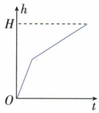
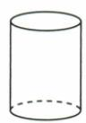
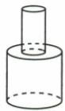
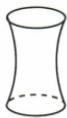
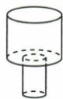
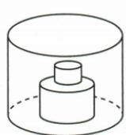
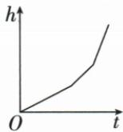
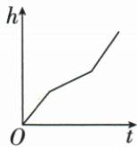
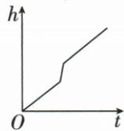
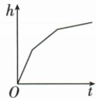

## 讲解

### 判据

题给匀速注水却水位分段，寻找容器各层实际能容水的截面，不将体积匀速直接当高度匀速。

### 流程

1. 相同时间进相同体积，写新增体积=该层可用面积×高度增量。
2. 因高度增量=体积增量/面积，面积小段更陡，面积大段更缓。
3. 有固定物体时以容器截面减物体该高度截面；跨过物体顶后占用部分消失。
4. 按水从底到顶的顺序排斜率，原叠柱依次缸减大柱、缸减小柱、整缸。
5. 比图连续性、每段快慢和界限数；恒截面才给恒斜率，不把渐变容器硬配折线。

## 例题

### 匀速注水从面积变化匹配容器

> 来源ID Q13-09；第13章一次函数；101-150/full.md 第3611–3634行。原答案与解析定位：101-150/full.md 第3636–3638行。

例4 均匀地向一个容器内注水,在注满水的过程中,水面的高度 h 与时间 t 之间的函数关系如图所示,则该容器可能是 ( )

  
A

  
B

  
C

  
D

**原资料答案与解析：**

解析 当高度与时间的函数图象是直线时, 直线的倾斜程度体现了高度变化的速度, 直线越缓, 说明高度变化的速度越慢; 直线越陡, 说明高度变化的速度越快. 由题图可以看出, 前一个阶段用时较少, 高度增加较快, 结合选项可知选 D.

答案 D

**展开解析（依据原详解补足理由与步骤）：**

匀速注水指相同时间进入相同体积，不意味着高度等速。截面积A固定的一层，新增体积=A×高度增量，所以高度增量=新增体积/A，截面越小水位上升越快。题图先较陡、后较缓且各段近直线，要求下部小恒截面、上部大恒截面，D符合。A等截面圆柱应一路同斜率；B下大上小应先缓后陡；C腰部渐变，截面随高度连续改变，不能形成题示两个恒速区段。不能根据容器总高度猜形状。

### 叠放圆柱注水按可用水面面积分三段

> 来源ID Q13-14；第13章一次函数；101-150/full.md 第3710–3724行。原答案与解析定位：101-150/full.md 第3740–3742行。

例4（2024 湖北武汉）如图，一个圆柱体水槽底部叠放两个底面半径不等的实心圆柱体，向水槽匀速注水。下列图象能大致反映水槽中水的深度 h 与注水时间 t 的函数关系的是（）

  
A

  
B

  
C

  
D

**原资料答案与解析：**

例4 解析 下层实心圆柱底面半径大,最初水面上升快,上层实心圆柱底面半径稍小,所以水没过下层圆柱后水面上升变慢,水没过上层圆柱后,水面上升更慢,所以对应图象是第一段比较陡,第二段比第一段缓,第三段比第二段缓.

答案 D

**展开解析（依据原详解补足理由与步骤）：**

缸内下方大圆柱、上方小圆柱固定放置。水未淹大柱时可容水的水平截面积=缸面积−大柱面积；越过大柱顶仍未淹小柱时=缸面积−小柱面积；超过全部柱时=缸面积。三者逐次增大，等流量下水位速度逐次减小，图应连续、三段由陡到缓，D对。A越往后越陡，顺序反；B后段又陡，未体现截面积继续增；C中段比前段更陡，也反。分段界限来自两柱顶高度，不是随意把时间平分三段。

## 易错

下窄上宽对应先快后慢，反向容器反向；物体两柱顶高度是换段依据，不按时间平均分段。
