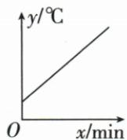
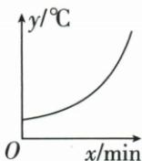
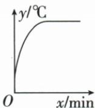
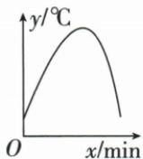

## 讲解

### 判据

题明确被测水温近似不变、仪器初温较低，先确定上升且逐渐接近目标温度，而非只选任意上升图。

### 流程

1. 读初温与目标的大小，初温低故读数向上，不应先无故下降。
2. 目标水温约60℃近似保持，最终读数在精度内趋稳，不无限越过目标。
3. 原趋势为先较快、后趋缓，图应上升斜率逐渐减小。
4. 逐项排始终线性越过、加速升、升后降等不符趋势图。
5. 区分示意近似与精确物理定律，不从没有精确刻度的曲线算确切达到时刻。

## 例题

### 温度逐渐接近水温的曲线辨析

> 来源ID Q13-13；第13章一次函数；101-150/full.md 第3696–3708行。原答案与解析定位：101-150/full.md 第3736–3738行。

例3 (2024 江西) 将常温中的温度计插入一杯 $60^{\circ}$ C 的热水(恒温)中, 温度计的读数 $y(\text{℃})$ 与时间 $x(\text{min})$ 的关系用图象可近似表示为 ( )

  
A

  
B

  
C

  
D

**原资料答案与解析：**

例3 解析 将常温中的温度计插入一杯 $60^{\circ}$ C 的热水(恒温)中, 则温度计的读数增大到 $60^{\circ}$ C 后保持不变, 故 C 选项中的图象符合题意.

答案 C

**展开解析（依据原详解补足理由与步骤）：**

原水温约60℃且近似不变，温度计初温低于水温，读数先较快上升，再逐渐趋近60℃并在测量精度内稳定，C符合。A始终匀速升且越过目标，不符趋近稳定；B越来越快上升，不符温差缩小后的趋缓；D升后下降，不符水温保持的题定过程。这里只判断近似趋势，原解析“达到60后保持”按测量精度理解，不宣称理论上必在一个确定有限时刻精确等于水温。

## 易错

“到60后保持”是测量精度层面的原解析表述，不据此断精确等于目标必在有限时刻；原水温若变化，该流程前提失效。
