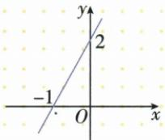

## 讲解

### 判据

看题给的是x还是y，先标未知对象。给x求y按代值顺序，给y求x解等式，图上读指定高度对应横数。

### 流程

1. 写函数规则与允许输入，核已给x是否合法。
2. 代给定输入时用括号保负号，按原运算顺序先乘后加减。
3. 若给输出c，改写f(x)=c，用等式性质求所有候选输入并回查范围。
4. 图解选水平y=c找交点横，而非习惯只找x轴；求c=0才用x轴。
5. 回代输出核答案，反求多候选时都保，函数唯一性只保证从x到y。

## 例题

### 代给定自变量求两个函数值

> 来源ID Q13-04；第13章一次函数；101-150/full.md 第3452–3452行。原答案与解析定位：101-150/full.md 第3454–3456行。

例4 已知 y=2x-3, 求 x 取 2 和 -2 时的函数值.

**原资料答案与解析：**

解析 当 $x = 2$ 时, $y = 2 \times 2 - 3 = 1$ .

当 x=-2 时, $y=2\times(-2)-3=-7$ .

**展开解析（依据原详解补足理由与步骤）：**

y=2x−3。x=2时先乘2×2=4，再减3，y=1；x=−2时代入负数必须保负号，2×(−2)−3=−4−3=−7。两次是同一规则对两种输入，不把x=−2看成“结果再取相反数”：常数−3始终不随x反号。

### 两条水平比较线读一次方程的根

> 来源ID Q13-31；第13章一次函数；151-200/full.md 第90–92行。原答案与解析定位：151-200/full.md 第94–94行。

例1 一次函数 $y = kx + b$ 的图象如图所示, 则关于 x 的方程 $kx + b = 0$ 的解为 \_\_\_\_, 关于 x 的方程 $kx + b = 2$ 的解为 \_\_\_\_.

**原资料答案与解析：**

答案 $x = -1; x = 0$

**展开解析（依据原详解补足理由与步骤）：**

原一次线与x轴交于(−1,0)，与y轴交于(0,2)。解kx+b=0，就是读纵0的交点横−1；解kx+b=2，读纵2交点横0。答案依次−1与0。第二问右边2不是0，不能仍盯x轴；图点纵2不是该方程所求x。

### 负半轴截距距离读一次方程根

> 来源ID Q13-36；第13章一次函数；151-200/full.md 第261–263行。原答案与解析定位：151-200/full.md 第241–243行。

例1（2024江苏扬州）如图，已知一次函数 $y = kx + b (k \neq 0)$ 的图象分别与 $x, y$ 轴交于 $A, B$ 两点，若 $OA = 2, OB = 1$ ，则关于 $x$ 的方程 $kx + b = 0$ 的解为 \_\_\_\_.

**原资料答案与解析：**

例1 解析 $\because OA=2,\therefore$ 一次函数 $y=kx+b(k\neq0)$ 的图象与 x 轴相交于点 $A(-2,0),\therefore$ 关于 x 的方程 $kx+b=0$ 的解为 x=-2.

答案 $x = -2$

**展开解析（依据原详解补足理由与步骤）：**

图中A在x负半轴，OA=2故A横−2，不是+2；B在y正半轴、OB=1。kx+b=0的根为x轴交点横，x=−2。图给的是距离2，需要依所在半轴添负号。

## 易错

原x=−2时−7不是−1；原kx+b=2的根横0不是纵2，也不是kx+b=0的−1。
