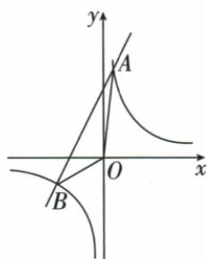
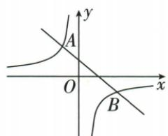

## 错法

原8/x≤2x+6两边直接乘x，始终写8≤2x²+6x，忽略负支x<0应翻号；再把零夹在两交点闭区间中，一并收入。这样既改变原不等式的等价性，又把原函数未定义的输入当解。

## 正解

保留x≠0，将差通分为2(x+4)(x−1)/x≥0，分子根−4、1与分母零0共同划段。逐段判商的号，得到−4≤x<0或x≥1。交点可取来自非严格比较，零不取来自原定义，两条理由不能互相覆盖。另一题需直线较低，先写y₁−y₂≤0再依分界−1、0、2得−1≤x<0或x≥2；不照搬前题方向。也可分x正负乘，但每支解必须与该支范围取交。

## 例题

### 交点求两式割补面积并分支解比较

> 来源ID Q15-13；第15章反比例函数；151-200/full.md 第2191–2209行。原答案与解析定位：151-200/full.md 第2211–2228行。

例4 如图,已知反比例函数 $y=\frac{k_{1}}{x}(k_{1}\neq0)$ 与一次函数 $y=k_{2}x+b(k_{2}\neq0)$ 的图象交于 A(1,8), B(-4,m)

两点.

(1) 求 $k_{1}, k_{2}, b$ 的值.  
(2) 求 $\triangle AOB$ 的面积.  
(3)请直接写出不等式 $\frac{k_{1}}{x}\leqslant k_{2}x+b$ 的解集.

**原资料答案与解析：**

解析 (1) $\because$ 反比例函数 $y = \frac{k_1}{x} (k_1 \neq 0)$ 与一次函数 $y = k_2 x + b (k_2 \neq 0)$ 的图象交于点 $A(1,8), B(-4,m)$ , $\therefore k_1 = 1 \times 8 = 8, m = 8 \div (-4) = -2, \therefore$ 点 $B$ 的坐标为 $(-4, -2)$ .

将 $A(1,8), B(-4,-2)$ 代入 $y = k_{2}x + b$ ，得 $\left\{ \begin{array}{l} k_{2} + b = 8, \\ -4k_{2} + b = -2, \end{array} \right.$ 解得 $\left\{ \begin{array}{l} k_{2} = 2, \\ b = 6, \end{array} \right.$

$$
\therefore k _ {1} = 8, k _ {2} = 2, b = 6.
$$

(2) 当 $x = 0$ 时, $y = 2x + 6 = 6$ , $\therefore$ 直线 $AB$ 与 $y$ 轴的交点坐标为 $(0,6)$ ,

$$
\therefore S _ {\triangle A O B} = \frac {1}{2} \times 6 \times 4 + \frac {1}{2} \times 6 \times 1 = 1 5.
$$

(3) $-4\leqslant x<0$ 或 $x\geqslant1$ .

详解: 观察函数图象可知, 当 -4 < x < 0 或 x > 1 时, 一次函数的图象在反比例函数图象的上方,
∴ 不等式 $\frac{k_{1}}{x}\leqslant k_{2}x+b$ 的解集为 $-4\leqslant x<0$ 或 $x\geqslant1$ .

**展开解析（依据原详解补足理由与步骤）：**

（1）A(1,8)给k₁=1×8=8，B横−4给m=8/(−4)=−2。代直线：k₂+b=8、−4k₂+b=−2，前式减后式得5k₂=10，k₂=2；回前式b=6。（2）AB交纵轴C(0,6)，O、C同轴，A、B在轴两边，△AOB由△AOC与△BOC组成。共享底OC=6，对应垂高是到纵轴水平距离1、4，面积6×1/2+6×4/2=15。（3）要8/x≤2x+6，移左得到(2x²+6x−8)/x≥0，即2(x+4)(x−1)/x≥0，且x≠0。分界−4、0、1：x<−4时分子正、分母负，商负；−4<x<0分子负、分母负，商正；0<x<1分子负、分母正，商负；x>1分子分母都正。分子零点−4、1因≤可取，分母零0永不取。所以−4≤x<0或x≥1，与原图直线位于双曲线上方的分段对应。

### 直线在双曲线下含等号但排零

> 来源ID Q15-19；第15章反比例函数；151-200/full.md 第2349–2361行。原答案与解析定位：151-200/full.md 第2303–2305行。

例6 (2024 山东威海) 如图, 在平面直角坐标系中, 直线 $y_1 = ax + b (a \neq 0)$ 与双曲线 $y_2 = \frac{k}{x} (k \neq 0)$ 交于点 $A(-1, m), B(2, -1)$ . 则满足 $y_1 \leqslant y_2$ 的 $x$ 的取值范围为 \_\_\_\_.

**原资料答案与解析：**

例6 解析 $\because y_{1} \leqslant y_{2}, \therefore x$ 的取值范围应满足直线与双曲线相交或直线在双曲线的下方. 由题图易得 $-1 \leqslant x < 0$ 或 $x \geqslant 2$ .

答案 $-1 \leqslant x < 0$ 或 $x \geqslant 2$

**展开解析（依据原详解补足理由与步骤）：**

B(2,−1)给k=−2；A横−1得m2，所以两点A(−1,2)、B(2,−1)。直线斜率(−1−2)/(2−(−1))=−3/3=−1，由B得−1=−2+b、b=1，y₁=1−x。要求1−x≤−2/x，移为[−x²+x+2]/x≤0，分子提负并分解=−(x−2)(x+1)，同乘常数−1翻向为(x−2)(x+1)/x≥0。三个分界−1、0、2。x<−1时两因子负、分子正、分母负，商负；−1<x<0时分子负分母负商正；0<x<2分子负分母正商负；x>2均正。−1、2为交点含等号，0是禁输入，故−1≤x<0或x≥2。按图“直线较低”读的是同一横下的两纵，不能交换y₁、y₂。
