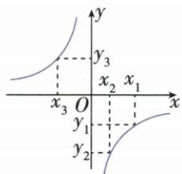

## 讲解

### 是什么

在x>0这一支或x<0这一支内，k>0时随x增y减，k<0时随x增y增。限定同支是结论的一部分；“所有非零横按大小排、纵统一增减”不成立。增减性检验用两个允许输入的差，无需导数。

### 怎么来的

取同支x₁<x₂，均非零且x₁x₂>0。两函数值相减，先通分：$y_2-y_1=k/x_2-k/x_1=k(x_1-x_2)/(x_1x_2)$。分子中x₁−x₂为负，分母正，所以差的符号与k相反；k为正得差负、y₂<y₁，k为负得差正、y₂>y₁。负支中虽然两个横都是负，其乘积仍正，证明同样适用。跨零时x₁x₂负，这一符号论证已改变，不能照搬原结论。原y=−1/x的x₁>x₂>0可判y₁>y₂，但x₃负的纵反为正，整体排序先另比符号。

通分后显露差的符号来源：

$$y_2-y_1=\frac{k}{x_2}-\frac{k}{x_1}=\frac{k(x_1-x_2)}{x_1x_2},\qquad x_1<x_2,\ x_1x_2>0.$$

### 什么时候能用

反向由同支增减推系数符号时，保证真实系数非零且规则确为反比例：原(k−1)/x每支增给k−1<0，不是k<0。仅凭一段看上去向下的示意线不能断言未给类型的函数反比。实际只在正分支讨论时，也应说明实际域，不把局部性质描述成全域。

## 例题

### 正比例无交点先判系数再比同支两纵

> 来源ID Q15-09；第15章反比例函数；151-200/full.md 第2102–2110行。原答案与解析定位：151-200/full.md 第2112–2114行。

例3 若函数 $y = -x$ 与 $y = \frac{k}{x} (k \neq 0)$ 的图象无交点，且 $y = \frac{k}{x} (k \neq 0)$ 的图象过点 $A(1, y_1), B(2, y_2)$ ，则 （）

A. $y_{1}<y_{2}$

B. $y_{1}=y_{2}$

C. $y_{1}>y_{2}$

D. $y_{1},y_{2}$ 的大小关系无法确定

**原资料答案与解析：**

解析 $\because$ 函数 $y = -x$ 的图象经过第二、四象限，函数 $y = -x$ 与 $y = \frac{k}{x} (k \neq 0)$ 的图象无交点， $\therefore y = \frac{k}{x}$ ( $k \neq 0$ ) 的图象在第一、三象限， $\therefore k > 0$ ，根据反比例函数的性质，可知 $y_1 > y_2$ .

答案 C

**展开解析（依据原详解补足理由与步骤）：**

公共点须满足−x=k/x且x≠0，乘x得−x²=k。若k<0，则−k>0，x=±√(−k)都是合法非零交点；k=0已被原定义排掉；所以无交点只能k>0。在正分支x=1<2，k/x随x增减小，y₁=k、y₂=k/2，因此y₁>y₂，C对。A反序；B需k=k/2会推出k=0与原条件冲突；D说无法确定，但无交点已锁定k为正，错。不能只凭“象限重合”断言一般两图必相交，本题上述方程才证明。

### 图象增减性约束的是整个比例系数

> 来源ID Q15-10；第15章反比例函数；151-200/full.md 第2129–2137行。原答案与解析定位：151-200/full.md 第2139–2141行。

例1 反比例函数 $y = \frac{k - 1}{x}$ 的图象, 在每个象限内, $y$ 随 $x$ 的增大而增大, 则 $k$ 的值可以为 ( )

A.0

B.1

C.2

D.3

**原资料答案与解析：**

解析 由题意得 k-1<0, 解得 k<1.

答案 A

**展开解析（依据原详解补足理由与步骤）：**

真实比例系数是k−1。在每个分支内随x增而增，要求k−1<0，即k<1。A0给系数−1，成立。B1使系数0，不是反比例函数；C2给系数1、D3给系数2，均在每支递减，与题相反。选A。不是直接据字母k写k<0：原式系数并非k本身。

### 负系数三点先比符号再比正分支

> 来源ID Q15-11；第15章反比例函数；151-200/full.md 第2147–2155行。原答案与解析定位：151-200/full.md 第2157–2173行。

例2 在反比例函数 $y=-\frac{1}{x}$ 的图象上有三点 $(x_{1},y_{1}),(x_{2},y_{2}),(x_{3},y_{3})$ ，若 $x_{1}>x_{2}>0>x_{3}$ ，则（）

A. $y_{3}>y_{1}>y_{2}$

B. $y_{3} > y_{2} > y_{1}$

C. $y_{1} > y_{2} > y_{3}$

D. $y_{1} > y_{3} > y_{2}$

**原资料答案与解析：**

解析 图象法: 在直角坐标系中作出 $y = -\frac{1}{x}$ 的大致图象, 如图, 描出符合条件的三个点, 观察图象直接得到 $y_{3} > y_{1} > y_{2}$ .

答案 A

**展开解析（依据原详解补足理由与步骤）：**

k=−1<0。x₁>x₂>0使y₁、y₂都负，x₃<0使y₃正；先知y₃大于二者。同在正分支，负系数使y随x增而增，x₁>x₂故y₁>y₂。合并y₃>y₁>y₂，A对。B颠倒同支的y₁、y₂；C把正的y₃排在两个负值下面；D把负y₁放正y₃上面，皆错。不能将跨零的全部横坐标排序直接当成整张图递增。

### 写一个递减分支系数值不误称唯一

> 来源ID Q15-14；第15章反比例函数；151-200/full.md 第2243–2245行。原答案与解析定位：151-200/full.md 第2249–2251行。

例1（2024 湖北武汉）某反比例函数 $y=\frac{k}{x}$ 具有下列性质: 当 x>0 时, y 随 x 的增大而减小. 写出一个满足条件的 k 的值是 \_\_\_\_.

**原资料答案与解析：**

例1 解析 $\because$ 当 $x > 0$ 时, $y$ 随 $x$ 的增大而减小, $\therefore k > 0$ .

答案 1(答案不唯一)

**展开解析（依据原详解补足理由与步骤）：**

题只要求x>0分支随输入增而减，由k/x性质得k>0。原给k=1，是非零正数，满足；且条件只限制正号，不唯一。正确回答可按原答案1，不能把“写出一个”解释成须确定仅有这一数。k=0不是反比例，k为负在正支反而增。

### 固定五百度电逐项核反比量变

> 来源ID Q15-15；第15章反比例函数；151-200/full.md 第2307–2312行。原答案与解析定位：151-200/full.md 第2253–2255行。

例2 (2024 河北) 节能环保已成为人们的共识. 淇淇家计划购买 500 度电, 若平均每天用电 $x$ 度, 则能使用 $y$ 天. 下列说法错误的是 ( )

A. 若 $x = 5$ ，则 $y = 100$   
B. 若 $y = 125$ ，则 $x = 4$   
C. 若 $x$ 减小, 则 $y$ 也减小  
D. 若 $x$ 减小一半, 则 $y$ 增大一倍

**原资料答案与解析：**

例2 解析 由题意可得 $xy = 500$ . 若 $x = 5$ , 则 $y = 100$ , 选项 A 中说法正确; 若 $y = 125$ , 则 $x = 4$ , 选项 B 中说法正确; 若 $x$ 减小, 则 $y$ 增大, 选项 C 中说法错误; 若 $x$ 减小为 $\frac{1}{2} x$ , 则 $y$ 变为 $2y$ , 选项 D 中说法正确. 故选 C.

答案 C

**展开解析（依据原详解补足理由与步骤）：**

总量500度，日平均x度、能用y天，x>0、y>0，xy=500。A x5时y500/5=100，对；B y125时x500/125=4，对。C正分支x减小使y=500/x增大，声称也减小，错，所以选C。D新日耗x/2对应y'=500/(x/2)=2(500/x)=2y，由原y变2y，增大一倍，对。平均日耗可按连续量讨论；总量固定不等于日耗与天数相加固定。

### 横坐标跨零先按象限拆开纵坐标

> 来源ID Q15-16；第15章反比例函数；151-200/full.md 第2316–2324行。原答案与解析定位：151-200/full.md 第2257–2267行。

例3（2024山东济宁）已知点 $A(-2, y_1), B(-1, y_2), C(3, y_3)$ 在反比例函数 $y = \frac{k}{x} (k < 0)$ 的图象上，则 $y_1, y_2, y_3$ 的大小关系是 （）

A. $y_{1} <   y_{2} <   y_{3}$

B. $y_{2} <   y_{1} <   y_{3}$

C. $y_{3}< y_{1}< y_{2}$

D. $y_{3}<y_{2}<y_{1}$

**原资料答案与解析：**

例3 解析 $\because k<0,\therefore y=\frac{k}{x}$ 的图象位于第二、四象限,且在每一象限内,y 随 x 的增大而增大,

$$
\because - 2 <   - 1 <   0 <   3, \therefore y _ {3} <   0 <   y _ {1} <   y _ {2},
$$

$$
\therefore y _ {3} <   y _ {1} <   y _ {2}.
$$

答案 C

**展开解析（依据原详解补足理由与步骤）：**

k<0。原−2、−1都负，y₁、y₂正；原3正，y₃负。故y₃小于二者。在负支−2<−1，k为负使随横增纵增，y₁<y₂，所以y₃<y₁<y₂，C对。A把负y₃排最大；B也把负y₃排最大且倒两个正值；D虽把y₃放小却颠倒y₁、y₂，错。可代符号核y₁=−k/2、y₂=−k，因−k为正，后一值为前一值2倍；y₃=k/3负。

## 易错

原考试“x>0时减”能推出k>0而不唯一确定k；原四个k候选1使系数零，即使看似不增不减，也不属于所问类型。
