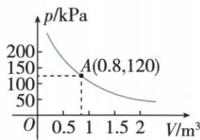

## 讲解

### 是什么

先找固定总量和组成它的两个正量：平均日耗×天数、电量；卸货速度×时间、货物；题定的力×力臂、固定平衡乘积。以真实单位写关系后，除正输入成反比式。一个变原值的r倍（r>0），另一值变原值的1/r倍。

### 怎么来的

从uv=C、C>0，u' =ru给v'=C/u'=C/(ru)=v/r。原日耗减一半r1/2，天数变2倍，是增大一倍而非仅加1天；原总质量60到90增3/2，速度6除3/2得到4。卸货vt=100，t上限5映到v下限20，因为正支减，边界是同一个乘积。杠杆原给两定量1600、0.5，不变乘积800，动力不是恒定800而是随臂长800/l。单位分析可核等式是否把不同量误相加，如吨/时乘时得吨，力N乘米得N·m。

相反倍率来自同一恒定乘积：

$$uv=C>0,\quad u'=ru\ (r>0)\quad\Rightarrow\quad v'=\frac{C}{u'}=\frac{C}{ru}=\frac{v}{r}.$$

### 什么时候能用

固定条件改变，总量或比例系数就可能改变，不能仍用原式；原气球特别指定温度不变、质量一定，机器狗直接给特定型号的数学关系。时间、速度、体积等原题为正，不能零或负；连续平均值按原题定义，可与实际按天整数需求不同。遇题限制最多、至少时先将语义译不等号再推方向，不凭文字直觉决定同增同减。

## 例题

### 机器狗固定质量速度乘积核原页分母

> 来源ID Q15-06；第15章反比例函数；151-200/full.md 第1845–1847行。原答案与解析定位：151-200/full.md 第1851–1853行。

例（2024 山西）机器狗是一种模拟真实犬只形态和部分行为的机器装置，其最快移动速度 $v(\mathrm{m/s})$ 是载重后总质量 $m(\mathrm{kg})$ 的反比例函数。已知一款机器狗载重后总质量 $m=60\mathrm{kg}$ 时，它的最快移动速度 $v=6\mathrm{m/s}$ ；当其载重后总质量 $m=90\mathrm{kg}$ 时，它的最快移动速度 $v=\_\_\_\_m/s$ 。

**原资料答案与解析：**

例 解析 $\because v$ 是 $m$ 的反比例函数, $\therefore$ 设 $v = \frac{k}{m}$ , 把 $m = 60$ , $v = 6$ 代入, 解得 $k = 360$ , $\therefore v = \frac{360}{m}$ . 当 $m = 90 \mathrm{~kg}$ 时, $v = \frac{360}{90} = 4 (\mathrm{~m/s})$ .

答案 4

**展开解析（依据原详解补足理由与步骤）：**

题已指定最快速度v是总质量m的反比例函数，设v=k/m，m>0。原60kg、6m/s给k=60×6=360；因此v=360/m。总质量90kg时v=360/90=4m/s，检查90×4仍360。质量从60增至90乘3/2，速度相应除3/2，也得到4。原PDF分母是90，识别文本漏0变成360/9，但答案仍4；原文证据CSV保留识别文本，正文原解析按实际PDF恢复90。只在题所规定的模型中使用，不能声称所有机器狗都遵守这条规律。

### 固定五百度电逐项核反比量变

> 来源ID Q15-15；第15章反比例函数；151-200/full.md 第2307–2312行。原答案与解析定位：151-200/full.md 第2253–2255行。

例2 (2024 河北) 节能环保已成为人们的共识. 淇淇家计划购买 500 度电, 若平均每天用电 $x$ 度, 则能使用 $y$ 天. 下列说法错误的是 ( )

A. 若 $x = 5$ ，则 $y = 100$   
B. 若 $y = 125$ ，则 $x = 4$   
C. 若 $x$ 减小, 则 $y$ 也减小  
D. 若 $x$ 减小一半, 则 $y$ 增大一倍

**原资料答案与解析：**

例2 解析 由题意可得 $xy = 500$ . 若 $x = 5$ , 则 $y = 100$ , 选项 A 中说法正确; 若 $y = 125$ , 则 $x = 4$ , 选项 B 中说法正确; 若 $x$ 减小, 则 $y$ 增大, 选项 C 中说法错误; 若 $x$ 减小为 $\frac{1}{2} x$ , 则 $y$ 变为 $2y$ , 选项 D 中说法正确. 故选 C.

答案 C

**展开解析（依据原详解补足理由与步骤）：**

总量500度，日平均x度、能用y天，x>0、y>0，xy=500。A x5时y500/5=100，对；B y125时x500/125=4，对。C正分支x减小使y=500/x增大，声称也减小，错，所以选C。D新日耗x/2对应y'=500/(x/2)=2(500/x)=2y，由原y变2y，增大一倍，对。平均日耗可按连续量讨论；总量固定不等于日耗与天数相加固定。

### 卸货总量固定用限时反推最低正速度

> 来源ID Q15-20；第15章反比例函数；151-200/full.md 第2395–2399行。原答案与解析定位：151-200/full.md 第2401–2405行。

例1 已知一艘轮船上装有 100 吨货物, 轮船到达目的地后开始卸货, 设平均卸货速度为 v (单位: 吨/时), 卸完这批货物所需的时间为 t (单位: 小时).

(1) 求 v 关于 t 的函数表达式.

(2)若要求不超过5小时卸完船上的这批货物,那么平均每小时至少要卸货多少吨?

**原资料答案与解析：**

解析（1）根据“平均卸货速度×卸货时间=货物总量”可得vt=100，则 $v=\frac{100}{t}(t>0)$ .

(2)∵不超过5小时卸完船上货物,∴0<t≤5,∴0< $\frac{100}{v}$ ≤5,解得v≥20.

答: 平均每小时至少要卸货 20 吨.

**展开解析（依据原详解补足理由与步骤）：**

总货100吨=平均速度v吨/时×时间t时，所以vt=100，v=100/t，t>0。（2）要求不超过5小时为0<t≤5，由t=100/v且v>0得到100/v≤5。两边乘正v：100≤5v，再除正5，v≥20吨/时。v=20时恰5小时符合不超过；更大速度用时更短。因此“至少”应写下界20，不是速度上限，也不能把卸完所需时间设0。

### 气球按原图对应值求系数再安全边界

> 来源ID Q15-21；第15章反比例函数；151-200/full.md 第2411–2417行。原答案与解析定位：151-200/full.md 第2419–2433行。

例2 一气球内充满了一定质量的气体, 当温度不变时, 气球内气体的气压 $p(\mathrm{kPa})$ 是气体体积 $V(\mathrm{m}^{3})$ 的反比例函数, 其图象如图.

(1) 写出这一函数的解析式.

(2) 当气体体积为 $1 \, m^{3}$ 时, 气压是多少?

(3) 当气球内气体的气压大于 140 kPa 时, 气球将爆炸. 为安全起见, 气体的体积应不少于多少?

**原资料答案与解析：**

解析（1）设 $p = \frac{m}{V} (m \neq 0)$ ，由图象过点 $A(0.8, 120)$ ，得 $m = 0.8 \times 120 = 96$ ，所以 $p = \frac{96}{V} (V > 0)$ .

(2) 当 V=1 时, p=96, 所以当气体体积为 $1 \, m^{3}$ 时, 气压是 96 kPa.

(3) 令 $p \leqslant 140$ , 得 $\frac{96}{V} \leqslant 140$ , 解得 $V \geqslant \frac{24}{35}$ . 所以气体的体积应不少于 $\frac{24}{35} \mathrm{~m}^3$ .

**展开解析（依据原详解补足理由与步骤）：**

原图明确点(0.8,120)，坐标分别体积m³、气压kPa，不猜未标读数。固定温度、给定质量且题指定反比，p=m/V，m=0.8×120=96，所以p=96/V，V>0。V=1时p=96kPa。（3）原条件“大于140会爆炸”，模型内不触发该条件需p≤140。代式96/V≤140，乘正V得96≤140V，再除正140得V≥96/140=24/35m³。边界对应p140，不超过原危险阈值可收。体积要至少此值，不是至多；这些是给定题的理想模型结论，未将其扩展成现实操作建议。

### 给定杠杆平衡乘积换成反比式

> 来源ID Q15-23；第15章反比例函数；151-200/full.md 第2481–2481行。原答案与解析定位：151-200/full.md 第2471–2477行。

例（2024 江苏连云港）杠杆平衡时，“阻力×阻力臂=动力×动力臂”。已知阻力和阻力臂分别为1 600 N和0.5 m，动力为FN，动力臂为l m。则动力F关于动力臂l的函数表达式为\_\_\_\_。

**原资料答案与解析：**

例 解析 $\because F \cdot l = 1600 \times 0.5$ ,

$$
\therefore F = \frac {8 0 0}{l}.
$$

答案 $F=\frac{800}{l}$

**展开解析（依据原详解补足理由与步骤）：**

按原题给关系：阻力×阻力臂=动力×动力臂。代阻力1600N、阻力臂0.5m，Fl=1600×0.5=800，单位乘积N·m。动力臂l是正长度，l>0，两边除正l，F=800/l，F单位N、l单位m。这里800是力臂乘积的数值，不是动力固定800N；改变l时F对应改变，但Fl保持给定值。只应用原题提供的平衡式，不额外引入高中物理结论。

## 易错

两量变动相反不等于差固定；原至少速度20不是至多20。现实模型只是本题条件下的函数关系，勿写普适物理定律。
