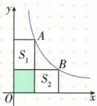
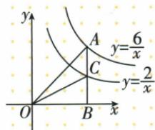
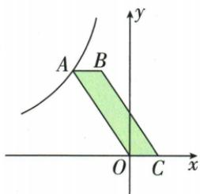
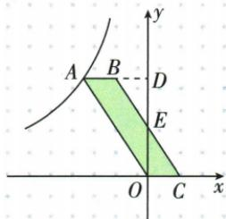

## 讲解

### 判据

图点在反比上并向轴作垂线，面积可能由固定xy转化；先识别哪块真是轴矩形或半矩形，再割补，而非所有图形都套同一个倍数。

### 流程

1. 定点所在象限，将真实长取坐标绝对值。轴矩形面积|k|，原k4给各矩形4。
2. 轴向直角三角形用同底垂高再除2，原k6与k2给3、1。
3. 看共有部分或包含关系：重叠阴影1在两个矩形中各出现一次，各扣1，得S₁+S₂6；OAC在OAB内，减OCB得2。
4. 若为两点倍数模型，核是否过原点正比例的对称交点、所作垂线对应哪一种，用底高证明倍数，不望图猜。
5. 反求k时面积只给绝对值，最后依据象限定正负。原平行四边形先证明与轴三角形同面积才给|k|6，第二象限取−6。

## 例题

### 两个等面积矩形各扣同一重叠阴影

> 来源ID Q15-07；第15章反比例函数；151-200/full.md 第1889–1903行。原答案与解析定位：151-200/full.md 第1905–1907行。

例1 如图, A, B 两点在双曲线 $y = \frac{4}{x}$ 上, 分别过 A, B 两点向坐标轴作垂线段. 已知 $S_{\text{阴影}} = 1$ , 则 $S_{1} + S_{2} =$ \_\_\_\_.

**原资料答案与解析：**

解析 根据反比例函数中 k 的几何意义得 $S_{1} + S_{\text{阴影}} = S_{2} + S_{\text{阴影}} = 4$ , $\therefore S_{1}+S_{2}=4+4-1\times2=6.$

答案6

**展开解析（依据原详解补足理由与步骤）：**

图中A、B都在第一象限y=4/x，两点分别向两轴垂足形成的矩形面积均为横坐标×纵坐标=4。每个矩形都由对应未阴影部分和面积1的阴影组成，S₁+1=4、S₂+1=4，所以各为3，相加6。相加两个完整矩形先得8，要求仅S₁+S₂，应从每个矩形各扣1，即8−2×1=6。只扣一次得到7是计算并集，非题所求；阴影不是三角形，不套|k|/2。

### 同横两双曲线以同高三角形相减

> 来源ID Q15-08；第15章反比例函数；151-200/full.md 第2080–2092行。原答案与解析定位：151-200/full.md 第2094–2098行。

例2 如图, 点 A 是反比例函数 $y = \frac{6}{x}$ 的图象上一点, 过点 A 作 AB ⊥ x 轴, 垂足为 B, 线段 AB 交反比例函数 $y = \frac{2}{x}$ 的图象于点 C, 则 $\triangle OAC$ 的面积为 \_\_\_\_.

**原资料答案与解析：**

解析 根据反比例函数中 k 的几何意义得 $S_{\triangle OAB} = \frac{1}{2} \times 6 = 3$ ,

$S_{\triangle OCB}=\frac{1}{2}\times2=1$ ，所以 $S_{\triangle OAC}=$ $S_{\triangle OAB}-S_{\triangle OCB}=3-1=2.$

答案2

**展开解析（依据原详解补足理由与步骤）：**

原图A、C同在过B的竖线上且第一象限，横设x>0。A纵6/x，C纵2/x，AB6/x、CB2/x，OB=x。以OB为底的两个直角三角形面积分别x×(6/x)/2=3与x×(2/x)/2=1。C位于AB内，大三角形OAB由OAC与OCB组成，故OAC面积3−1=2。也可取AC=(6−2)/x=4/x为底，O到这条竖线的垂高x，面积(4/x)×x/2=2。底不是OB同时又用AC作高，两者未必按那种配法垂直。

### 平行四边形底高求双曲线点并补全原割补

> 来源ID Q15-18；第15章反比例函数；151-200/full.md 第2332–2345行。原答案与解析定位：151-200/full.md 第2273–2301行。

例5 (2024 黑龙江齐齐哈尔) 如图, 反比例函数 $y = \frac{k}{x} (x < 0)$ 的图象经过平行四边形 $ABCO$ 的顶点 $A, OC$ 在 $x$ 轴上, 若点 $B(-1,3), S_{\square ABCO} = 3$ , 则实数 $k$ 的值为 \_\_\_\_.

**原资料答案与解析：**

例5 解析 如图,延长AB交y轴于点D,∵ $B(-1,3)$ , $S_{\square ABCO}=3$ ,
∴ OC · OD = 3OC = 3,

$$
\begin{array}{r l} & {\therefore O C = 1 = B D, \text {易证} \triangle B E D \cong} \\ & {\triangle C E O, \therefore S _ {\triangle A O D} = S _ {\square A B C O} = 3,} \end{array}
$$

$$
\therefore | k | = 2 S _ {\triangle A O D} = 6,
$$

由图象知 $k<0,\therefore k=-6.$

答案 -6

**展开解析（依据原详解补足理由与步骤）：**

ABCO按图顺序是平行四边形，AB∥OC、AB=OC，OC在横轴。B(−1,3)，AB水平，A与B同高3；原面积3=OC×3，得OC=1。C在正横轴、O原点，所以C(1,0)。A在B左侧，AB=1，横−1−1=−2，故A(−2,3)，k=xy=−6，符号符合第二象限。原详解的割补也可补足：延AB交纵轴D(0,3)，BD=1=OC=1，令BC交纵轴E。△BED与△CEO中，BD、CO水平且DE、OE竖直，∠BDE=∠COE=90°；∠BED与∠CEO是两直线相交的对顶角，相等；对应边BD=CO，所以两三角形全等（两角及一边），面积相等。△AOD由四边形ABEO与△BED组成，平行四边形ABCO由同一四边形ABEO与△CEO组成，故面积都3。A到纵轴、横轴与O构成直角三角形面积|k|/2，所以|k|6；A在第二象限xy负，k=−6。这里“全等”所需角与边须说出，不能只保留原书“易证”。

## 易错

并集面积只扣一次重叠，不是原题非阴影两部分和；任意△AOB与不经原点直线交点不自动等|k|，原面积15须另割补。
