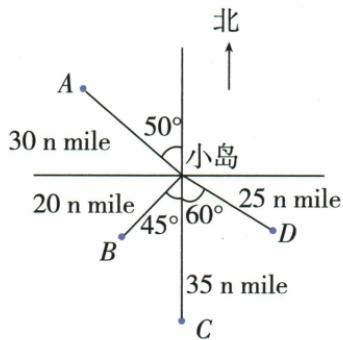
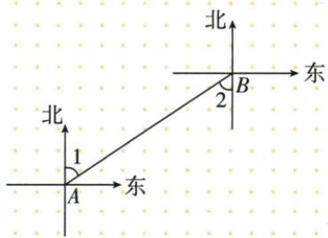
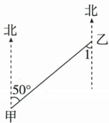

## 讲解

### 是什么

从一个观测点出发，用方向角规定一条射线，再用距离规定射线上一点。北偏西50°是从北向西旋转50°，南偏东60°是从南向东旋转60°，起始方向不可颠倒。图通常上北下南左西右东。

### 怎么来的

只有距离会留下以观测点为中心的圆上多点，只有方向会留下射线上多点，两项同时约束才唯一。相邻南北与东西方向成90°，所以同一方向改用另一相邻起始方向时偏角互余；原A北偏西50°也可西偏北40°，不是西偏北50°。这是同原图方向的重述，非新题。

### 什么时候能用

先确定观测点，换观测点后方位距离都可能改变。严格按图单位，原海里不写普通米或英里；不需换算时保原单位。自定义圆坐标则角从x正半轴逆时针，不与北偏角规则混用。

### 本章补充：两点互看与方位角的基准

方向角“北偏东θ”以北线为起始、向东偏θ；同一方向改用东西邻基准时才取余角。两点互看是方向射线反向，南北同时互换、东西同时互换，偏角保留：原北偏东60反向南偏西60；北偏东50反向南偏西50，原图∠1从乙的南线起量，故仍50而非40。两地北线按原平面方向模型互相平行，反向夹角对应相等，解释了口诀。

方位角另以正北作唯一零线、顺时针量到目标方向，通常统一记0≤θ<360°；0与360指同方向，不当两种位置。原东90、西270。只给方向能定位一支射线、加距离才定位点；本章互看题仅求方向或角，不补造距离。此处解释的是原平面图约定，不扩展成地球曲面远距离航向规则。

## 例题

### 四渔船按方向角和海里定位

> 来源ID Q12-05；第12章平面直角坐标系；101-150/full.md 第2830–2830行。原答案与解析定位：101-150/full.md 第2832–2858行。

例4 如图,四艘渔船 A,B,C,D 在回港途中遭遇 9 级强风,小岛上边防战士接到命令后立即准备救援,请告诉边防战士这些渔船的正确位置.

**原资料答案与解析：**

解析 渔船 A 相对于小岛的位置是北偏西 $50^{\circ}$ , 30 n mile;

渔船 B 相对于小岛的位置是西南方向,20 n mile;

渔船 C 相对于小岛的位置是正南方向, 35 n mile;

渔船 D 相对于小岛的位置是南偏东 $60^{\circ}$ , 25 n mile.

**展开解析（依据原详解补足理由与步骤）：**

以小岛为观测点，上北下南。A从北向西偏50°，距离30海里；B从南向西偏45°是西南方向，20海里；C正南无偏角，35海里；D从南向东偏60°，25海里。A角是以北射线为起始，不是从西起；D以南起不是从东起。每船必须给方向和距离两项，只有方位不能确定沿射线多远，只有距离不能确定圆上哪一点。n mile按原图为海里，不换成普通英里。

### 圆坐标按圆层数与逆时针角读D

> 来源ID Q12-06；第12章平面直角坐标系；101-150/full.md 第2882–2907行。原答案与解析定位：101-150/full.md 第2872–2874行。

例1（2023江苏连云港）画一条水平数轴，以原点 $O$ 为圆心，过数轴上的每一刻度点画同心圆，过原点 $O$ 按逆时针方向依次画出与正半轴的角度分别为 $30^{\circ}, 60^{\circ}, 90^{\circ}, 120^{\circ}, \cdots, 330^{\circ}$ 的射线，这样就建立了“圆”坐标系。如图，在建立的“圆”坐标系内，我们可以将点 $A, B, C$ 的坐标分别表示为 $A(6, 60^{\circ}), B(5, 180^{\circ}), C(4, 330^{\circ})$ ，则点 $D$ 的坐标可以表示为 \_\_\_\_.

**原资料答案与解析：**

例1 解析 根据题图可知点 D 在从内向外数的第 3 个圆上, 且 OD 与 x 轴非负半轴的夹角为 $150^{\circ}$ , 故点 D 的坐标可以表示为 $(3, 150^{\circ})$ .

答案（3,150°）

**展开解析（依据原详解补足理由与步骤）：**

原圆坐标第一数是从内向外的圆层，第二数是从x正半轴逆时针量角，不能当横纵坐标。D在第三圆，射线角150°，故(3,150°)。检查原A第6圆60°、B第5圆180°、C第4圆330°与题给一致，说明读图计数起点正确。这个自定义坐标描述位置的方式不是通常直角坐标，括号写法相同仍须读题定含义。

### 两点互看北偏东六十反为南偏西六十

> 来源ID Q16-28；第16章图形的初步认识；151-200/full.md 第3686–3699行。原答案与解析定位：151-200/full.md 第3701–3703行。

例2 如图,从 A 看 B 的方向是北偏东 $60^{\circ}$ ,那么从 B 看 A 的方向是 \_\_\_\_.

**原资料答案与解析：**

答案 南偏西 60°

注意 解 “两点互看” 问题的口诀：角度不变，方向相反（北↔南，西↔东）.

**展开解析（依据原详解补足理由与步骤）：**

A看B由A的北线向东偏60°，B在A东北侧。从B看A是同一直线反向，目标落西南侧，因此基准北换南、偏东换偏西，偏角仍60°，南偏西60°。可想象AB方向转半周180°，两地的南北方向线平行，对向射线相应夹角不变。不能只将东换西而仍北；也不能把60改30，后者是改用另一条东西基准的互余表达，不是原南基准的同一说法。

### 甲乙方向互看五十度并核四选项

> 来源ID Q16-36；第16章图形的初步认识；151-200/full.md 第3935–3955行。原答案与解析定位：151-200/full.md 第3917–3919行。

例2 (2024 安徽)如图,乙地在甲地的北偏东 $50^{\circ}$ 方向上,则 $\angle1$ 的度数为 ()

A. $60^{\circ}$

B. $50^{\circ}$

C. ${40}^{ \circ  }$

D. $30^{\circ}$

**原资料答案与解析：**

例2 解析 易知甲地在乙地的南偏西 $50^{\circ}$ 方向上, 所以 $\angle1$ 的度数为 $50^{\circ}$ .

答案 B

**展开解析（依据原详解补足理由与步骤）：**

甲看乙北偏东50°，反向乙看甲是南偏西50°。原∠1画在乙的向南方向线与乙到甲的射线之间，正是50°，B对。A60°、D30°与反向保持的50°不符；C40°是90−50的余角，若改用向西基准才可描述为西偏南40°，但原∠1从向南线量，不能换基准后仍称它。选B。先认图中角的两边，不仅背方向反转口诀。

## 易错

原D南偏东60°，若说东偏南60°改变方向；B南偏西45°可简称西南，不是西北。
