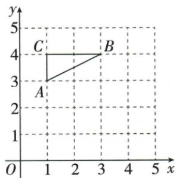
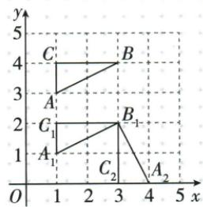

## 讲解

### 是什么

在固定坐标系中，右移m个单位横加m，左移横减m；上移n纵加n，下移纵减n，另一坐标保持。图形平移时所有点同向同距，等价各点横坐标同加同一量、纵同加同一量。

### 怎么来的

每个坐标本是各轴定向位移，右与上为正，将原位移加移动量就是新位移。原A(1,1)右2使横1+2=3，上3使纵1+3=4。两点同加相同横纵量，其坐标差不变，轴向长度和整体形状不变；位置改变不等于形状大小改变。

### 什么时候能用

m、n若表示距离通常正，方向决定加减；若用有号位移量，可直接分别加，不再另翻号。是移动点而坐标系固定；若移动原点不动点，数值变化方向相反，需分清本条情景。

第25章原网格船整体左3下4、线段右4上1、三角向下2都遵守统一横纵增量。各对应点同时加同一个横向增量和同一个纵向增量，任意两点坐标差不变，故边向与长度保持。左右/上下两分量不相加当直线距离，作图还须按原顶点顺序连接。r12的平移像A₁(1,1)/B₁(3,2)/C₁(1,2)与原答案图一致，随后旋转另以B₁为中心计算，不再把原点当中心。

## 例题

### 右上两次平移分别改对应坐标

> 来源ID Q12-17；第12章平面直角坐标系；101-150/full.md 第3346–3346行。原答案与解析定位：101-150/full.md 第3314–3316行。

例3 (2024 江西) 在平面直角坐标系中, 将点 $A(1,1)$ 向右平移 2 个单位长度, 再向上平移 3 个单位长度得到点 $B$ , 则点 $B$ 的坐标为 \_\_\_\_.

**原资料答案与解析：**

例3 解析 由题意得点 B 的坐标为 $(1+2,1+3)$ ，即 $(3,4)$ .

答案 (3,4)

**展开解析（依据原详解补足理由与步骤）：**

A(1,1)右移2是横加2纵不变，先到(3,1)；再上移3是纵加3横不变，到B(3,4)。合起来(1+2,1+3)。向上使纵数增加，不是减少；移动2与3方向不同不能都加横坐标。

### 网格船从A到B所有顶点左三下四

> 来源ID Q25-14；第25章图形的轴对称平移与旋转；301-350/full.md 第341–352行。原答案与解析定位：301-350/full.md 第354–364行。

例1 如图,经过平移,小船上的点A到了点B.

(1)请画出平移后的小船.   
(2)该小船向\_\_\_\_平移了\_\_\_\_格,向\_\_\_\_平移了\_\_\_\_格.

**原资料答案与解析：**

解析（1）如图所示，找出所给图形的各个顶点的对应点，顺次连接，得到平移后的图形.

(2)由(1)可知,该小船向下平移了4格,向左平移了3格.故答案为下;4;左;3(或左;3;下;4).

**展开解析（依据原详解补足理由与步骤）：**

从原图A到B，沿格线数出水平向左3格、竖直向下4格，这两项共同给平移向量。依次把船的每个折点左移3格、下移4格，按原先连接顺序连成新船；顶点的数目、相邻关系和船头方向都保持。只移动船顶A而另把船尾按另一方向移动会改变形状。原答案配图给出了全部对应位置，依此核对所有顶点，不能把“左3下4”理解成斜边长度7。

### 格线线段右四上一作像并连接AD与BC

> 来源ID Q25-18；第25章图形的轴对称平移与旋转；301-350/full.md 第442–453行。原答案与解析定位：301-350/full.md 第476–484行。

例1 (2024 黑龙江哈尔滨节选) 如图, 方格纸中每个小正方形的边长

均为1个单位长度,线段AB的端点均在小正方形的顶点上.在方格纸中将线段AB先向右平移4个单位长度,再向上平移1个单位长度后得到线段CD(点A的对应点为点C,点B的对应点为点D),画出线段CD,AD,BC.

**原资料答案与解析：**

例1 解析 如图所示.

**展开解析（依据原详解补足理由与步骤）：**

从原图端点A作C：右移4格、上移1格；B同样右移4格、上移1格作D，连CD得到平移后的线段。再按题目连AD、BC；原答案图给出这四个端点及三条待画线段。作图必须同时核对两个端点的统一位移和三条连接关系，不能只画一个端点或只画CD。

### 先下二再绕三二逆时针九十并求C四分之一圆弧π

> 来源ID Q25-31；第25章图形的轴对称平移与旋转；301-350/full.md 第982–1005行。原答案与解析定位：301-350/full.md 第898–916行。

例4 (2024 山东济宁) 如图, $\triangle ABC$ 三个顶点的坐标分别是 $A(1,3)$ ,

$B(3,4), C(1,4).$

(1) 将 $\triangle ABC$ 向下平移 2 个单位长度得 $\triangle A_{1}B_{1}C_{1}$ ，画出平移后的图形，并直接写出点 $B_{1}$ 的坐标.

(2) 将 $\triangle A_{1}B_{1}C_{1}$ 绕点 $B_{1}$ 逆时针旋转 $90^{\circ}$ 得 $\triangle A_{2}B_{1}C_{2}$ ，画出旋转后的图形，并求点 $C_{1}$ 运动到点 $C_{2}$ 所经过的路径长.

**原资料答案与解析：**

例4 解析 (1) $\triangle A_{1}B_{1}C_{1}$ 如图所示, $B_{1}(3,2)$ .

(2) $\triangle A_{2}B_{1}C_{2}$ 如图所示.

路径长为 $\frac{90\pi\cdot2}{180}=\pi.$

**展开解析（依据原详解补足理由与步骤）：**

(1)向下平移2，横坐标不变，纵坐标减2：A₁(1,1)、B₁(3,2)、C₁(1,2)。

(2)绕B₁(3,2)逆时针90°：先取相对中心坐标。A₁相对B₁为(−2,−1)，转后为(1,−2)，加回中心得A₂(4,0)；C₁相对B₁为(−2,0)，转后为(0,−2)，加回中心得C₂(3,0)。B₁自身固定。原答案图与这三个位置一致；辅助OCR文本出现的C₂(3,1)与图及变换不符，采用核对后的(3,0)。

(3)C₁沿以B₁为中心、半径B₁C₁=2的90°弧运动，弧长$L=90\pi\times2/180=\pi$。它是四分之一圆周，不是端点直线距离2√2。

## 易错

原流程图文本自动提取把上移写成y−b及错箭头，实际JPEG原图上移a,b+n正确。本条按实际图与原例恢复，不照抄错误流程提取。
