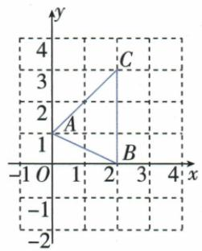
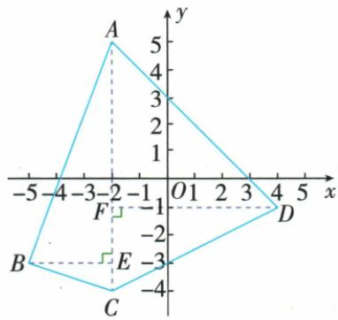

## 讲解

### 判据

坐标图有同横或同纵边，先选它作底；有轴向对角可把四边形拆成两个方便三角形。

### 流程

1. 按原坐标落点和连原顺序，确认轮廓与轴向边。
2. 底长用同一方向坐标差绝对值。
3. 高从对顶点到底所在直线取另一方向差，底不在轴时别用距轴代它。
4. 逐三角形底高÷2，割补说明哪些部分不重叠及覆盖全图。
5. 完整相加或相减，保面积单位与正值。

## 例题

### 坐标三角形直接底高与四边形割补

> 来源ID Q12-13；第12章平面直角坐标系；101-150/full.md 第3129–3131行。原答案与解析定位：101-150/full.md 第3175–3239行。

例3 (1)已知三角形 $ABC$ 三个顶点的坐标分别为 $A(0,1), B(2,0), C(2,3)$ . 在如图1所示的平面直角坐标系中画出三角形 $ABC$ , 并求出三角形 $ABC$ 的面积.

(2)如图2,四边形ABCD四个顶点的坐标分别为 $A(-2,5)$ , $B(-5,-3)$ , $C(-2,-4)$ , $D(4,-1)$ ,求四边形ABCD的面积.

**原资料答案与解析：**

解析（1） $\triangle ABC$ 如图 1 所示.

(直接法)因为点 B 和点 C 的横坐标相同,所以 $BC \parallel y$ 轴,BC=3.

又点 A 到 BC 的距离(即三角形 ABC 的高)为 2, 所以 $S_{\triangle ABC} = \frac{1}{2} \times 3 \times 2 = 3$ .

图1

图 2

(2)(割补法)如图2,连接AC,

∵ 点 A 与点 C 的横坐标相同, ∴ AC∥y 轴.

过点 B 作 $BE \perp AC$ 于点 E, 过点 D 作 $DF \perp AC$ 于点 F,

则 $BE = -2 - (-5) = 3, DF = 4 - (-2) = 6.$

$$
\because A (- 2, 5), C (- 2, - 4), \therefore A C = 5 - (- 4) = 9.
$$

$$
\therefore S _ {\text {四边形} A B C D} = S _ {\triangle A C B} + S _ {\triangle A C D} = \frac {1}{2} \times 9 \times 3 + \frac {1}{2} \times 9 \times 6 = \frac {8 1}{2}.
$$

**展开解析（依据原详解补足理由与步骤）：**

（1）按原点坐标落A(0,1)、B(2,0)、C(2,3)，B、C同横2形成竖直底BC=|3−0|=3。A到直线x=2的水平垂距|0−2|=2为高，面积(1/2)×3×2=3。

（2）A、C同横−2，AC竖直，长|5−(−4)|=9。原顺序ABCD围成的四边形由对角AC分为△ACB与△ACD，B在AC左侧、D在右侧，无面积重叠。B到x=−2水平距|−5−(−2)|=3，D到它距|4−(−2)|=6。分别面积(1/2)×9×3=27/2、(1/2)×9×6=27，相加81/2。底是整AC，高是到AC垂距，不是到y轴距离5与4；原81中的数位空格按两面积相加恢复。

## 易错

原AC位于x=−2，高分别3、6，不是5、4；81/2是两三角形27/2与27之和，不能跳到答案不说明底高。
