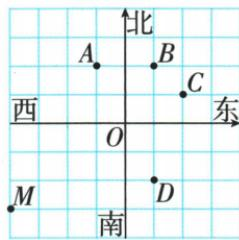
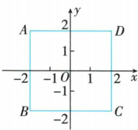
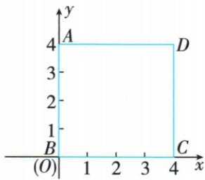
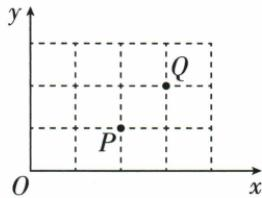

## 讲解

### 是什么

在平面取互相垂直且原点重合的两条数轴，构成平面直角坐标系。通常水平x轴向右正，竖直y轴向上正，交点O为原点。点A的坐标(a,b)中，a是向x轴垂直投影所落数值，b是向y轴投影数值。

### 怎么来的

数轴用一个实数定线上位置；平面点需要横、纵两个独立定位量。过点作两轴垂线得到两投影数值；反过来从x轴a处画平行y轴线、从y轴b处画平行x轴线，两线唯一相交，得到唯一点。这说明固定坐标系下每点与一对实数一一对应。原点投影均0，坐标(0,0)。

### 什么时候能用

两轴各自单位尺度要先确定，实际意义坐标注明单位。原网格P(2,1)说明每横格1、每竖格1；另M(−40,−30)题每格10米，不能跨题套比例。坐标是相对当前原点的定向位置，换原点或正方向会改变坐标，图形本身未必变化。

## 例题

### 已知M坐标确定每格尺度再判其他点

> 来源ID Q12-03；第12章平面直角坐标系；101-150/full.md 第2742–2750行。原答案与解析定位：101-150/full.md 第2752–2771行。

例2 如图,小明从点 O 出发,先向西走 40 米,再向南走 30 米到达点 M,若点 M 的位置用 $(-40,-30)$ 表示,则 $(10,20)$ 表示的是 ()

A.点 $A$

B.点 $B$

C. 点 C

D. 点 D

**原资料答案与解析：**

解析 点 M 的位置用 $(-40, -30)$ 表示, 则每一个小正方形的边长为 10 米, 那么 $(10, 20)$ 表示的是点 B.

# 答案 B

**展开解析（依据原详解补足理由与步骤）：**

原图M在O左4格下3格，实际(−40,−30)米，说明横竖每格各10米。目标(10,20)是O右1格上2格，对应B，选B。A左1格上2格为(−10,20)，C右2格上1格为(20,10)，D右1格下2格为(10,−20)，均不符合。先从已知点定比例，再读两轴，不能把格数(1,2)直接答成米坐标。

### 同一个边长四正方形两种建系

> 来源ID Q12-04；第12章平面直角坐标系；101-150/full.md 第2777–2777行。原答案与解析定位：101-150/full.md 第2779–2821行。

例3 已知正方形 ABCD 的边长为 4, 建立适当的平面直角坐标系, 写出各顶点的坐标.

**原资料答案与解析：**

解析 此题为开放性题, 答案不唯一, 只要合理即可.

解法一:以正方形的中心为原点,平行于正方形两邻边的直线为坐标轴建立如图1所示的平面直角坐标系,则各个顶点的坐标分别为 $A(-2,2)$ , $B(-2,-2)$ , $C(2,-2)$ , $D(2,2)$ .

解法二:以正方形的一个顶点为原点,两邻边所在的直线为坐标轴建立如图2所示的平面直角坐标系,则各个顶点的坐标分别为 $A(0,4)$ , $B(0,0)$ , $C(4,0)$ , $D(4,4)$ .

图1

图2

**展开解析（依据原详解补足理由与步骤）：**

中心作原点且轴平行边，边长4意味着中心到各边的横或竖距离2，左x=−2、右x=2，上y=2、下y=−2。按原图依次A(−2,2)、B(−2,−2)、C(2,−2)、D(2,2)。若以B为原点，BC正x、BA正y，两邻边各4，B(0,0)、C(4,0)、A(0,4)、D(4,4)。同点第二种坐标都比第一种各加2，几何图形大小未改变，只换坐标基准。原题开放，其他合理原点方向也可，但须明确轴与单位后再写坐标，不将一种答案说唯一。

### 由P读网格单位再确定Q逐项辨析

> 来源ID Q12-07；第12章平面直角坐标系；101-150/full.md 第2911–2931行。原答案与解析定位：101-150/full.md 第2876–2878行。

例2（2024 广西）如图,在平面直角坐标系中,点 O 为坐标原点,点 P 的坐标为(2,1),则点 Q 的坐标为()

A.(3,0)

B.(0,2)

C.(3,2)

D.(1,2)

**原资料答案与解析：**

例2 解析 由 $P(2,1)$ 可知,题图中小正方形的边长为1,则点Q的横坐标为3,纵坐标为2,即 $Q(3,2)$ .

答案C

**展开解析（依据原详解补足理由与步骤）：**

P在O右2格上1格且P(2,1)，故横竖每格分别1单位。Q右3格上2格，坐标(3,2)，C正确。A(3,0)落x轴，Q明在轴上方；B(0,2)落y轴，Q在轴右方；D(1,2)横坐标只1，在Q左侧。按两条垂直投影读横纵，不能拿Q与P相对差(1,1)当Q对O的坐标。

## 易错

横纵顺序不颠倒，不把与另一个点的相对差作对O坐标；原Q相对P为右1上1，但Q坐标(3,2)。
