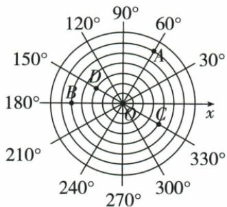

## 讲解

### 是什么

两个数按约定顺序组成(a,b)，称有序数对；每个位置分别表示一个确定量，顺序交换通常改变意思。数对能描述座位列排、东西南北位移，也能按题自定义圆层与角度，不能看到括号就默认横纵坐标。

### 怎么来的

仅说一个数通常只定位一列或一排，还留很多可能；第二个独立位置量同时限制，才可定到交点。同一套编号中，前后数意义固定，原(2,3)列2排3，与(3,2)列3排2不同。圆题首项不是横距离而是圆层，因此“一一对应”依赖题给规则和可用范围，不是任意两数都在每套实际编号中有座位。

### 什么时候能用

使用前先读约定、起点、方向、单位。东和北取正才把西南写负；座位排列一般正整数而直角坐标可任意实数。两数相等时交换数值看不出差别，但位置意义仍有顺序，不能由此取消约定。

## 例题

### 座位数对先列后排同列后移一排

> 来源ID Q12-01；第12章平面直角坐标系；101-150/full.md 第2619–2619行。原答案与解析定位：101-150/full.md 第2621–2623行。

例 小红坐在教室的第2列第3排,用(2,3)表示,小亮坐在小红正后方的第一个位置,则小亮的位置可以表示为\_\_\_\_.

**原资料答案与解析：**

解析 小亮坐在小红正后方的第一个位置,说明小亮也在第2列,但是在第4排,所以小亮的位置可表示为(2,4).

答案 (2,4)

**展开解析（依据原详解补足理由与步骤）：**

原(2,3)按第一数列、第二数排。正后方第一个位置列仍2，排从3加1到4，故(2,4)。不能写(3,3)把后移误作列增加，也不能颠倒顺序写(4,2)。座位的排号递增朝后是本题原解析约定，若另一教室编号约定不同，应按其约定。

### 东西前项南北后项正负指方向

> 来源ID Q12-02；第12章平面直角坐标系；101-150/full.md 第2732–2732行。原答案与解析定位：101-150/full.md 第2734–2736行。

例1 我们规定向东和向北为正,如向东走4米,再向北走6米,记作(4,6),则有序数对(6,4)表示\_\_\_\_;(-2,-6)表示\_\_\_\_.

**原资料答案与解析：**

解析 因为向东和向北为正,所以向西和向南为负.由题意知向东或向西的数字写在前,向南或向北的数字写在后.由有序数对的意义可得,(6,4)表示向东走6米,再向北走4米,(-2,-6)表示向西走2米,再向南走6米.

答案 向东走6米,再向北走4米;向西走2米,再向南走6米

**展开解析（依据原详解补足理由与步骤）：**

原以东为前项正方向、北为后项正方向。(6,4)就是东6米、北4米；(−2,−6)前项负为西2米、后项负为南6米。负号表示方向相反，路程长度仍2、6正数。相同起点与同一约定下(6,4)不能按原示范(4,6)交换含义。

### 圆坐标按圆层数与逆时针角读D

> 来源ID Q12-06；第12章平面直角坐标系；101-150/full.md 第2882–2907行。原答案与解析定位：101-150/full.md 第2872–2874行。

例1（2023江苏连云港）画一条水平数轴，以原点 $O$ 为圆心，过数轴上的每一刻度点画同心圆，过原点 $O$ 按逆时针方向依次画出与正半轴的角度分别为 $30^{\circ}, 60^{\circ}, 90^{\circ}, 120^{\circ}, \cdots, 330^{\circ}$ 的射线，这样就建立了“圆”坐标系。如图，在建立的“圆”坐标系内，我们可以将点 $A, B, C$ 的坐标分别表示为 $A(6, 60^{\circ}), B(5, 180^{\circ}), C(4, 330^{\circ})$ ，则点 $D$ 的坐标可以表示为 \_\_\_\_.

**原资料答案与解析：**

例1 解析 根据题图可知点 D 在从内向外数的第 3 个圆上, 且 OD 与 x 轴非负半轴的夹角为 $150^{\circ}$ , 故点 D 的坐标可以表示为 $(3, 150^{\circ})$ .

答案（3,150°）

**展开解析（依据原详解补足理由与步骤）：**

原圆坐标第一数是从内向外的圆层，第二数是从x正半轴逆时针量角，不能当横纵坐标。D在第三圆，射线角150°，故(3,150°)。检查原A第6圆60°、B第5圆180°、C第4圆330°与题给一致，说明读图计数起点正确。这个自定义坐标描述位置的方式不是通常直角坐标，括号写法相同仍须读题定含义。

## 易错

原(6,4)东6北4，不是東4北6；原(3,150°)是层3角150°，不能当直角坐标作象限号判断。
