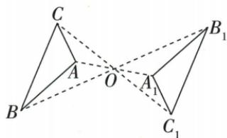
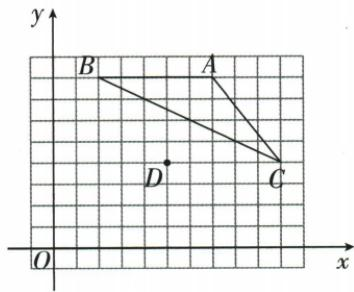
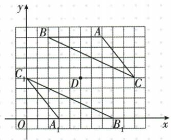

## 错法

原五结论把AB=AA₁当对；原点P(1,−4)只改横或纵坐标。

## 正解

AB的像边是A₁B₁，AA₁是原点与像点的位移连接，长度不保证等。原点对称要求两坐标同时反号，得(−1,4)；任意中心则用2h−x/2k−y，理由是中心平分每对连接线。

## 例题

### 中心对称五结论对应边与点移距逐项区分

> 来源ID Q25-38；第25章图形的轴对称平移与旋转；301-350/full.md 第1172–1174行。原答案与解析定位：301-350/full.md 第1176–1198行。

例2 如图, 已知 $\triangle ABC$ 和 $\triangle A_{1}B_{1}C_{1}$ 关于点 O 中心对称, 点 A, B, C 的对称点分别为点 $A_{1}, B_{1}, C_{1}$ . 下列结论: ① $\angle ABC = \angle A_{1}B_{1}C_{1}$ ; ② AB = AA\_{1}; ③ OA = OA\_{1};

④ $AC \parallel A_{1}C_{1}$ ; ⑤ $\triangle BOC \cong \triangle B_{1}OC_{1}$ . 其中正确的有 \_\_\_\_. (填序号)

**原资料答案与解析：**

解析 $\because \triangle ABC$ 和 $\triangle A_{1}B_{1}C_{1}$ 关于点 $O$ 中心对称， $\therefore \angle ABC = \angle A_{1}B_{1}C_{1}$ ，

$$
A B = A _ {1} B _ {1}, O A = O A _ {1}, A C / / A _ {1} C _ {1}, O B = O B _ {1}, O C = O C _ {1}, B C = B _ {1} C _ {1},
$$

$\therefore \triangle BOC \cong \triangle B_{1}OC_{1}$ , 故①③④⑤正确, ②错误.

答案 ①③④⑤

**展开解析（依据原详解补足理由与步骤）：**

①正确：对应顶点角ABC与A₁B₁C₁等。②错误：AB的对应边是A₁B₁，而AA₁是同一点与像点之间的连接线，不保证与AB等长。③正确：中心O平分AA₁。④按原图正确：AC与A₁C₁是不同对应边所在直线，半转后平行；一般位置也可能共线，不能脱离图写成必为两条不同平行线。⑤正确：OB=OB₁、OC=OC₁，同时半转保持夹角BOC，SAS得两三角全等。因此一定正确的是①③④⑤。

### 一点负四原点半转负一点四逐项分清其他变换

> 来源ID Q25-44；第25章图形的轴对称平移与旋转；301-350/full.md 第1362–1370行。原答案与解析定位：301-350/full.md 第1304–1306行。

例4（2024四川成都）在平面直角坐标系 $xOy$ 中，点 $P(1, - 4)$ 关于原点对称的点的坐标是 （）

A. $(-1,-4)$

B. $(-1,4)$

C.(1,4)

D. $(1,-4)$

**原资料答案与解析：**

例4 解析 两个点关于原点对称,则它们的横坐标互为相反数,纵坐标也互为相反数,故点(1,-4)关于原点对称的点的坐标是(-1,4).

答案B

**展开解析（依据原详解补足理由与步骤）：**

原点是两对应点连线中点，横纵坐标同时取相反数，P(1,−4)→(−1,4)，选B。A(−1,−4)只改横坐标，是y轴反射；C(1,4)只改纵坐标，是x轴反射；D(1,−4)为原点未移动，P本身不在原点所以半转不可能固定。

### 网格对五四半转求四边面积40并菱形画角分线

> 来源ID Q25-43；第25章图形的轴对称平移与旋转；301-350/full.md 第1340–1358行。原答案与解析定位：301-350/full.md 第1279–1302行。

例3（2024 安徽）如图，在由边长为 1 个单位长度的小正方形组成的网格中建立平面直角坐标系 $xOy$ ，格点（网格线的交点） $A, B, C, D$ 的坐标分别为 $(7,8), (2,8), (10,4), (5,4)$ .

(1)以点 D 为旋转中心, 将 $\triangle ABC$ 旋转 $180^{\circ}$ 得到 $\triangle A_{1}B_{1}C_{1}$ , 画出 $\triangle A_{1}B_{1}C_{1}$ .  
(2) 直接写出以 $B, C_{1}, B_{1}, C$ 为顶点的四边形的面积.  
(3)在所给的网格图中确定一个格点 E, 使得射线 AE 平分 $\angle BAC$ , 写出点 E 的坐标.

**原资料答案与解析：**

例3 解析（1）如图所示.

(2)40.

(3)(3,0)或(4,2)或(5,4)或(6,6).(写出一个即可)

提示:由图可知 AB=AC=CD=BD=5, 所以四边形 ABDC 为菱形, 所以 AD 平分 $\angle BAC$ , 所以在射线 AD 上的格点(不包括 A 点)都符合题意.

**展开解析（依据原详解补足理由与步骤）：**

(1)D(5,4)为中心，对应点两坐标之和分别10和8。A₁=(10−7,8−8)=(3,0)，B₁=(10−2,8−8)=(8,0)，C₁=(10−10,8−4)=(0,4)，按序连接。(2)四边形B-C₁-B₁-C由水平对角CC₁分成上下两三角，CC₁长10；B到y=4距离4，B₁到y=4也4，面积10×4/2+10×4/2=40。(3)AB=5，AC=√(3²+4²)=5，BD=√(3²+4²)=5，CD=5；四边形ABDC四边等为菱形，AD是从顶点A出的对角线，平分∠BAC。沿A到D的射线画角平分线，可取格点E=D(5,4)，也可取同射线上(6,6)、(4,2)、(3,0)。须先证明菱形角平分，不能凭网格点“看起来居中”就连。
