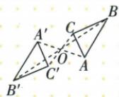
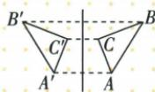
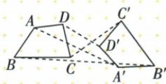
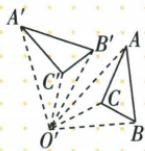
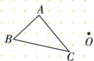
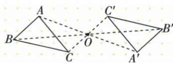
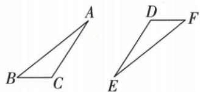
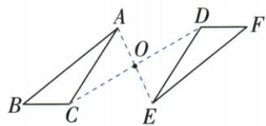

## 讲解

### 判据

题给中心作像或给两图找中心，统一使用对应点连接被同一中心平分。

### 流程

1.作像连AO并越O延长取OA′=OA，B/C同作，原顺序连像。2.找中心按ABC/EFD配A-E/B-F/C-D，先取AE中点，再检另两对也被它平分。3.原不同对应线AE/CD交点恰是中点可直接定位；如果两线重合仍用中点。4.选择图题每幅至少核两对顶点，A一幅全满足，其他并非指定180°对应。

## 例题

### 四图对应点同一中点识别中心对称第一幅

> 来源ID Q25-32；第25章图形的轴对称平移与旋转；301-350/full.md 第1070–1082行。原答案与解析定位：301-350/full.md 第1084–1084行。

例1 下列图形中,成中心对称的是 ( )

  
A

  
B

  
C

  
D

**原资料答案与解析：**

答案 A

**展开解析（依据原详解补足理由与步骤）：**

A中各对应顶点的连线都通过O，O平分每一条，两图半转后重合，符合中心对称。B是沿竖直轴的镜像，翻折重合却不在半转后重合；C的各对应点连线不能共同由O平分，即使两图形状相同也不能判中心对称；D的对应点从O看在同向或不同于180°方向，未满足反向等半径。因此选A。检验时固定题图对应点，不能换一套点配对来掩盖不符。

### 三角关于外点O半转逐点作等长反向延长线

> 来源ID Q25-34；第25章图形的轴对称平移与旋转；301-350/full.md 第1096–1098行。原答案与解析定位：301-350/full.md 第1100–1108行。

例3 如图, 已知 $\triangle ABC$ 和 $\triangle ABC$ 外一点 O, 作 $\triangle A'B'C'$ , 使其与 $\triangle ABC$ 关于点 O 成中心对称.

**原资料答案与解析：**

解析 所作图形如图所示.

**展开解析（依据原详解补足理由与步骤）：**

连AO并沿A→O方向延长，取OA′=OA，保证O在AA′内部且为中点；B/C同样作B′/C′，连A′B′C′。这样每对点从O看反向且等长，转角恰180°，整个三角形的半转像成立。单纯取OA′=OA但不限制A′在AO的反向延长线上会有无数点，不能确定中心对应点。原O在三角形外不影响作法，也无需O是原图中心。

### 三角对应A到E和C到D取中点交点确定对称中心

> 来源ID Q25-37；第25章图形的轴对称平移与旋转；301-350/full.md 第1148–1156行。原答案与解析定位：301-350/full.md 第1158–1166行。

例1 如图所示,已知 $\triangle ABC$ 和与其成中心对称的图形 $\triangle EFD$ ,请画图确定对称中心.

**原资料答案与解析：**

解析 如图, 连接 AE、CD 交于点 O, 点 O 就是对称中心.

**展开解析（依据原详解补足理由与步骤）：**

按△ABC与△EFD的字母顺序，A↔E、B↔F、C↔D。连AE与CD，原图两线交于O；再核O为AE/CD中点，或直接先取AE中点O并检验CD/BF也被O平分，所得即对称中心。原答案用两对应点连线交点定位，是因为此图两连线不共线；若对应线重合，不能从无限交点中任选一个，仍应取一对的中点并核另两对。

### 中心对称五结论对应边与点移距逐项区分

> 来源ID Q25-38；第25章图形的轴对称平移与旋转；301-350/full.md 第1172–1174行。原答案与解析定位：301-350/full.md 第1176–1198行。

例2 如图, 已知 $\triangle ABC$ 和 $\triangle A_{1}B_{1}C_{1}$ 关于点 O 中心对称, 点 A, B, C 的对称点分别为点 $A_{1}, B_{1}, C_{1}$ . 下列结论: ① $\angle ABC = \angle A_{1}B_{1}C_{1}$ ; ② AB = AA\_{1}; ③ OA = OA\_{1};

④ $AC \parallel A_{1}C_{1}$ ; ⑤ $\triangle BOC \cong \triangle B_{1}OC_{1}$ . 其中正确的有 \_\_\_\_. (填序号)

**原资料答案与解析：**

解析 $\because \triangle ABC$ 和 $\triangle A_{1}B_{1}C_{1}$ 关于点 $O$ 中心对称， $\therefore \angle ABC = \angle A_{1}B_{1}C_{1}$ ，

$$
A B = A _ {1} B _ {1}, O A = O A _ {1}, A C / / A _ {1} C _ {1}, O B = O B _ {1}, O C = O C _ {1}, B C = B _ {1} C _ {1},
$$

$\therefore \triangle BOC \cong \triangle B_{1}OC_{1}$ , 故①③④⑤正确, ②错误.

答案 ①③④⑤

**展开解析（依据原详解补足理由与步骤）：**

①正确：对应顶点角ABC与A₁B₁C₁等。②错误：AB的对应边是A₁B₁，而AA₁是同一点与像点之间的连接线，不保证与AB等长。③正确：中心O平分AA₁。④按原图正确：AC与A₁C₁是不同对应边所在直线，半转后平行；一般位置也可能共线，不能脱离图写成必为两条不同平行线。⑤正确：OB=OB₁、OC=OC₁，同时半转保持夹角BOC，SAS得两三角全等。因此一定正确的是①③④⑤。

## 易错

一般旋转中心不一定是对应点中点；这里严格180°，位置和等距两个条件齐备。
