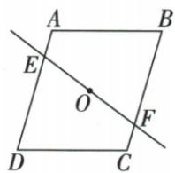

## 讲解

### 判据

截线经过平行四边形两条对角线的交点，且两个交点落在一组对边上。先想到以对角线交点为中心旋转180°：完整图形重合，截线也回到自身，可以同时找到对应线段和对应区域。

### 流程

1. 由平行四边形对角线互相平分，确认交点O既是AC的中点，也是BD的中点。因此半转后A与C对应、B与D对应；这一步给出了整个图形的对称中心。
2. 截线EF经过O，半转后仍是这条直线。它与一组对边的交点E、F随对应边互换，所以E与F对应；若截线不过O，就没有这个保证。
3. 按对应端点寻找线段。AE转成CF，旋转保持长度，因此原$AE=3$可转为$CF=3$。不是仅由“面积相等”推出线段等长。
4. 再看两块完整区域。AEFB半转后与EDCF重合，旋转保持面积，两块面积相同；原其中一块为15，另一块也为15。
5. 两块内部不重叠且拼成原平行四边形，才可相加得总面积30。求段长用保长度，求面积用保面积，虽然依据同一次半转，结论仍要分别说明。

## 例题

### 直线过平行四边中心用半转对应截段和两半面积

> 来源ID Q25-39；第25章图形的轴对称平移与旋转；301-350/full.md 第1204–1218行。原答案与解析定位：301-350/full.md 第1220–1222行。

例3 如图, 直线 EF 经过平行四边形 ABCD 的对角线的交点, 若 AE = 3, 四边形 AEFB 的面积为 15, 则 CF = \_\_\_\_, 四边形 EDCF 的面积为 \_\_\_\_, 平行四边形 ABCD 的面积为 \_\_\_\_.

**原资料答案与解析：**

解析 平行四边形是中心对称图形,两对角线的交点就是对称中心,过对称中心的直线把中心对称图形分成的两部分是全等图形,所以 $CF=AE=3$ , $S_{四边形EDCF}=S_{四边形AEFB}=15$ , 则 $S_{\square ABCD}=30$ .

答案 3;15;30

**展开解析（依据原详解补足理由与步骤）：**

平行四边形关于对角交点O中心对称，过O的直线EF半转后仍是同一直线。A→C、B→D，直线与对应边交点E→F，所以AE=CF=3。四边形AEFB与EDCF在半转后重合，面积相等，各为15；原平行四边形由两块不重叠拼成，面积15+15=30。平分面积的依据是完整图形中心对称与切线过中心，不能把任意一条截线都当等面积。

## 易错

截线不过O就不能保证这些对应；等面积不能单独推出AE=CF。
