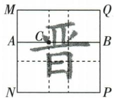

## 错法

看到“黄金分割点”就把所求子段乘0.618，只答一个值；或把短段与全长的比也叫0.618。容易出错是因为记住一个数，却没有记住这个比中的对象：黄金比是较长段/全长，同时等于较短段/较长段，并非任意子段/全长。

## 正解

先用题目明确的长短关系确定比的对象。记$g=(\sqrt{5}-1)/2$，则长段=g×全长，短段=(1−g)×全长。原$AB=2$、C为黄金点而未说AC较长：AC作为长段时为$\sqrt{5}-1$，作为短段时为$3-\sqrt{5}$，两种内部位置都要保留。

如果题目已经明确所求段是长段，只保留长段分支；不能为“分类”而再列与条件冲突的答案。0.618只是g的近似值，原题要求精确表达时仍用根式。两分支最后都要与补段相加回全长，并核对各段为正。

## 例题

### 全长二未指定长段的黄金点两值

> 来源ID Q26-03；第26章相似；301-350/full.md 第1454–1454行。原答案与解析定位：301-350/full.md 第1456–1462行。

例3 已知线段 AB=2，点 C 是线段 AB 的黄金分割点，则 AC 的长度为 \_\_\_\_.

**原资料答案与解析：**

解析∵线段AB=2,点C是线段AB的黄金分割点, $\therefore\frac{AC}{AB}=\frac{AC}{2}=$ $\frac{\sqrt{5}-1}{2}$ 或 $\frac{AB-AC}{AB}=\frac{2-AC}{2}=\frac{\sqrt{5}-1}{2}$ ,

∴ AC 的长度为 $\sqrt{5}-1$ 或 $3-\sqrt{5}$ .

答案 $\sqrt{5} - 1$ 或 $3 - \sqrt{5}$

注意 一条线段的黄金分割点有两个，当题中未指明线段被分成的两部分哪部分更长时，需要分类讨论.

**展开解析（依据原详解补足理由与步骤）：**

黄金比g=(√5−1)/2是较长段/全长，同时也是较短段/较长段。AB=2：若AC为长段，AC=2g=√5−1；若AC为短段，则另一段为2g，AC=2−2g=3−√5。两值都在(0,2)内且分别对应两侧黄金点；题未说明AC较长，必须两值。

### 正方习字格黄金长段由平行求AB二再得根五减一

> 来源ID Q26-08；第26章相似；301-350/full.md 第1685–1698行。原答案与解析定位：301-350/full.md 第1663–1665行。

例1 (2024 山西) 黄金分割是汉字结构最基本的规律. 借助如图的正方形习字格书写的汉字“晋”端庄稳重、舒展美观. 已知一条分割线的端点 $A, B$ 分别在习字格的边 $MN, PQ$ 上, 且 $AB \parallel NP$ , “晋”字的笔画“丶”的位置在 $AB$ 的黄金分割点 $C$ 处, 且 $\frac{BC}{AB} = \frac{\sqrt{5} - 1}{2}$ . 若 $NP = 2 \mathrm{~cm}$ , 则 $BC$ 的长为 \_\_\_\_ cm (结果保留根号).

**原资料答案与解析：**

例1 解析 ∵ 四边形 MNPQ 为正方形, ∴ $MN \parallel PQ$ , ∠N = 90°, ∵ AB ∥ NP, ∴ 四边形 ANPB 为平行四边形, ∵ ∠N = 90°, ∴ 四边形 ANPB 为矩形, ∴ NP = AB = 2 cm, ∵ $\frac{BC}{AB} = \frac{\sqrt{5} - 1}{2}$ , ∴ BC = ( $\sqrt{5} - 1$ ) cm.

答案 $(\sqrt{5} - 1)$

**展开解析（依据原详解补足理由与步骤）：**

正方形MN∥PQ，AB∥NP，A-N-P-B构成矩形，AB=NP=2 cm。题已明确BC/AB=g=(√5−1)/2，说明BC为长段，不再分短段支路。BC=2g=√5−1 cm。字形只提供背景，比例依题给条件，不依据所有汉字都黄金分割的泛化说法。
