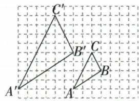
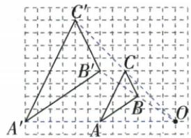
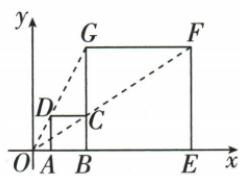
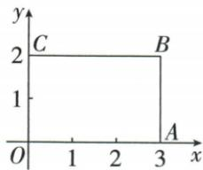

## 讲解

### 是什么

位似以固定O和同一个非零有向倍数t，将每个点P放到同一直线上，使相对O的水平、竖直偏移同时乘t。t>0时像点同侧，t<0时异侧；长度相似比为k=|t|>0。k>1放大、0<k<1缩小；t=−1就是中心对称，t=1恒等。

位似一定相似，而相似可以另有转动或平移，不一定是同中心径向缩放。识别位似不仅核对应连线共点，还要核统一倍数及同侧/异侧一致；对应边平行或共线也是重要检验。

### 怎么来的

每一点的相对偏移同乘t，两点间的差也同乘t，故边长乘|t|；t为负把所有方向同时反转，角关系仍保持。因而角同边同比，是相似。对应边方向差只整体同向或反向，所以平行或共线；中心到对应点长度比为k。原图网格三边各倍2，连线交O，并核同侧统一距离比2才确认位似。

非恒等变换t≠1时，一对不固定的对应点满足P′−O=t(P−O)，解得O=(P′−tP)/(1−t)，因此对应关系和t固定时中心唯一。t=1两图重合恒等，任意O都可描述，原无条件“中心只有一个”应排此外。

### 什么时候能用

一般点集有轴或多种配对时，先固定对应顺序。原资料只用“相似且对应连线共点”作定义，教学检验补入对应边平行与统一有向比，以排除并非径向统一缩放的情况。长度相似比正，未指同异侧时常有±k两支。

## 例题

### 三顶点到O各取中点位似比二分之一面积四分之一

> 来源ID Q26-30；第26章相似；301-350/full.md 第2646–2660行。原答案与解析定位：301-350/full.md 第2662–2664行。

例1 如图, $\triangle DEF$ 与 $\triangle ABC$ 是位似图形, 点 O 是位似中心, D、E、F 分别是 OA、OB、OC 的中点, 则 $\triangle DEF$ 与 $\triangle ABC$ 的面积比是 \_\_\_\_.

**原资料答案与解析：**

解析 $\because \triangle DEF$ 与 $\triangle ABC$ 是位似图形, 点 $O$ 是位似中心, $D, E, F$ 分别是 $OA, OB, OC$ 的中点, $\therefore \triangle DEF$ 与 $\triangle ABC$ 的相似比是 $\frac{1}{2}, \therefore \triangle DEF$ 与 $\triangle ABC$ 的面积比是 $\frac{1}{4}$ .

答案 $\frac{1}{4}$

**展开解析（依据原详解补足理由与步骤）：**

D/E/F分别为OA/OB/OC中点，所以有向比例OD/OA=OE/OB=OF/OC=1/2，同侧位似。对应各边也缩1/2，面积比平方为1/4。三角图形可能不以O作为自身中心，这不影响O作为缩放中心；不是三中点面积比1/2。

### 位似三辨析逆命题和逆向周长比仅第二项对

> 来源ID Q26-31；第26章相似；301-350/full.md 第2666–2666行。原答案与解析定位：301-350/full.md 第2668–2670行。

例2 下列说法: ① 若 $\triangle ABC \sim \triangle A'B'C'$ , 则 $\triangle ABC$ 与 $\triangle A'B'C'$ 是位似图形; ② 若四边形 $ABCD$ 与四边形 $A'B'C'D'$ 是位似图形, 则二者必定相似; ③ 若多边形 $A$ 与多边形 $B$ 是位似图形, 且前后两者的相似比为 $\frac{7}{4}$ , 则多边形 $B$ 与多边形 $A$ 的周长之比为 $\frac{7}{4}$ . 其中正确的是 .

**原资料答案与解析：**

解析 相似不一定位似,但位似必相似,所以①错,②对;若多边形A与多边形B的相似比为 $\frac{7}{4}$ ,则多边形B与多边形A的周长之比为 $\frac{4}{7}$ ,所以③错.

答案 ②

**展开解析（依据原详解补足理由与步骤）：**

①错：相似允许转动、平移等位置关系，未必关于同一中心统一径向缩放；②对：位似各边按同一倍数、各角保持，必相似；③错：A/B边比7/4，周比也7/4，但题问B/A顺序反过来，应4/7。因此只有②。

### 负四二以O放大二未定同异侧两个像点

> 来源ID Q26-32；第26章相似；301-350/full.md 第2674–2674行。原答案与解析定位：301-350/full.md 第2676–2678行。

例3 在平面直角坐标系中,已知点 $E(-4,2)$ , $F(-2,-2)$ , 以原点 O 为位似中心, 相似比为 2, 把 $\triangle EFO$ 放大, 则点 E 的对应点的坐标是 \_\_\_\_.

**原资料答案与解析：**

答案 $(-8,4)$ 或 $(8, - 4)$

注意 求位似变换后对应点的坐标时，若题目未指明放大或缩小后的图形与原图形在位似中心异侧还是同侧，则应将两种情况的坐标都写出.

**展开解析（依据原详解补足理由与步骤）：**

相似比2是正的长度放大倍数，题未指定同侧或异侧。同侧各坐标乘2，E′(−8,4)；异侧沿反向射线取双半径，各坐标乘−2，E″(8,−4)。F同时也按同一有向倍数移动，不能只给E改侧而其它点不改。两支均以O为中心，原E不在O，像点不同，均应保留。

### 网格三边同比二并对应连线同一O确认位似

> 来源ID Q26-33；第26章相似；301-350/full.md 第2707–2720行。原答案与解析定位：301-350/full.md 第2722–2745行。

例1 如图, 图中的小方格都是边长为 1 的正方形, $\triangle ABC$ 与 $\triangle A'B'C'$ 的顶点都在格点上. $\triangle A'B'C'$ 与 $\triangle ABC$ 是位似图形吗? 如果是, 在图上画出位似中心并求出相似比; 如果不是, 请说明理由.

**原资料答案与解析：**

解析 $\triangle A'B'C'$ 与 $\triangle ABC$ 是位似图形.

由勾股定理, 得 $AB = \sqrt{3^{2} + 2^{2}} = \sqrt{13}$ , $BC = \sqrt{2^{2} + 1^{2}} = \sqrt{5}$ , $AC = \sqrt{2^{2} + 4^{2}} = 2\sqrt{5}$ , $A'B' = \sqrt{6^{2} + 4^{2}} = 2\sqrt{13}$ , $B'C' = \sqrt{4^{2} + 2^{2}} = 2\sqrt{5}$ , $A'C' = \sqrt{4^{2} + 8^{2}} = 4\sqrt{5}$ .

因为 $\frac{A^{\prime}B^{\prime}}{AB}=2,\frac{B^{\prime}C^{\prime}}{BC}=2,\frac{A^{\prime}C^{\prime}}{AC}=2,$

所以 $\frac{A^{\prime}B^{\prime}}{AB}=\frac{B^{\prime}C^{\prime}}{BC}=\frac{A^{\prime}C^{\prime}}{AC}$ ，所以 $\triangle A^{\prime}B^{\prime}C^{\prime}\sim\triangle ABC.$

如图, 连接 $A^{\prime}A, B^{\prime}B, C^{\prime}C$ 并延长, 相交于一点 O,

因此 $\triangle A^{\prime}B^{\prime}C^{\prime}$ 与 $\triangle ABC$ 是位似图形,点O即为位似中心,相似比为2.

**展开解析（依据原详解补足理由与步骤）：**

原图边的水平/竖直格数：AB为3/2，BC为2/1，AC为2/4，勾股分别√13、√5、2√5；像边格数各倍2，边长2√13、2√5、4√5，三边同比2，故三角相似。再按A-A′/B-B′/C-C′连接延长，原图交同一O，各对应点在O同侧，径向距离比2且对应边平行，故本题为同侧位似，相似比像/原=2。仅证明三边同比只得到相似，还须核统一缩放中心与方向。

### 同侧一三两正方大边六用OB比OB加六得C三二

> 来源ID Q26-34；第26章相似；301-350/full.md 第2751–2764行。原答案与解析定位：301-350/full.md 第2766–2774行。

例2 如图,在平面直角坐标系中,正方形 ABCD 与正方形 BEFG 是以点 O 为位似中心的位似图形,且相似比为 $\frac{1}{3}$ ,两个正方形在点 O 的同侧,点 A、B、E 在 x 轴上,其余顶点在第一象限内,若正方形 BEFG 的边长为 6,则点 C 的坐标为 \_\_\_\_.

**原资料答案与解析：**

解析∵正方形ABCD与正方形BEFG是以点O为位似中心的位似图形,相似比为 $\frac{1}{3},EF=6,$

$$
\therefore \frac {O C}{O F} = \frac {O B}{O E}, B C = 2, \text {又} \angle C O B = \angle F O E, \therefore \triangle O B C \sim \triangle O E F, \therefore \frac {O B}{O E} = \frac {B C}{E F}, \text {即} \frac {O B}{O B + 6} = \frac {1}{3}, \therefore O B = 3,
$$

∴ 点 C 的坐标为 $(3,2)$ .

答案 (3,2)

**展开解析（依据原详解补足理由与步骤）：**

小正方ABCD/大正方BEFG相似比1/3，大边6，所以小边BC2。对应B↔E，同侧径向OB/OE=1/3；原O-A-B-E序给OE=OB+BE=OB+6。设OB=x，x/(x+6)=1/3，乘3(x+6)得3x=x+6，同减x得2x=6，x3。C在B正上2，故C(3,2)。小边2是高度，不代表OB也2；原B同时是小形顶点及大形另一顶点，要严格按给定对应顺序。

### 四边关于O二倍放大分别沿AO异侧与OA同侧

> 来源ID Q26-35；第26章相似；301-350/full.md 第2780–2786行。原答案与解析定位：301-350/full.md 第2788–2798行。

例3 如图,分别按下列要求作出四边形 ABCD 以 O 点为位似中心的位似四边形.

(1) 沿 AO 方向, 相似比为 2, 把四边形 ABCD 放大.

(2) 沿 OA 方向, 相似比为 2, 把四边形 ABCD 放大.

**原资料答案与解析：**

解析（1）分别连接并延长 AO, BO, CO, DO，在延长线上找点 $A', B', C', D'$ ，使得 $2AO = OA', 2BO = OB'$ ， $2CO = OC', 2DO = OD'$ ，连接 $A'B', B'C', C'D', D'A'$ ，则四边形 $A'B'C'D'$ 为所求作的四边形.

(2) 分别连接并延长 OA, OB, OC, OD，在延长线上找点 $A''$ , $B''$ , $C''$ , $D''$ ，使得 $2AO = OA''$ , $2BO = OB''$ , $2CO = OC''$ , $2DO = OD''$ ，连接 $A''B''$ , $B''C''$ , $C''D''$ , $D''A''$ ，则四边形 $A''B''C''D''$ 为所求作的四边形.

**展开解析（依据原详解补足理由与步骤）：**

(1)沿AO方向越过O，在每条AO/BO/CO/DO的对应反向射线上取像点，使OA′=2OA等，得到异侧二倍像；按A′-B′-C′-D′顺序连接。(2)沿OA方向在从O指向原各点的同向射线上截双半径，得到同侧二倍像，顺序连接。两种均保持原边夹角，边长倍2面积倍4，但位置相反；题已分别指定方向，每小问只画相应一支，不把二者合一图当一种操作。

### 原点矩形缩三分之一限定第一象限取一与三分之二

> 来源ID Q26-36；第26章相似；301-350/full.md 第2806–2825行。原答案与解析定位：301-350/full.md 第2829–2831行。

例（2024黑龙江绥化）如图，矩形OABC各顶点的坐标分别为 $O(0,0)$ ， $A(3,0)$ ， $B(3,2)$ ， $C(0,2)$ ，以原点O为位似中心，将这个矩形按相似比 $\frac{1}{3}$ 缩小，则顶点B在第一象限对应点的坐标是()

A.(9,4)

B.(4,9)

C. $\left(1,\frac{3}{2}\right)$

D. $\left(1,\frac{2}{3}\right)$

**原资料答案与解析：**

例 解析 点 B 在第一象限对应点的坐标是 $\left(\frac{1}{3} \times 3, \frac{1}{3} \times 2\right)$ ，即 $\left(1, \frac{2}{3}\right)$ .

答案D

**展开解析（依据原详解补足理由与步骤）：**

B(3,2)，同侧缩1/3给(1,2/3)，仍第一象限；异侧会(−1,−2/3)，不符合题限定，所以只取同侧D。A(9,4)横纵倍数不同且放大；B(4,9)同样不统一；C(1,3/2)横缩1/3但纵缩3/4，不是统一比例，均错。

## 易错

两个相似三角未必位似，原辨析①错；只将某点反向而其它点同向也不是同一次位似。
