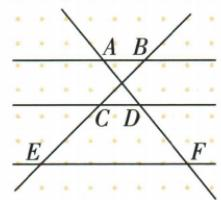
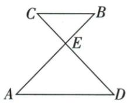
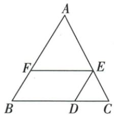
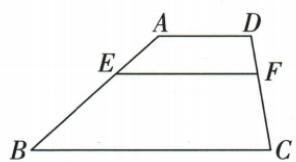
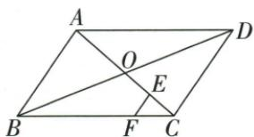

## 讲解

### 是什么

两条不同直线被一组三条平行线所截，相邻两层之间的对应线段成比例；上/下、上/全、下/全须左右使用同一层次。图形交叉时仍按哪两条平行线截出的段来配，不按视觉左右或字母相邻猜。

三角形中DE∥BC截两边给AD/AB=AE/AC；D/E在边内时还能写AD/DB=AE/EC。延长线上时全段的加减由真实点序决定，不能一律“上+下”。

### 怎么来的

先看三角型：DE∥BC提供平行线等角，加共有A角，AA使ADE与ABC相似，对应边比给AD/AB=AE/AC。边内再由DB=AB−AD、EC=AC−AE，以同一比的余量可得上/下等式。

一般两截线可把一条平移到两线相交的方便位置，平移不改变各层截段长度，转成两相似三角形的对应比；同样三条平行线提供对应角。原交叉三平行图AD对应BC、DF对应CE，是按层配，直线相交点不改变这套配法。

### 什么时候能用

三个平行位置不同、截线不与它们平行，相关段长非零。证比例先交代平行条件；反向仅靠一个比例式是否能判平行需要相同三角内位置等前提，不无条件逆用。

## 例题

### 三平行线交叉截段上三下四求AF21

> 来源ID Q26-04；第26章相似；301-350/full.md 第1466–1476行。原答案与解析定位：301-350/full.md 第1478–1482行。

例4 如图, 已知 $AB \parallel CD \parallel EF$ , $\frac{BC}{CE}=\frac{3}{4},AD=9$ , 则 AF 的长度为 \_\_\_\_.

**原资料答案与解析：**

解析 $\because AB \parallel CD \parallel EF, \frac{BC}{CE} = \frac{3}{4}, \therefore \frac{AD}{DF} = \frac{BC}{CE} = \frac{3}{4}$ , 又 $\because AD = 9, \therefore \frac{9}{DF} = \frac{3}{4}, \therefore DF = 12, \therefore AF = AD + DF = 9 + 12 = 21.$

答案 21

注意 在应用平行线分线段成比例定理时，需注意线段的对应，如 $\frac{\text{上}}{\text{下}} = \frac{\text{上}}{\text{下}}$ ， $\frac{\text{上}}{\text{全}} = \frac{\text{上}}{\text{全}}$ ，并注意所求线段是否与已知比例中的线段对应.

**展开解析（依据原详解补足理由与步骤）：**

三条平行线截两条直线，BC与AD来自同一上层两线，CE与DF来自同一下层两线，所以AD/DF=BC/CE=3/4。AD9给9/DF=3/4，交叉相乘36=3DF，DF12；A-D-F按序，AF=9+12=21。AF是全段，不能把它直接放到下段DF所在比例位置。

### X型全长十六分三五和二次平行传比两问都十

> 来源ID Q26-06；第26章相似；301-350/full.md 第1569–1600行。原答案与解析定位：301-350/full.md 第1602–1614行。

例2 (1)如图 1,AB 与 CD 相交于点 E,AD∥BC, $\frac{BE}{AE}=\frac{3}{5}$ ,CD=16,则 DE 的长为 \_\_\_\_.

(2)如图 2, $DE \parallel AB, EF \parallel BC, AF = 15, FB = 9, CD = 6$ , 则 BD 的长为 \_\_\_\_.

图 1

图 2

**原资料答案与解析：**

解析 (1) $\because AD \parallel BC, \therefore BE:AE=CE:DE=3:5,$

$$
\because C D = 1 6, C E + D E = C D, \therefore D E = \frac {5}{8} \times 1 6 = 1 0.
$$

(2) $\because EF \parallel BC, AF = 15, FB = 9, \therefore \frac{AF}{BF} = \frac{AE}{EC} = \frac{5}{3}, \because DE \parallel AB, \therefore \frac{AE}{EC} = \frac{BD}{CD} = \frac{5}{3},$

$$
\therefore \frac {B D}{6} = \frac {5}{3}, \therefore B D = 1 0.
$$

答案 (1)10 (2)10

**展开解析（依据原详解补足理由与步骤）：**

(1)AD∥BC，对顶角与平行角给X型对应，BE:AE=CE:DE=3:5。C-E-D按序，CD=CE+DE16，因此8份=16，每份2，DE5份=10。(2)EF∥BC给AE/EC=AF/FB=15/9=5/3；DE∥AB再给BD/CD=AE/EC=5/3。CD6，所以BD=6×5/3=10。第一问全长16需用3+5作份数，第二问两个比例通过同一AE/EC传递，不能随意把两图的段拼一起。

### 中点与三二底边过D作平行线传比求AE比BE三五

> 来源ID Q26-07；第26章相似；301-350/full.md 第1620–1633行。原答案与解析定位：301-350/full.md 第1635–1643行。

例3 如图, $\triangle ABC$ 中,D 在 BC 边上,F 是 AD 的中点,连接 CF 并延长,交 AB 于点 E,已知 $\frac{CD}{BD}=\frac{3}{2}$ ,则 $\frac{AE}{BE}$ 等于 \_\_\_\_.

**原资料答案与解析：**

解析 作 $DG \parallel CE$ ，交 $AB$ 于点 $G$ ，则 $\frac{BG}{GE} = \frac{BD}{DC} = \frac{2}{3}$ ，设 $BG=2x(x>0)$ ，则 GE=3x，

∵ $EF \parallel DG, F$ 是 AD 的中点, ∴ $\frac{AE}{EG} = \frac{AF}{FD} = 1$ ,

$$
\therefore A E = E G = 3 x, \therefore \frac {A E}{B E} = \frac {3 x}{3 x + 2 x} = \frac {3}{5}.
$$

答案 $\frac{3}{5}$

**展开解析（依据原详解补足理由与步骤）：**

过D作DG∥CE，交AB于G。BC两段BD:DC=2:3，通过这组平行线给BG:GE=2:3。设BG=2x、GE=3x，x>0。又EF在CE上平行DG，F为AD中点，AF/FD=1，所以AE/EG=1，AE=EG=3x。原A-E-G-B按序，BE=EG+GB=5x，AE/BE=3x/(5x)=3/5。辅助G使已知底边比与中点分别作用到同一AB直线上。

### 平行四边边中三条平行线一二比求FC6逐项

> 来源ID Q26-09；第26章相似；301-350/full.md 第1702–1723行。原答案与解析定位：301-350/full.md 第1667–1681行。

例2 (2024 黑龙江哈尔滨) 如图, 在四边形 ABCD 中, $AD \parallel BC$ , 点 E 在 AB 上, $EF \parallel AD$ 交 CD 于点 F, 若 AE:BE=1:2, DF=3, 则 FC 的长为 ( )

A.6

B.3

C.5

D.9

**原资料答案与解析：**

例2 解析∵在四边形ABCD中,AD∥BC,EF∥AD,

$$
\therefore A D \parallel E F \parallel B C,
$$

$$
\therefore \frac {A E}{E B} = \frac {D F}{F C}, \text {即} \frac {1}{2} = \frac {3}{F C},
$$

$$
\therefore F C = 6.
$$

答案A

**展开解析（依据原详解补足理由与步骤）：**

AD∥EF∥BC，所以AE/EB=DF/FC。代1/2=3/FC，两边乘2FC，FC=6，A。B3等于DF却忽略1:2；C5不满足3/FC=1/2；D9是DF+FC整段CD，题问的是FC，故错误。

### 平行四边半对角再中点CE四分之一求EF一

> 来源ID Q26-24；第26章相似；301-350/full.md 第2246–2268行。原答案与解析定位：301-350/full.md 第2215–2220行。

例4 (2024 河南) 如图, 在 $\square ABCD$ 中, 对角线 $AC, BD$ 相交于点 $O$ , 点 $E$ 为 $OC$ 的中点, $EF \parallel AB$ 交 $BC$ 于点 $F$ . 若 $AB = 4$ , 则 $EF$ 的长为 ( )

A. $\frac{1}{2}$

B.1

C. $\frac{4}{3}$

D.2

**原资料答案与解析：**

例4 解析 ∵ 点 O 为 AC 的中点，
点 E 为 OC 的中点，∴ $CE = \frac{1}{4}AC$ ,
∵ EF // AB, ∴ △EFC ∼ △ABC,
∴ $\frac{EF}{AB}=\frac{CE}{AC}=\frac{1}{4}$ , ∴ $EF=\frac{1}{4}AB=1$ .

答案B

**展开解析（依据原详解补足理由与步骤）：**

平行四边对角互平分，OC=AC/2；E为OC中点，CE=OC/2=AC/4。EF∥AB，△CEF∽△CAB，EF/AB=CE/CA=1/4。AB4给EF1，B。A1/2误把又一次中点当另一份边长；C4/3不满足四分之一比例；D2只做OC的一次平分而漏E中点。

## 易错

AF全段不对应CE下段；原DF12与AF21要按A-D-F序分别求。
