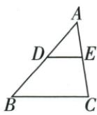
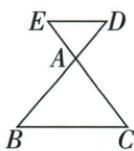
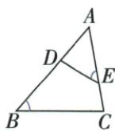
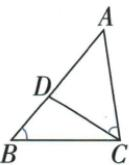
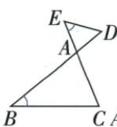
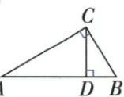

## 讲解

### 是什么

在直角△ABC中C为直角，D为斜边AB上的垂足。△ACD、△CBD和原△ABC两两相似。可得AC²=AB·AD、BC²=AB·BD、CD²=AD·BD；前两式表示直角边平方等于斜边乘其相邻投影，后一式表示高平方等于两投影乘积。

字母位置不可互换：靠近A的投影AD对应AC，靠近B的BD对应BC。

### 怎么来的

ACD与ABC共有A，D/C均90；CBD与ABC共有B，D/C均90，由AA得到三个相似。第一对相似中AC/AB=AD/AC，交叉乘积给AC²=AB·AD；另一对BC/AB=BD/BC同理。两小三角比较，AD/CD=CD/BD，交叉得CD²=AD·BD。每个等式先有具体三角和对应边，不从“高垂直”直接背乘积。

三个正长度条件由原非退化直角三角且高落斜边内部保证；如果D为任意边上的点而不是垂足，缺直角就不能作此证明。

### 什么时候能用

本章原图提供理论模型，没有与这些乘积直接匹配的独立数值例题；模型证明如实单列，不自编题凑齐考点。可以先AA再按具体题求比，不必记全部乘积。

## 例题

### 斜边高母子三角三相似与一线三角原模型证明

> 来源ID Q26-39；第26章相似；301-350/full.md 第1788–1810行。原答案与解析定位：301-350/full.md 第1788–1810行。

# 2. 常见的基本图形

  
图①

  
图②

  
图③

  
图④

  
图⑤

  
图⑥

图①和图②分别为“A型”图和“X型”图,条件是 $DE \parallel BC$ ,基本结论是 $\triangle ADE \sim \triangle ABC$ ;图③④是图①的变形图;图⑤是图②的变形图.

图⑥是“母子型”图,条件是 CD 为直角 $\triangle ABC$ 斜边上的高,基本结论是 $\triangle ACD \sim \triangle ABC \sim \triangle CBD$ .

**原资料答案与解析：**

# 2. 常见的基本图形

  
图①

  
图②

  
图③

  
图④

  
图⑤

  
图⑥

图①和图②分别为“A型”图和“X型”图,条件是 $DE \parallel BC$ ,基本结论是 $\triangle ADE \sim \triangle ABC$ ;图③④是图①的变形图;图⑤是图②的变形图.

图⑥是“母子型”图,条件是 CD 为直角 $\triangle ABC$ 斜边上的高,基本结论是 $\triangle ACD \sim \triangle ABC \sim \triangle CBD$ .

**展开解析（依据原详解补足理由与步骤）：**

斜边高模型：ABC在C直角、CD⊥AB。ACD与ABC共有A角且D/C均90°，AA相似；CBD与ABC共有B角且D/C均90°，也相似；故三个三角按正确对应角顺序相似。进一步由AC/AB=AD/AC得AC²=AB·AD，由BC/AB=BD/BC得BC²=AB·BD，由AD/CD=CD/BD得CD²=AD·BD。这些乘积来自明确对应，不是所有共斜边的小三角都可用。原图只给模型，无独立数值题，不编题补空。

## 易错

不能把一般锐角/钝角三角的高分图也当三个相似；原三等角全等还需边等，已有旧条目另作区分。
