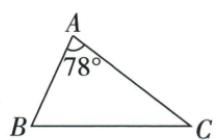
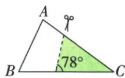
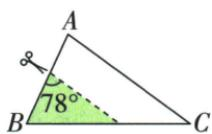
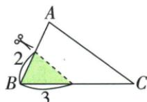
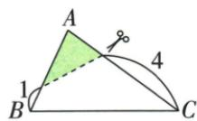
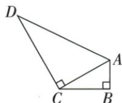
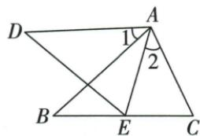
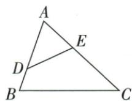
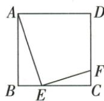

## 讲解

### 是什么

SAS相似：两对对应边成同一比例，且这两边的夹角相等。SSS相似：三对对应边成同一比例。它们与全等判定区别在“边等”改为“边同比”，且须统一对应順序。

两边比例加非夹角不能作为一般判据，可能出现两种不同三角。直角形斜边和一直角边同比是另一个可行条件，其理由来自勾股补出第三边同比。

### 怎么来的

若两边同比k，把其中一形按1/k缩到两邻边与另一形等长，夹角也相等，SAS全等给缩后形与另一形一致，原两形相似。SSS同样将三边缩到分别相等，再SSS全等。

直角两形斜边c/c′和腿a/a′均为k，则c=kc′、a=ka′。另一腿平方b²=c²−a²=k²(c′²−a′²)=k²b′²；两长度正，b=kb′，于是三边同比，SSS相似。非直角的SSA没有这条平方差约束，不能照搬。

### 什么时候能用

用SAS前明确已知等角顶点的两条邻边；边积式先除正长度改成这两边的比例。原正方形ABE/ECF两比例腿恰夹90，原两直角8/4/2/2√3可用斜腿同比。

## 例题

### 七十八度三角四种剪法核两角或夹角比例排C

> 来源ID Q26-13；第26章相似；301-350/full.md 第1981–1995行。原答案与解析定位：301-350/full.md 第1997–1999行。

例2 如图, $\triangle ABC$ 中, $\angle A = 78^{\circ}, AB = 4, AC = 6$ . 将 $\triangle ABC$ 沿图示中的虚线剪下一部分, 剪下的阴影三角形与原三角形不相似的是 ( )

  
A

  
B

  
C

  
D

**原资料答案与解析：**

解析 选项 A 与 B 中剪下的阴影三角形分别与原三角形有两组角对应相等, 可得阴影三角形与原三角形相似; 选项 D 中剪下的阴影三角形与原三角形都有两边之比是 2:3, 且两边的夹角对应相等, 所以两个三角形相似, 故选 C.

# 答案 C

**展开解析（依据原详解补足理由与步骤）：**

A的阴影三角与原图共享C角，题图另一角均78°，AA相似；B共享B角，另一角对应78°，AA相似；D原AB4、AC6，图示去掉靠B端1与靠C端4，留下邻A两边3和2；它们分别对应原AC6和AB4，比均1/2，夹角都是A78°，SAS相似（B/C对应交换）。C的阴影两边标2/3，其夹角在B，不能把原AB4/AC6的比配到同一夹角A；原剪法没有保持那一组对应顶角和边的比例关系，C为原图不相似的一项。判断相似不能只见两边比2:3就跳过夹角和实际对应位置；这只说明不能用这套SAS判据，单凭判据不足不能反推“不相似”。原资料缺C的完整初中反证；保留这一解析缺口，独立数值几何复核支持答案C，未将该数值核验冒充原详解。

### 两直角三角斜边与一直角边比例二补勾股证明相似

> 来源ID Q26-14；第26章相似；301-350/full.md 第2001–2002行。原答案与解析定位：301-350/full.md 第2004–2010行。

例3 如图, 在 Rt△ACB 和 Rt△ADC 中, ∠B = ∠ACD = 90°, AD = 8, AB = 2, BC = 2√3.
求证: Rt△ACB ∼ Rt△ADC.

**原资料答案与解析：**

证明 在 Rt△ACB 中, $\angle B=90^{\circ}$ , 由勾股定理, 得 $AC=\sqrt{AB^{2}+BC^{2}}=4$ .

$$
\because \frac {A C}{A B} = \frac {4}{2} = 2, \frac {A D}{A C} = \frac {8}{4} = 2, \therefore \frac {A C}{A B} = \frac {A D}{A C}. \therefore \mathrm{Rt} \triangle A C B \sim \mathrm{Rt} \triangle A D C.
$$

**展开解析（依据原详解补足理由与步骤）：**

第一三角B90，AC²=AB²+BC²=2²+(2√3)²=16，AC4；第二三角C90、AD8，其另一腿CD²=AD²−AC²=64−16=48，CD4√3。按ACB对应ADC：斜边AC/AD=4/8=1/2，直角边AB/AC=2/4=1/2，另一腿BC/CD=(2√3)/(4√3)=1/2，三边比例同，SSS相似。原“斜边与一直角边成比例”可用，依据是勾股补出第二腿的同比，不是一般SSA。

### 边积改比例共A两角差用SAS相似再平角同减

> 来源ID Q26-18；第26章相似；301-350/full.md 第2102–2104行。原答案与解析定位：301-350/full.md 第2106–2128行。

例7 如图, 在 $\triangle ABC$ 与 $\triangle ADE$ 中, 点 E 为 BC 边上一点, 且 $\angle 1 = \angle 2, AD \cdot AC = AB \cdot AE$ .

求证: $\angle2=\angle DEB.$

**原资料答案与解析：**

证明 $\because \angle 1 = \angle 2, \therefore \angle DAE = \angle BAC, \because AD \cdot AC = AB \cdot AE, \therefore \frac{AD}{AB} = \frac{AE}{AC},$

$$
\therefore \triangle A D E \sim \triangle A B C, \therefore \angle A E D = \angle A C B.
$$

$$
\because \angle 2 + \angle A C B + \angle A E C = 1 8 0 ^ {\circ} = \angle D E B + \angle A E D + \angle A E C, \therefore \angle 2 = \angle D E B.
$$

**展开解析（依据原详解补足理由与步骤）：**

原∠1=∠2，两边同加公共∠BAE，得DAE=BAC。AD·AC=AB·AE，各长度正，除AB·AC得AD/AB=AE/AC；这是等夹角A两邻边的同比，所以△ADE∽△ABC，AED=ACB。△AEC角和给∠2+ACB+AEC=180°；原B-E-C按序，DEB+AED+AEC也等180°。同减相等AED/ACB与AEC，得到∠2=DEB。边积不直接推出任意两个三角相似，需夹角对应。

### 添相似条件按ADE对ACB的交换顺序

> 来源ID Q26-21；第26章相似；301-350/full.md 第2224–2226行。原答案与解析定位：301-350/full.md 第2201–2203行。

例1 (2024 山东滨州) 如图, 在 $\triangle ABC$ 中, 点 $D, E$ 分别在边 $AB, AC$ 上. 添加一个条件使 $\triangle ADE \sim \triangle ACB$ , 则这个条件可以是 \_\_\_\_. (写出一种情况即可)

**原资料答案与解析：**

例1 解析 $\because \angle DAE = \angle CAB$ ， $\therefore$ 添加条件 $\angle ADE = \angle C$ 或 $\angle AED = \angle B$ 或 $AD: AC = AE: AB$ ，均可判定 $\triangle ADE \sim \triangle ACB$ .

答案 $\angle ADE = \angle C$ （答案不唯一）

**展开解析（依据原详解补足理由与步骤）：**

共有A角相等，但指定△ADE∽△ACB表示D↔C、E↔B。可添加ADE=C；则两角等AA相似。也可添加AED=B；或AD/AC=AE/AB，等A夹角两邻边比例，SAS相似。题只需一种，可写ADE=C；不随意写DE∥BC，因为平行通常给ADE∽ABC而不是已指定的ACB交换顺序。

### 正方三六二拼BC九两直角边比例三二证ABE与ECF

> 来源ID Q26-22；第26章相似；301-350/full.md 第2228–2230行。原答案与解析定位：301-350/full.md 第2205–2209行。

例2 (2024 广东广州) 如图, 点 E, F 分别在正方形 ABCD 的边 BC, CD 上, BE = 3, EC = 6, CF = 2. 求证: $\triangle ABE \sim \triangle ECF$ .

**原资料答案与解析：**

例2 证明 $\because BE = 3, EC = 6,$ $\therefore BC = 9,$ 四边形ABCD是正方形， $\therefore AB = BC = 9, \angle B = \angle C =$ $90^{\circ}, \because \frac{AB}{EC} = \frac{9}{6} = \frac{3}{2}, \frac{BE}{CF} = \frac{3}{2},$

$$
\therefore \frac {A B}{E C} = \frac {B E}{C F}, \therefore \triangle A B E \sim \triangle E C F.
$$

**展开解析（依据原详解补足理由与步骤）：**

BC=BE+EC=3+6=9，正方AB=BC9。两三角B/C均90°；AB/EC=9/6=3/2，BE/CF=3/2，两比例边正夹已知直角。SAS相似判定得△ABE∽△ECF。AB不能误用EC6，BE不能误用整BC9；字母順序A↔E/B↔C/E↔F与两比一致。

## 易错

相似式ADE∽ACB指定交换D/E，所补比例应AD/AC=AE/AB，而不是AD/AB=AE/AC。
