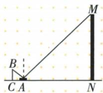
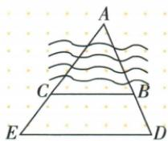
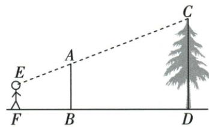
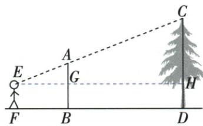
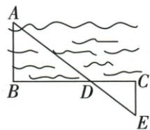
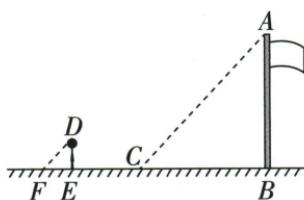

## 讲解

### 是什么

把物体高度或宽度当某三角的一边，再构造一条便于测量的对应边及一组可测边比，用AA相似将不可测量转成可测量。三种测高来源不同：同刻太阳光线近似平行、眼睛标杆顶目标顶共线、水平镜的反射角等入射角。

模型条件属于测量依据，不能省略：物体竖直、基线水平且高度参照一致；河宽线要垂直河岸，否则测得是斜距。

### 怎么来的

太阳模型两直角加同一光线方向角，故高度/影长同一比；不同时间方向可能改变，不能混用。标杆视线模型先在眼高作水平线，上方两竖直高度差与水平视距形成相似小三角，算得目标超眼高度后加回眼高。镜面水平时反射角相等是资料采用的物理依据，与地面夹角为这两角的余角也相等，再加竖直角AA。河宽X型以两垂直和D处对顶角AA，A型以平行角和共有顶角AA。

### 什么时候能用

测长单位统一，精度依原要求保留；镜子水平、无障碍且观测点合法，视线模型三点共线。现实地面坡度或太阳不同时刻破坏条件时，不把同一比例硬用。

## 例题

### 镜中楼顶眼高一点六镜距一点五楼距二十求21点3

> 来源ID Q26-25；第26章相似；301-350/full.md 第2395–2403行。原答案与解析定位：301-350/full.md 第2405–2423行。

例1 如图,小明为了测量楼房MN的高度,在离N点20 m的A处放了一个平面镜(平面镜的厚度忽略不计),小明从A处沿NA方向走到C点,正好从镜中看到楼顶M点,若AC=1.5 m,小明眼睛离地面的高度BC为1.6 m,则楼房MN的高度约为\_\_\_\_(结果保留小数点后一位).

**原资料答案与解析：**

解析：光线的反射角等于入射角，且等角的余角相等，

$$
\begin{array}{l} \therefore \angle B A C = \angle M A N. \because B C \perp C N, \\ M N \perp C N, \therefore \angle B C A = \angle M N A = \\ 9 0 ^ {\circ}, \therefore \triangle B C A \sim \triangle M N A. \end{array}
$$

$$
\therefore \frac {B C}{M N} = \frac {A C}{A N}, \text { 即 } \frac {1 . 6}{M N} = \frac {1 . 5}{2 0}.
$$

$$
\therefore M N = 1. 6 \times 2 0 \div 1. 5 \approx 2 1. 3 (\mathrm{m}).
$$

$$
\therefore \text {   楼房   } M N \text {   的高度约为   } 2 1. 3 \mathrm{m}.
$$

答案 $21.3\mathrm{m}$

**展开解析（依据原详解补足理由与步骤）：**

水平镜放A，反射角等入射角是光学原理；两光线与地面所夹角为这两法线角的余角，也相等。眼高BC和楼MN均垂直同一水平地面，C/N两角90°，AA得△BCA∽△MNA。BC/MN=AC/AN，1.6/MN=1.5/20，乘20MN得32=1.5MN，除1.5得MN=64/3≈21.3 m。采用眼睛高度1.6不是随意人体全高，镜若不水平、地面不同高度需另建模。

### 河岸A型九十七十基段二十求两村距七十

> 来源ID Q26-26；第26章相似；301-350/full.md 第2427–2429行。原答案与解析定位：301-350/full.md 第2431–2434行。

例2 如图, 河两岸分别有 A, B 两村, 现测得 A, B, D 在一条直线上, A, C, E 在一条直线上, BC // DE, DE = 90 m, BC = 70 m, BD = 20 m, 则 A, B 两村之间的距离为 \_\_\_\_ m.

**原资料答案与解析：**

解析 $\because BC \parallel DE, \therefore \triangle ABC \sim \triangle ADE, \therefore \frac{AB}{AD} = \frac{BC}{DE}$ , 即 $\frac{AB}{AB + 20} = \frac{70}{90}$ . $\therefore AB = 70\mathrm{m}$ .

∴ A, B 两村之间的距离为 70 m.
答案 70

**展开解析（依据原详解补足理由与步骤）：**

BC∥DE给△ABC∽△ADE。按图A-B-D序，AD=AB+20，AB/(AB+20)=70/90=7/9。乘9(AB+20)得9AB=7AB+140，同减7AB得2AB=140，AB70 m。回验AD90，70/90=BC/DE，符合。20是两同射线上端段之差，不是整AD。

### 视线标杆高2点4眼1点5距离2点5加8求树5点28

> 来源ID Q26-27；第26章相似；301-350/full.md 第2447–2447行。原答案与解析定位：301-350/full.md 第2449–2489行。

例1 如图,直立在 B 处的标杆 AB=2.4 米,站立在 F 处的观测者从 E 处看到标杆顶端 A、树顶 C 在同一条直线上(点 F,B,D 也在同一条直线上).已知 BD =8 米,FB=2.5 米,EF=1.5 米,求树高 CD.

**原资料答案与解析：**

解析 过点 E 作 $EH \perp CD$ ，垂足为 H, EH 交 AB 于点 G，如图所示.
由已知得, $EF\perp FD,AB\perp FD,CD\perp FD,\therefore AB\parallel CD,$

又∵ $EH \perp CD, \therefore EH \perp AB, \therefore$ 四边形 EFDH、四边形 EFBG 都为矩形，
∴ DH = GB = EF = 1.5 米, EG = FB = 2.5 米, GH = BD = 8 米,

$\therefore AG = AB - GB = 2.4 - 1.5 = 0.9$ （米）， $\because AG / / CH,\therefore \triangle AEG\sim \triangle CEH,$

$\therefore \frac{AG}{CH}=\frac{EG}{EH},$ 即 $\frac{0.9}{CH}=\frac{2.5}{2.5+8},$ $\therefore CH=3.78$ 米，

$\therefore CD=CH+DH=3.78+1.5=5.28$ （米）.

答:树高 CD 为 5.28 米.

**展开解析（依据原详解补足理由与步骤）：**

从眼E作水平EH，交标杆AB于G、树CD于H。两矩形给GB=DH=眼高1.5，EG=FB2.5，EH=FB+BD=10.5。标杆超眼部分AG=2.4−1.5=0.9；A/E/C共线，AG∥CH，△AEG∽△CEH，AG/CH=EG/EH。CH=0.9×10.5/2.5=3.78。树总高CD=CH+DH=3.78+1.5=5.28 m。先减眼高是构成同水平基线的小三角，最后加眼高是恢复真正树高，不能只答3.78。

### 河岸X型两直角与对顶角一百一十比五十五求104

> 来源ID Q26-28；第26章相似；301-350/full.md 第2495–2507行。原答案与解析定位：301-350/full.md 第2509–2513行。

例2 如图,为了估算河的宽度,我们可以在河对岸的岸边选定一个目标,记为点A,再在河的另一边选定点B和点C,使 $AB\perp BC$ ,BC与河岸平行,再选定点E,使 $EC\perp BC$ ,用视线确定BC和AE的交点D.此时如果测得BD=110m,CD=55m,EC=52m,求河的宽度AB.

**原资料答案与解析：**

解析 $\because AB\perp BC,EC\perp BC,\therefore \angle ABD = \angle ECD = 90^{\circ}$ ，又 $\because \angle ADB = \angle EDC,\therefore \triangle ABD\sim \triangle ECD,$

$\therefore \frac{AB}{EC}=\frac{BD}{CD}$ ，即 $\frac{AB}{52}=\frac{110}{55}$ ，解得AB=104.

∴ 河的宽度 AB 为 104 m.

**展开解析（依据原详解补足理由与步骤）：**

AB⊥BC、EC⊥BC，两三角B/C90°；D为两直线交点，ADB=EDC对顶角等，AA得△ABD∽△ECD。对应AB/EC=BD/CD，AB/52=110/55=2，AB104 m。图示B-D-C序，BD与CD分别两小三角底边，不把BC165误代任何一侧。垂直两岸与水平基线确保所得AB代表河宽。

### 同刻人身高等影长旗影11点3所以旗高同长

> 来源ID Q26-29；第26章相似；301-350/full.md 第2541–2549行。原答案与解析定位：301-350/full.md 第2523–2537行。

例（2024 四川自贡节选）为测量水平操场上旗杆的高度,小张采用了如图所示的测量方法.小张在测量时发现,自己在操场上的影长 EF 恰好等于自己的身高 DE.此时,小组同学测得旗杆 AB 的影长 BC 为 11.3 m,据此可得旗杆高度为

**原资料答案与解析：**

例 解析 由题意易证 $\triangle ABC \sim$

$$
\triangle D E F, \therefore \frac {A B}{D E} = \frac {B C}{E F},
$$

$$
\because D E = E F, \therefore A B = B C = 1 1. 3 \mathrm{m},
$$

$$
\therefore \text { 旗杆的高度为 } 1 1. 3 \mathrm{m}.
$$

答案 11.3

**展开解析（依据原详解补足理由与步骤）：**

同一时刻同一地区阳光近似平行，人与旗杆均垂直水平地面；两太阳光线与地面夹角相等、两竖直角均90°，AA得△ABC∽△DEF。AB/DE=BC/EF，已知DE=EF，两边相乘整理为AB=BC=11.3 m。人身高等影长说明此刻高度/影长为1，不需要杜撰具体身高。不同时间太阳高度变化，不能继续沿用这一比例。

## 易错

原镜面题眼高为1.6 m，到镜的水平距离为1.5 m，两者不能交换；原树高题另给眼高1.5 m，先求出树顶高出眼睛的3.78 m后，应加回该题眼高，得到5.28 m。不同题的眼高各沿本题条件，不能通用。河宽线若不垂直河岸，求出的将是所选斜线距离，不能直接称垂直河宽。
