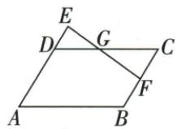

## 讲解

### 是什么

甲与乙相似比k>0，则面积甲/乙=k²；已知面积比s>0反求边比为√s，取正根。相似三角的底和垂直高都同倍改变，面积包含两个长度因子，所以不是k，也不是2k。

相似多边形可按对应对角线分成对应三角，每块面积比k²，相加后整体也k²。

### 怎么来的

记对应底b/b′=k、对应高h/h′=k。面积比$(bh/2)/(b′h′/2)=(b/b′)(h/h′)=k\cdot k=k^2$，面积公式中的1/2相消。反求时k²=s，代数有±√s，但长度比为正，只保留正值。原平行四边延长题DE/CF2/3，面积就4/9；若题目反问另一順序，则9/4。

面积单位随长度单位平方变化。图纸比例尺1/20000时面积比是1/400000000，不能仍当线性尺度；此处仅说明规则，不新编原资料例题。

### 什么时候能用

只有两图已经相似或确认统一缩放，才能用平方规律；任意两等面积图不能反推相似，任意两底边成比也不能认面积平方。

## 例题

### 平行四边三分之一延长与中点面积比四九逐项

> 来源ID Q26-15；第26章相似；301-350/full.md 第2016–2026行。原答案与解析定位：301-350/full.md 第2028–2032行。

例4 如图,已知□ABCD中,F为BC的中点,延长AD至E,使DE:AD=1:3,连接EF交DC于点G,则 $S_{\triangle DEG}:S_{\triangle CFG}=$ ( )

A.2:3

B.3:2

C.9:4

D.4:9

**原资料答案与解析：**

解析 设 $DE = x (x > 0)$ ，则 $AD = 3x$ 。∵ 四边形 ABCD 是平行四边形，∴ $AD \parallel BC, BC = AD = 3x$ 。

又点 $F$ 是 $BC$ 的中点， $\therefore CF = \frac{1}{2} BC = \frac{3}{2} x.\because AD \parallel BC, \therefore \triangle DEG \sim \triangle CFG, \therefore \frac{S_{\triangle DEG}}{S_{\triangle CFG}} = \left(\frac{DE}{CF}\right)^2 = \frac{4}{9}$ .

答案 D

**展开解析（依据原详解补足理由与步骤）：**

设DE=x>0，AD=3x；平行四边BC=AD3x，F中点所以CF=3x/2。DE∥CF，G处对顶角等，△DEG∽△CFG。按题顺序边比DE/CF=x/(3x/2)=2/3，面积比平方为4/9，D。A2/3忘平方；B3/2倒顺序且未平方；C9/4是反向面积比。

### 相似比一三面积比一九四项区分幂次

> 来源ID Q26-23；第26章相似；301-350/full.md 第2234–2242行。原答案与解析定位：301-350/full.md 第2211–2213行。

例3 (2024 重庆 A) 若两个相似三角形的相似比是 $1:3$ , 则这两个相似三角形的面积比是 ( )

A. $1:3$

B.1:4

C. $1:6$

D.1:9

**原资料答案与解析：**

例3 解析 因为两个相似三角形的面积比等于相似比的平方, 所以这两个相似三角形的面积比是 1:9.

答案 D

**展开解析（依据原详解补足理由与步骤）：**

对应底边比1/3，对应高比也1/3，面积底×高÷2中的两个因子同时缩放，所以面积比(1/3)²=1/9，D。A1/3是线性量比；B1/4与本题比例不符；C1/6只是把3乘2而不是平方，均错误。

### 三顶点到O各取中点位似比二分之一面积四分之一

> 来源ID Q26-30；第26章相似；301-350/full.md 第2646–2660行。原答案与解析定位：301-350/full.md 第2662–2664行。

例1 如图, $\triangle DEF$ 与 $\triangle ABC$ 是位似图形, 点 O 是位似中心, D、E、F 分别是 OA、OB、OC 的中点, 则 $\triangle DEF$ 与 $\triangle ABC$ 的面积比是 \_\_\_\_.

**原资料答案与解析：**

解析 $\because \triangle DEF$ 与 $\triangle ABC$ 是位似图形, 点 $O$ 是位似中心, $D, E, F$ 分别是 $OA, OB, OC$ 的中点, $\therefore \triangle DEF$ 与 $\triangle ABC$ 的相似比是 $\frac{1}{2}, \therefore \triangle DEF$ 与 $\triangle ABC$ 的面积比是 $\frac{1}{4}$ .

答案 $\frac{1}{4}$

**展开解析（依据原详解补足理由与步骤）：**

D/E/F分别为OA/OB/OC中点，所以有向比例OD/OA=OE/OB=OF/OC=1/2，同侧位似。对应各边也缩1/2，面积比平方为1/4。三角图形可能不以O作为自身中心，这不影响O作为缩放中心；不是三中点面积比1/2。

## 易错

原1:3四选中的1:6是把乘2误作平方；原中点位似边半而面积四分之一。
