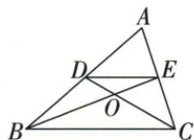

## 讲解

### 判据

原两中线相交时中点可作中位线，图内两相似是平行与交叉的直接结果。

### 流程

1.D/E为边中点，DE∥BC；共有A角配平行角，ABC∽ADE。2.O两交线对顶，配DE/BC平行角，BOC∽EOD。3.新增BOD=A之后，OBD=ABE共射线，OBD∽ABE；COE=BOD=A、OCE=ACD，OCE∽ACD。4.每组都写足两角与对应顺序；没有新增角时后两组不能保证。

## 例题

### 两中线中位线找A与X两对并按附角再找两对

> 来源ID Q26-16；第26章相似；301-350/full.md 第2059–2062行。原答案与解析定位：301-350/full.md 第2064–2074行。

例5 (A型、X型)如图,在 $\triangle ABC$ 中,两条中线BE,CD相交于点O.

(1) 写出图中两对相似的三角形.  
(2) 若 $\angle BOD = \angle A$ ，写出与(1)中不同的两对相似三角形.

**原资料答案与解析：**

解析 (1) $\because BE, CD$ 是 $\triangle ABC$ 的两条中线, $\therefore DE$ 是 $\triangle ABC$ 的中位线, $\therefore DE \parallel BC$ ,

$$
\therefore \triangle A B C \sim \triangle A D E, \triangle B O C \sim \triangle E O D.
$$

(2) 当 $\angle BOD = \angle A$ 时, $\because \angle OBD = \angle ABE, \therefore \triangle OBD \sim \triangle ABE.$

$$
\because \angle C O E = \angle B O D = \angle A, \angle O C E = \angle A C D, \therefore \triangle O C E \sim \triangle A C D.
$$

**展开解析（依据原详解补足理由与步骤）：**

(1)BE/CD为中线，E/D分别是AC/AB中点，DE为中位线，DE∥BC。由共有A角和一对平行角，△ABC∽△ADE；由O处对顶角与平行角，△BOC∽△EOD。(2)新增∠BOD=∠A时，OB与BE共线、BD与BA共线，∠OBD=∠ABE，配新增角得△OBD∽△ABE。∠COE=∠BOD为对顶角，且∠OCE=∠ACD，得到△OCE∽△ACD。每一对各写两角来源，不能因共用O就认所有小三角相似。

## 易错

A型/X型是找形提示，图形名字并不是定理条件。
