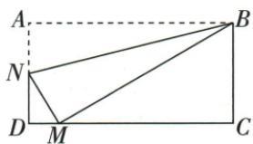

## 讲解

### 判据

折后M落DC，折射A直角到NMB，三个直角在同一直线位置组合。

### 流程

1.原D/C90，反射给NMB90。2.三角NDM角和NMD+90+MND180；直线DMC给NMD+90+BMC180。3.同减公共NMD和90得MND=BMC。4.D=C90，AA NDM∽MCB，按N↔M/D↔C/M↔B配。5.没有对应边相等就只结相似，旧一线三等角全等模型的额外等边条件另看。

## 例题

### 矩形折A到DC上的M用三直角补角证明NDM与MCB相似

> 来源ID Q26-17；第26章相似；301-350/full.md 第2076–2084行。原答案与解析定位：301-350/full.md 第2086–2092行。

例6 (一线三等角型)在综合与实践课上,老师组织同学们以“矩形的折叠”为主题开展数学活动.有一张矩形纸片ABCD如图所示,点N在边AD上,现将矩形折叠,折痕为BN,点A对应的点记为点M,若点M恰好落在边DC上,求证:△NDM∽△MCB.

**原资料答案与解析：**

证明 ∵ 四边形 ABCD 是矩形, ∴ $\angle A = \angle D = \angle C = 90^{\circ}$ .

由折叠的性质可知 $\angle NMB = \angle A = 90^{\circ}$ ，∴ $\angle D = \angle NMB = \angle C.$

$$
\because \angle N M D + \angle D + \angle M N D = 1 8 0 ^ {\circ}, \angle N M D + \angle N M B + \angle B M C = 1 8 0 ^ {\circ}, \therefore \angle M N D = \angle B M C, \therefore \triangle N D M \sim \triangle M C B.
$$

**展开解析（依据原详解补足理由与步骤）：**

矩形D/C均90°，折A到M保持∠NMB=∠A90°。原D-M-C共线，平角给∠NMD+90°+∠BMC=180°；△NDM内角和给∠NMD+90°+∠MND=180°。同减NMD与90，MND=BMC。再D=C90°，AA得△NDM∽△MCB。折叠保证右角但不保证两三角对应边等长，所以结论是相似，不随意升为全等。

## 易错

折后M须落题设有限DC，不能把延长线上的不同点序直接套同一平角分割。
