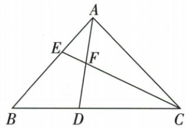

## 讲解

### 判据

已知底边分段比与中线中点，目标在另一边，用辅助平行分别转移两条信息。

### 流程

1.过D作DG∥CE，把BD/DC2/3转为BG/GE2/3。2.原F中AD点，EF∥DG使AE/EG=AF/FD1。3.设BG2x/GE3x，AE也3x，BE按点序为GE+GB5x。4.AE/BE3/5。5.作线理由是让中点与已知分段共同作用于AB，G不是任意添的点。

## 例题

### 中点与三二底边过D作平行线传比求AE比BE三五

> 来源ID Q26-07；第26章相似；301-350/full.md 第1620–1633行。原答案与解析定位：301-350/full.md 第1635–1643行。

例3 如图, $\triangle ABC$ 中,D 在 BC 边上,F 是 AD 的中点,连接 CF 并延长,交 AB 于点 E,已知 $\frac{CD}{BD}=\frac{3}{2}$ ,则 $\frac{AE}{BE}$ 等于 \_\_\_\_.

**原资料答案与解析：**

解析 作 $DG \parallel CE$ ，交 $AB$ 于点 $G$ ，则 $\frac{BG}{GE} = \frac{BD}{DC} = \frac{2}{3}$ ，设 $BG=2x(x>0)$ ，则 GE=3x，

∵ $EF \parallel DG, F$ 是 AD 的中点, ∴ $\frac{AE}{EG} = \frac{AF}{FD} = 1$ ,

$$
\therefore A E = E G = 3 x, \therefore \frac {A E}{B E} = \frac {3 x}{3 x + 2 x} = \frac {3}{5}.
$$

答案 $\frac{3}{5}$

**展开解析（依据原详解补足理由与步骤）：**

过D作DG∥CE，交AB于G。BC两段BD:DC=2:3，通过这组平行线给BG:GE=2:3。设BG=2x、GE=3x，x>0。又EF在CE上平行DG，F为AD中点，AF/FD=1，所以AE/EG=1，AE=EG=3x。原A-E-G-B按序，BE=EG+GB=5x，AE/BE=3x/(5x)=3/5。辅助G使已知底边比与中点分别作用到同一AB直线上。

## 易错

E-G-B的次序先从实际图核，不把BE当GE或AE。
