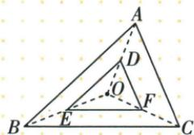
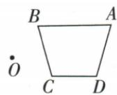
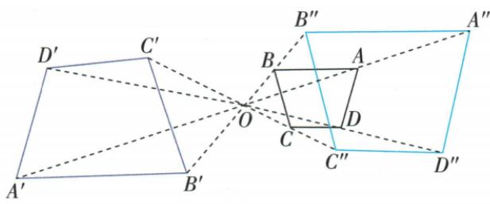

## 讲解

### 判据

给O及尺度2、方向AO或OA，方向决定越中心异侧还是从中心同側。

### 流程

1.沿AO越过O，取OA′2OA；B/C/D也取各自反向半径倍2，成异側像。2.沿OA方向取各自同向双半径，成同側像。3.每个顶点使用同一方向符号和倍数，按原连接順序闭合。4.边长倍2、面积倍4作核验；中心若本身是原顶点仍固定，不再往任意射线画。

## 例题

### 三顶点到O各取中点位似比二分之一面积四分之一

> 来源ID Q26-30；第26章相似；301-350/full.md 第2646–2660行。原答案与解析定位：301-350/full.md 第2662–2664行。

例1 如图, $\triangle DEF$ 与 $\triangle ABC$ 是位似图形, 点 O 是位似中心, D、E、F 分别是 OA、OB、OC 的中点, 则 $\triangle DEF$ 与 $\triangle ABC$ 的面积比是 \_\_\_\_.

**原资料答案与解析：**

解析 $\because \triangle DEF$ 与 $\triangle ABC$ 是位似图形, 点 $O$ 是位似中心, $D, E, F$ 分别是 $OA, OB, OC$ 的中点, $\therefore \triangle DEF$ 与 $\triangle ABC$ 的相似比是 $\frac{1}{2}, \therefore \triangle DEF$ 与 $\triangle ABC$ 的面积比是 $\frac{1}{4}$ .

答案 $\frac{1}{4}$

**展开解析（依据原详解补足理由与步骤）：**

D/E/F分别为OA/OB/OC中点，所以有向比例OD/OA=OE/OB=OF/OC=1/2，同侧位似。对应各边也缩1/2，面积比平方为1/4。三角图形可能不以O作为自身中心，这不影响O作为缩放中心；不是三中点面积比1/2。

### 四边关于O二倍放大分别沿AO异侧与OA同侧

> 来源ID Q26-35；第26章相似；301-350/full.md 第2780–2786行。原答案与解析定位：301-350/full.md 第2788–2798行。

例3 如图,分别按下列要求作出四边形 ABCD 以 O 点为位似中心的位似四边形.

(1) 沿 AO 方向, 相似比为 2, 把四边形 ABCD 放大.

(2) 沿 OA 方向, 相似比为 2, 把四边形 ABCD 放大.

**原资料答案与解析：**

解析（1）分别连接并延长 AO, BO, CO, DO，在延长线上找点 $A', B', C', D'$ ，使得 $2AO = OA', 2BO = OB'$ ， $2CO = OC', 2DO = OD'$ ，连接 $A'B', B'C', C'D', D'A'$ ，则四边形 $A'B'C'D'$ 为所求作的四边形.

(2) 分别连接并延长 OA, OB, OC, OD，在延长线上找点 $A''$ , $B''$ , $C''$ , $D''$ ，使得 $2AO = OA''$ , $2BO = OB''$ , $2CO = OC''$ , $2DO = OD''$ ，连接 $A''B''$ , $B''C''$ , $C''D''$ , $D''A''$ ，则四边形 $A''B''C''D''$ 为所求作的四边形.

**展开解析（依据原详解补足理由与步骤）：**

(1)沿AO方向越过O，在每条AO/BO/CO/DO的对应反向射线上取像点，使OA′=2OA等，得到异侧二倍像；按A′-B′-C′-D′顺序连接。(2)沿OA方向在从O指向原各点的同向射线上截双半径，得到同侧二倍像，顺序连接。两种均保持原边夹角，边长倍2面积倍4，但位置相反；题已分别指定方向，每小问只画相应一支，不把二者合一图当一种操作。

## 易错

原AO与OA有向相反，不能只看两字母同用就画同一侧；未指定侧别另需两图。
