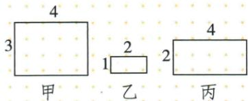
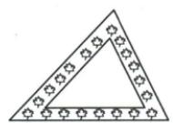
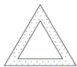
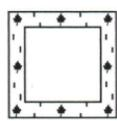
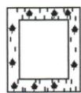

## 讲解

### 判据

题给同名多边形或等宽边缘，检查角同时还要看边比，只有三角可用AA 判据。

### 流程

1.三矩形长短比分别4/3、2、2，故乙/丙相似，甲不相似。2.内外三角对应边平行所以角等，AA相似，不要求给具体边长。3.正方所有角和边结构一致必相似。4.矩形花边长宽各减同一常量，通常比例改变，选D。5.辨析六边只边比、五边只角都不足；同边数正多边角等边同比兼有。

## 例题

### 三矩形四三二一四二按长短比只有乙丙相似

> 来源ID Q26-10；第26章相似；301-350/full.md 第1826–1842行。原答案与解析定位：301-350/full.md 第1844–1846行。

例1 如图所示的三个矩形中,相似的是\_\_\_\_与\_\_\_\_.

**原资料答案与解析：**

解析 矩形的四个角都是直角,符合角分别相等,故判断矩形是否相似取决于边是否成比例.因为 $\frac{4}{3}\neq\frac{2}{1},\frac{4}{3}\neq\frac{4}{2}$ ,所以甲与乙、甲与丙均不相似;因为 $\frac{2}{1}=\frac{4}{2}$ ,所以乙与丙相似.

答案 乙;丙

**展开解析（依据原详解补足理由与步骤）：**

三矩形四角都90°，仍须对应边成比例。甲长/短4/3；乙2/1=2；丙4/2=2。因此乙与丙角对应相等且两种边均按2倍缩放，相似；甲与另两者4/3≠2，不相似。把丙长边对应乙短边会错配，应先匹配长/短或将一图转动再匹配。

### 等宽花边三角正方相似矩形未必逐项判断

> 来源ID Q26-12；第26章相似；301-350/full.md 第1955–1967行。原答案与解析定位：301-350/full.md 第1969–1971行。

例1 手工制作课上,小红将一些花布的边角料剪裁后装饰手工画,下面四个图案是她剪裁出的空心不等边三角形、等边三角形、正方形、矩形花边,其中,每个图案花边的宽度都相等,那么,每个图案中花边的内、外边缘所围成的几何图形不一定相似的是()

  
A

  
B

  
C

  
D

**原资料答案与解析：**

解析 三角形相似只需两个角分别相等即可,因此 A、B 选项中图形相似.边数超过 3 的多边形相似不仅需要角分别相等,还需要边成比例.由于所有的正方形都相似,因此 C 选项中图形相似.D 选项中,两个矩形虽然四个角分别相等,但边不一定成比例,因此 D 选项中图形不一定相似.

# 答案 D

**展开解析（依据原详解补足理由与步骤）：**

A内外三角边对应平行，内角对应相等，AA便相似；B等边内外三角均60°也相似；C内外均正方，角同为90且所有边统一比，必相似。D矩形四角相同，但等宽花边使长宽各减同样的两倍宽，通常不能使长与宽按同一倍缩放，故内外不一定相似，选D。三角只需两角；超过三边的多边形仍须对应边成比例。

### 多边形三句辨析角等边比必须兼有

> 来源ID Q26-38；第26章相似；301-350/full.md 第1820–1822行。原答案与解析定位：301-350/full.md 第1820–1822行。

1. 边对应成比例的两个六边形是相似多边形. (×)   
2. 两个五边形所有内角都相等, 则它们是相似多边形. (×)  
3.任意边数相同的正多边形都是相似多边形. (√)

**原资料答案与解析：**

1. 边对应成比例的两个六边形是相似多边形. (×)   
2. 两个五边形所有内角都相等, 则它们是相似多边形. (×)  
3.任意边数相同的正多边形都是相似多边形. (√)

**展开解析（依据原详解补足理由与步骤）：**

①错：只给六边形边成比例没给对应角，铰接改变角仍可保持边长，所以不保证相似；②错：五边形只给各内角相等仍可改变边长比例，不保证统一缩放；③对：同边数正多边形每角相同且所有边统一比例，相似。与三角AA不同，多边形多出可变的形状自由，须角与边一起核。

## 易错

根据图配长短或转图匹配，不任意将一条长边配另一短边。
