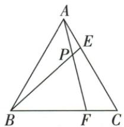

## 讲解

### 判据

目标AE²=BE·PE，可先看成PE/AE=AE/BE，两比中的三点分别构成AEP与BEA。

### 流程

1.等边A60提供BAP+EAP60；BPF60是ABP外角，BAP+ABE60。2.同减BAP得EAP=ABE。3.E-P-B共线给AEP=AEB，AA AEP∽BEA。4.按正确对点写PE/AE=AE/BE，交乘得到目标。5.这样每个比例项来自同一对三角，避免拼凑无依据比式。

## 例题

### 等边交叉六十用余角相等AA证AE平方等BE乘PE

> 来源ID Q26-20；第26章相似；301-350/full.md 第2170–2183行。原答案与解析定位：301-350/full.md 第2185–2185行。

例9 如图,在等边三角形 ABC 的边 AC, BC 上各取一点 E, F, 连接 AF, BE, 相交于点 P, $\angle BPF = 60^{\circ}$ . 求证: $AE^{2} = BE \cdot PE$ .

**原资料答案与解析：**

证明 $\because \triangle ABC$ 为等边三角形, $\therefore \angle BAC = 60^{\circ}, \therefore \angle BAP + \angle EAP = 60^{\circ}, \because \angle BPF = 60^{\circ}, \therefore \angle BAP + \angle ABE = 60^{\circ}, \therefore \angle EAP = \angle ABE$ , 又 $\because \angle AEP = \angle AEB, \therefore \triangle AEP \sim \triangle BEA, \therefore \frac{PE}{AE} = \frac{AE}{BE}, \therefore AE^{2} = BE \cdot PE.$

**展开解析（依据原详解补足理由与步骤）：**

等边ABC使BAC60，故BAP+EAP=60。P在AF上且P-F与P-A反向，BPF60是△ABP的外角，BAP+ABE=60。两式同减BAP得EAP=ABE。E-P-B按序，AEP与AEB同角；AA得△AEP∽△BEA。按对应P↔A、A↔B、E↔E，PE/AE=AE/BE，乘正数AE·BE得AE²=BE·PE。不要把两端平方项当作任意同一边拼出；比例必须从这套对应顺序来。

### 边积改比例共A两角差用SAS相似再平角同减

> 来源ID Q26-18；第26章相似；301-350/full.md 第2102–2104行。原答案与解析定位：301-350/full.md 第2106–2128行。

例7 如图, 在 $\triangle ABC$ 与 $\triangle ADE$ 中, 点 E 为 BC 边上一点, 且 $\angle 1 = \angle 2, AD \cdot AC = AB \cdot AE$ .

求证: $\angle2=\angle DEB.$

**原资料答案与解析：**

证明 $\because \angle 1 = \angle 2, \therefore \angle DAE = \angle BAC, \because AD \cdot AC = AB \cdot AE, \therefore \frac{AD}{AB} = \frac{AE}{AC},$

$$
\therefore \triangle A D E \sim \triangle A B C, \therefore \angle A E D = \angle A C B.
$$

$$
\because \angle 2 + \angle A C B + \angle A E C = 1 8 0 ^ {\circ} = \angle D E B + \angle A E D + \angle A E C, \therefore \angle 2 = \angle D E B.
$$

**展开解析（依据原详解补足理由与步骤）：**

原∠1=∠2，两边同加公共∠BAE，得DAE=BAC。AD·AC=AB·AE，各长度正，除AB·AC得AD/AB=AE/AC；这是等夹角A两邻边的同比，所以△ADE∽△ABC，AED=ACB。△AEC角和给∠2+ACB+AEC=180°；原B-E-C按序，DEB+AED+AEC也等180°。同减相等AED/ACB与AEC，得到∠2=DEB。边积不直接推出任意两个三角相似，需夹角对应。

## 易错

目标乘积只是选形提示，不是已知，不能拿它先证明相似再反证自己。
