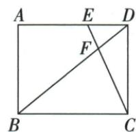

## 讲解

### 判据

DE=x、对角线上BF=y，先用全对角长表达余段，再相似列变量关系。

### 流程

1.6/8矩形勾股BD10，DF10−y，BC8。2.x>0时DEF/BCF由平行与对顶角AA相似，x/8=(10−y)/y。3.乘8y并逐步提取y：xy=80−8y，(x+8)y=80，y80/(x+8)。4.x0时小三角退化不引用相似，直接E=D/F=D给y10，与公式一致。5.检x8时y5，再将整个0≤x≤8写为自变量范围，x2给y8。

## 例题

### 六八矩形对角交线DE二求BF八并端点函数

> 来源ID Q26-19；第26章相似；301-350/full.md 第2130–2134行。原答案与解析定位：301-350/full.md 第2136–2162行。

例8 如图, 在矩形 ABCD 中, AB=6, AD=8, 点 E 在边 AD 上, CE 与 BD 相交于点 F.

(1) 若 DE=2，则 BF 的长度为 \_\_\_\_。

(2) 设 DE = x, BF = y，当 $0 \leqslant x \leqslant 8$ 时，y 关于 x 的函数关系式为 \_\_\_\_.

**原资料答案与解析：**

解析（1）∵ 在 Rt△ABD 中，AB=6,AD=8,∴ $BD=\sqrt{AB^{2}+AD^{2}}=10$ ,

在矩形 ABCD 中, $AD \parallel BC, AD = BC, \therefore \triangle DEF \sim \triangle BCF, \therefore \frac{DE}{BC} = \frac{DF}{BF},$

$$
\because D E = 2, \therefore \frac {2}{8} = \frac {1 0 - B F}{B F}, \therefore B F = 8.
$$

(2) 当 $0 < x \leqslant 8$ 时, 由(1)知, $\frac{DE}{BC} = \frac{DF}{BF}, BD = 10$ ,

∵ BF=y, ∴ DF=10-y, 又 BC=8, ∴ $\frac{x}{8}=\frac{10-y}{y}$ , 化简得 $y=\frac{80}{x+8}$ ,

当 x=0 时, y=BD=10. 显然, 此时也符合 $y=\frac{80}{x+8}$ .

∴ y 关于 x 的函数关系式为 $y=\frac{80}{x+8}$ .

答案 (1)8 (2) $y=\frac{80}{x+8}$

**展开解析（依据原详解补足理由与步骤）：**

先BD²=6²+8²=100，BD10。(1)DE∥BC，F处对顶角等，△DEF∽△BCF，DE/BC=DF/BF。设BF=y，DF=10−y，代DE2/BC8得2/8=(10−y)/y。乘8y得2y=80−8y，加8y得10y=80，y8。

(2)DE=x>0，同法x/8=(10−y)/y，乘8y得xy=80−8y，移项xy+8y=80，提取y得(x+8)y=80，x+8>0，除得$y=80/(x+8)$。x=0时E=D、小三角DEF退化，不能继续引用非退化三角相似，但F=D直接给y=BD10，公式也给80/8=10，所以整个0≤x≤8均可用。端点x8时E=A、F为矩形对角交点，y5，回验。

## 易错

用公式端点成立不能反过来称退化三角相似；分母x+8在本域正。
