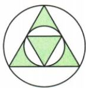
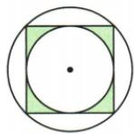
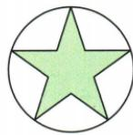
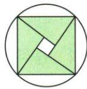

## 讲解

### 判据

选项同时要求轴对称与中心对称，逐项作两个独立检查，外圆和阴影都算整体。

### 流程

1.先找轴，沿其翻折核全部内外线条；再绕候选中心半转核重合，不能前一项成立代后一项。2.线段/菱形都两项成立；等边只有轴；一般平行四边中心成立但轴未必。3.圆内正方B两项均成立，三角A/五星C缺180，旋臂D缺镜轴。4.不同数字6/9是两图之间关系且随字体，不能混到自身双重对称判断。

## 例题

### 线段等边一般平行四边菱形逐项两种对称判断

> 来源ID Q25-33；第25章图形的轴对称平移与旋转；301-350/full.md 第1088–1088行。原答案与解析定位：301-350/full.md 第1090–1090行。

例2 下列图形: ①线段; ②等边三角形; ③平行四边形; ④菱形. 其中既是轴对称图形又是中心对称图形的是 \_\_\_\_.

**原资料答案与解析：**

答案 ①④

**展开解析（依据原详解补足理由与步骤）：**

①线段关于本身所在直线及其中垂线轴对称，也关于中点半转重合，两者都有。②等边三角形有3条轴，但最小非零旋转为120°，180°不能重合，只有轴对称。③一般平行四边形关于对角交点中心对称，却未必有轴；矩形/菱形等特殊平行四边形可以有轴，这里不能把“所有平行四边形有轴”当必然。④菱形有两对角线作为轴，也有对角交点作中心。因此题目所列图形中两种性质都必有的是①④。

### 数字六九半转是两个不同字形的中心对应

> 来源ID Q25-36；第25章图形的轴对称平移与旋转；301-350/full.md 第1119–1119行。原答案与解析定位：301-350/full.md 第1121–1123行。

例5 在 0\~9 这十个数字中, 可以成中心对称的不同的数字是 \_\_\_\_.

**原资料答案与解析：**

答案 6 和 9

注意 本题题意是找两个数字作为两个图形成中心对称，而不是找自身能看成中心对称图形的数字.

**展开解析（依据原详解补足理由与步骤）：**

原答案为6与9：按本资料采用的常见字形，将一个6半转180°可与9重合，两个不同数字字形之间成中心对称。这里问“不同的数字”，不是找某一个字形半转后自身不变；0/8的自身可能对称不回答这个问题。此结论依赖具体字体绘法，例如带衬线或圈笔不同的6/9未必严格重合。资料没有给所有字体的图样，不能推广为任意印刷6/9必对称。

### 四种圆内图案轴对称与中心对称兼有选B

> 来源ID Q25-42；第25章图形的轴对称平移与旋转；301-350/full.md 第1324–1336行。原答案与解析定位：301-350/full.md 第1275–1277行。

例2 (2024 湖南长沙) 下列图形中, 既是轴对称图形又是中心对称图形的是 ( )

  
A

  
B

  
C

  
D

**原资料答案与解析：**

例2 解析 选项 A 是轴对称图形但不是中心对称图形, 选项 B 既是轴对称图形又是中心对称图形, 选项 C 是轴对称图形但不是中心对称图形, 选项 D 是中心对称图形但不是轴对称图形, 故选项 B 符合题意.

答案 B

**展开解析（依据原详解补足理由与步骤）：**

A内部等边三角图案有镜轴但180°不重合；B内部正方与圆同心，沿正方两对角线和两边中垂线均可折叠，180°也重合，故两者兼有；C内部五角星有5条轴，但奇数个等分尖角在180°后落空隙，不能半转重合；D内部四旋臂图案可半转重合，但镜像改变旋臂的朝向，原各条轴不能重合。因此B正确。外圆自己具有无限镜轴和中心，仍须同时检验内部线条/阴影，不能仅据外圆判整个图。

## 易错

整图中的一个圆具有两种对称，不保证含阴影的整个图有；只许按提供图样，不据器具名称或字体名称泛断。
