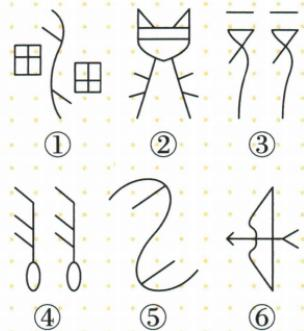

## 讲解

### 判据

图案由一个部件变到另一个部件，按对应点的移动规律分类，不只看两部件全等。

### 流程

1.平移查各点同向同距，边朝向保持，原③④符合。2.旋转查同中心等半径同有向转角，原①⑤符合。3.轴反射查一条直线垂直平分不同对应点连线，朝向翻折，原②⑥符合。4.明确判断的是哪两个部件，整体可能同时有其它对称；以题意指定的对应部件作依据。

## 例题

### 六种甲骨文按滑动转动翻折分类

> 来源ID Q25-22；第25章图形的轴对称平移与旋转；301-350/full.md 第639–652行。原答案与解析定位：301-350/full.md 第654–654行。

例3 甲骨文是我国古代的一种文字,下列甲骨文中,能看作用其中一部分进行平移变换得到的是\_\_\_\_;能看作用其中一部分进行旋转变换得到的是\_\_\_\_;能看作用其中一部分进行轴对称变换得到的是\_\_\_\_.

**原资料答案与解析：**

答案 ③④;①⑤;②⑥

**展开解析（依据原详解补足理由与步骤）：**

③④的一部分只改变位置，边的朝向保持，且各点位移统一，属于平移；①⑤可以绕共同位置转动重合，用同中心同角度同方向移动各点，属于旋转；②⑥的左右部件按一条线翻折互相重合，属于轴对称。故平移③④、旋转①⑤、轴对称②⑥。观察对象是图案中的相应部件，不是说整体只能拥有一种对称；若一个图案同时允许几种解释，需按提供的对应部件和原图关系判断。

### 四幅平移作图对应方向不变排除第三幅

> 来源ID Q25-13；第25章图形的轴对称平移与旋转；301-350/full.md 第312–325行。原答案与解析定位：301-350/full.md 第327–327行。

例2 下列平移作图中,错误的是
.

  
①

  
②

  
③

  
④

**原资料答案与解析：**

答案 ③

**展开解析（依据原详解补足理由与步骤）：**

①②④均能把各对应顶点用同一方向、同一长度的有向线段连接，三角形各边方向保持，符合平移。③的三角形斜边方向翻转，若把一个顶点移到对应位置，其余顶点不能用同样位移到位，它呈镜像而不是整体滑动，所以错误的是③。平移保全等只是必要结果；反射/旋转也保全等，要再查统一位移和方向。

## 易错

平移后也全等，旋转后也全等，所以“形状大小一样”不足分类。
