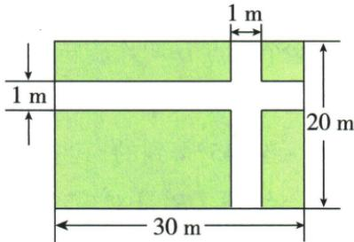
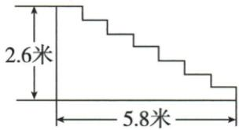

## 错法

花园直接600−20−30漏路口，楼梯用√(5.8²+2.6²)代覆盖长度。

## 正解

花园两次扣掉1平方米路口须加回一次，得到551；地毯实际绕每个踏面和立面，长度为同向水平5.8加竖直2.6，共8.4，再乘宽2、单价30，费用504。两题都先按实际覆盖范围计算，不能以更短抽象线段代原区域。

## 例题

### 花园二十乘三十两一米道路平移拼绿地551

> 来源ID Q25-16；第25章图形的轴对称平移与旋转；301-350/full.md 第400–411行。原答案与解析定位：301-350/full.md 第413–413行。

例3 如图,在宽为 $20 \, m$ , 长为 $30 \, m$ 的长方形花园中, 修建两条宽度为 $1 \, m$ 的长方形道路, 余下部分进行绿化, 求绿化部分的面积.

**原资料答案与解析：**

解析 将水平道路向上平移到花园边缘, 竖直道路向右平移到花园边缘, 则绿化部分变成宽为 $19 \, m$ , 长为 $29 \, m$ 的长方形. 所以绿化部分的面积为 $29 \times 19 = 551 \, (\text{m}^2)$ .

**展开解析（依据原详解补足理由与步骤）：**

把两条路两旁绿地平移拼接，横向总绿宽20−1=19，纵向总绿长30−1=29，面积19×29=551 m²。另核：花园600，两条路分别面积20×1和30×1，路口1×1被两次扣除，须加回1，绿地600−20−30+1=551。两条平行路或路不贯通的图不能直接用本图的两个减1；搬移保持面积而不是把道路长度随意改掉。

### 楼梯地毯各水平竖直段总长八点四费用504

> 来源ID Q25-17；第25章图形的轴对称平移与旋转；301-350/full.md 第415–424行。原答案与解析定位：301-350/full.md 第426–426行。

例4 某宾馆重新装修后,准备在大厅主楼梯上铺设某种红色地毯,已知这种地毯每平方米售价30元,主楼梯宽2米,其侧面如图所示,则该宾馆购买地毯至少需要多少元?

**原资料答案与解析：**

解析 平移题图中表示楼梯台阶的线段, 构成一个长、宽分别为 5.8 米、2.6 米的长方形, ∴ 地毯的长度为 $2.6 + 5.8 = 8.4$ (米), ∴ 地毯的面积为 $8.4 \times 2 = 16.8$ (平方米), ∴ 购买地毯至少需要 $16.8 \times 30 = 504$ (元).

**展开解析（依据原详解补足理由与步骤）：**

地毯紧贴台阶，所需侧面路径是各段水平踏面与竖直立面的长度和。水平段沿同一方向拼接总长5.8 m，竖直段同向拼接总高2.6 m，总路径长8.4 m。地毯宽2 m，面积8.4×2=16.8 m²；每平方米30元，费用16.8×30=504元。勾股得到的是首尾斜线距离，斜线会离开台阶表面，不能代覆盖台阶的地毯长度；面积和价格单位须对应。
