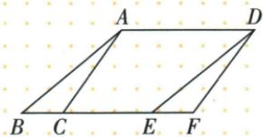

## 讲解

### 是什么

平移是把图形每一点沿同一方向移动同一距离。距离非负，方向要标明；零距离时图形不动。任意一对对应点的有向连接线都表示同一位移，所以通常的不同对应连线平行且等长，也可能在同一直线上。

平移保持边长、角、面积、周长与边的朝向，不改变顶点连接顺序。前后图全等，但全等本身不足以辨认平移，因为反射和旋转也保持这些量中的长度与角。

### 怎么来的

以网格的水平、竖直位移分别记p/q，任意点(x,y)变为(x+p,y+q)。两点的坐标差由(x₂+p)−(x₁+p)=x₂−x₁、(y₂+q)−(y₁+q)=y₂−y₁给出，位移在差中相消，故边的方向与长度都不变；对应三角形全等，面积随之保持。

作图可以不算每点坐标：先从一对点读水平/竖直格数，再对所有顶点重复同一位移并按序连接。识别时只要发现一个对应点移动方向或距离不同，就不能是同一次平移。

### 什么时候能用

指定对应点字母时按顺序配对；平移距离是对应点之间的直线距离，水平/竖直格数只给两个分量，不把分量和当直线长度。若题图给CE而C对应F，CE不是对应点距离。

## 例题

### 三角沿边平移保持面积角并对应点距离7

> 来源ID Q25-12；第25章图形的轴对称平移与旋转；301-350/full.md 第293–306行。原答案与解析定位：301-350/full.md 第308–308行。

例1 如图, 将面积为 3 的三角形 ABC 沿 BC 方向平移到三角形 DEF 的位置, CE = 5, EF = 2, $\angle B = 40^{\circ}$ .

(1) BC 的长度是 \_\_\_\_， $\angle DEF=$ \_\_\_\_°.  
(2)平移的距离是\_\_\_\_，三角形DEF的面积是\_\_\_\_。

**原资料答案与解析：**

答案 (1)2;40 (2)7;3

**展开解析（依据原详解补足理由与步骤）：**

(1)平移后△DEF与△ABC全等，面积保持3。(2)∠E对应∠B，所以∠E=40°。(3)BC对应EF，BC=EF=2。按图B-C-E-F顺序，BE=BC+CE=2+5=7；B对应E，因此BE为平移距离，CF也为7。CE是原末点与新中点之间的空隙，不是对应点连接，不能直接把5当平移距离。

### 四幅平移作图对应方向不变排除第三幅

> 来源ID Q25-13；第25章图形的轴对称平移与旋转；301-350/full.md 第312–325行。原答案与解析定位：301-350/full.md 第327–327行。

例2 下列平移作图中,错误的是
.

  
①

  
②

  
③

  
④

**原资料答案与解析：**

答案 ③

**展开解析（依据原详解补足理由与步骤）：**

①②④均能把各对应顶点用同一方向、同一长度的有向线段连接，三角形各边方向保持，符合平移。③的三角形斜边方向翻转，若把一个顶点移到对应位置，其余顶点不能用同样位移到位，它呈镜像而不是整体滑动，所以错误的是③。平移保全等只是必要结果；反射/旋转也保全等，要再查统一位移和方向。

### 网格船从A到B所有顶点左三下四

> 来源ID Q25-14；第25章图形的轴对称平移与旋转；301-350/full.md 第341–352行。原答案与解析定位：301-350/full.md 第354–364行。

例1 如图,经过平移,小船上的点A到了点B.

(1)请画出平移后的小船.   
(2)该小船向\_\_\_\_平移了\_\_\_\_格,向\_\_\_\_平移了\_\_\_\_格.

**原资料答案与解析：**

解析（1）如图所示，找出所给图形的各个顶点的对应点，顺次连接，得到平移后的图形.

(2)由(1)可知,该小船向下平移了4格,向左平移了3格.故答案为下;4;左;3(或左;3;下;4).

**展开解析（依据原详解补足理由与步骤）：**

从原图A到B，沿格线数出水平向左3格、竖直向下4格，这两项共同给平移向量。依次把船的每个折点左移3格、下移4格，按原先连接顺序连成新船；顶点的数目、相邻关系和船头方向都保持。只移动船顶A而另把船尾按另一方向移动会改变形状。原答案配图给出了全部对应位置，依此核对所有顶点，不能把“左3下4”理解成斜边长度7。

### 格线线段右四上一作像并连接AD与BC

> 来源ID Q25-18；第25章图形的轴对称平移与旋转；301-350/full.md 第442–453行。原答案与解析定位：301-350/full.md 第476–484行。

例1 (2024 黑龙江哈尔滨节选) 如图, 方格纸中每个小正方形的边长

均为1个单位长度,线段AB的端点均在小正方形的顶点上.在方格纸中将线段AB先向右平移4个单位长度,再向上平移1个单位长度后得到线段CD(点A的对应点为点C,点B的对应点为点D),画出线段CD,AD,BC.

**原资料答案与解析：**

例1 解析 如图所示.

**展开解析（依据原详解补足理由与步骤）：**

从原图端点A作C：右移4格、上移1格；B同样右移4格、上移1格作D，连CD得到平移后的线段。再按题目连AD、BC；原答案图给出这四个端点及三条待画线段。作图必须同时核对两个端点的统一位移和三条连接关系，不能只画一个端点或只画CD。

### 三角沿FE移三用边界两次加三求周长30

> 来源ID Q25-19；第25章图形的轴对称平移与旋转；301-350/full.md 第457–470行。原答案与解析定位：301-350/full.md 第486–494行。

例2 (2024 山东东营) 如图, 将 $\triangle DEF$ 沿 $FE$ 方向平移 $3 \mathrm{~cm}$ 得到 $\triangle ABC$ , 若 $\triangle DEF$ 的周长为 $24 \mathrm{~cm}$ , 则四边形ABFD的周长为 $\mathrm{cm}$ .

**原资料答案与解析：**

例2 解析：将 $\triangle DEF$ 沿 $FE$ 方向平移 $3\mathrm{cm}$ 得到 $\triangle ABC$

$$
\therefore A B = D E, A D = B E = 3 \mathrm{cm}.
$$

∴ 四边形 ABFD 的周长 = AD + BE + AB + EF + DF = AD + BE + △DEF 的周长 = 3 + 3 + 24 = 30 (cm).

答案 30

**展开解析（依据原详解补足理由与步骤）：**

对应点是D→A、E→B、F→C，所以AD=BE=3、AB=DE。原B-E-C-F共线且依次，BF=BE+EF=3+EF。四边形ABFD外周长=AB+BF+FD+DA=DE+(3+EF)+FD+3=(DE+EF+FD)+6=24+6=30 cm。只加一次3会漏掉另一端边界；整个平移前后三角形周长虽然各24，组合外边界不是任一原三角形的周长。

## 易错

三角CE5/EF2原例中真正距离是BE=7；错误图③发生翻向，不能因边长相同而称平移。
