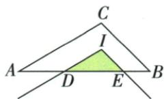
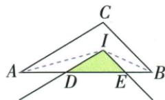

## 讲解

### 判据

内心I处平移原顶角两边并交AB于D/E，利用原顶点内部角平分与平行线等角。

### 流程

1.DI∥AC、EI∥BC，平移只改变位置不改变方向。2.AI、BI是内角平分线，结合内错角把ADI/BEI各证为等腰，AD=DI、BE=EI。3.周长DE+DI+EI换为DE+AD+BE。4.原A-D-E-B按序合成AB=4 cm，无需把另两边3/2强代。

## 例题

### 内心平移角两等腰替边阴影周长等原AB4

> 来源ID Q24-31；第24章圆；251-300/full.md 第3786–3788行。原答案与解析定位：251-300/full.md 第3790–3800行。

例7 如图, 点 I 为 $\triangle ABC$ 的内心, AB = 4 cm, AC = 3 cm, BC = 2 cm, 将 $\angle ACB$ 平移, 使其顶点与点 I 重合, 则图中阴影部分的周长为 \_\_\_\_.

**原资料答案与解析：**

解析 连接 $AI, BI, \because$ 点 $I$ 为 $\triangle ABC$ 的内心, $\therefore AI$ 和 $BI$ 分别平分 $\angle CAB$ 和 $\angle CBA$ ,

$\therefore \angle CAI = \angle DAI, \angle CBI = \angle EBI.$ 由平移的性质得 $DI \parallel AC, EI \parallel BC,$

$\therefore \angle CAI = \angle DIA, \angle CBI = \angle EIB, \therefore \angle DAI = \angle DIA, \angle EBI = \angle EIB, \therefore DA = DI, EB = EI,$

∴ $DE + DI + EI = DE + DA + EB = AB = 4 \, cm$ ，即图中阴影部分的周长为 $4 \, cm$ .

答案 $4 \mathrm{~cm}$

**展开解析（依据原详解补足理由与步骤）：**

连AI、BI，内心使∠CAI=∠DAI、∠CBI=∠EBI。平移保持方向，DI∥AC、EI∥BC；内错角给∠DIA=∠CAI、∠EIB=∠CBI。因此△ADI有∠DAI=∠DIA，AD=DI；△BEI有∠EBI=∠EIB，BE=EI。阴影△DIE周长DE+DI+EI=DE+AD+BE。原A-D-E-B顺序使这三段合AB=4 cm。AC=3、BC=2用于给定原三角形，不必强行代进周长。

## 易错

如果平移角方向反向或交延长线，点序和同位内错角须重核，不能无条件说周长等AB。
