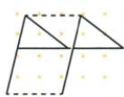
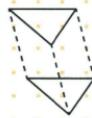
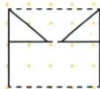
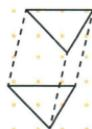
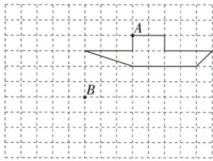
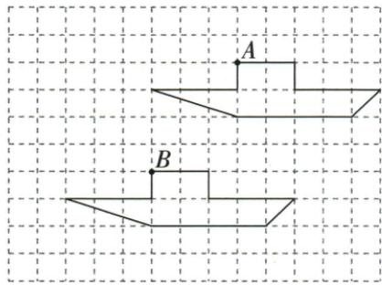
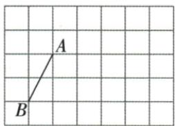
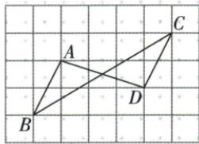

## 讲解

### 判据

格图给一对点的位置或统一右移/上移数量，重复同一位移而不是逐点猜新位置。

### 流程

1.船图A→B读左3/下4，把每个船折点都左3下4，连接顺序照原。2.线段题右4/上1，A→C与B→D必须用同一位移，再连CD。3.成图检查至少两对连接的方向、长短相同，边的朝向不翻转。4.按原要求补连AD、BC，核三条待画线段都完成。5.若题给坐标，也可逐点加同一横纵增量，结果应与格数相符。

## 例题

### 四幅平移作图对应方向不变排除第三幅

> 来源ID Q25-13；第25章图形的轴对称平移与旋转；301-350/full.md 第312–325行。原答案与解析定位：301-350/full.md 第327–327行。

例2 下列平移作图中,错误的是
.

  
①

  
②

  
③

  
④

**原资料答案与解析：**

答案 ③

**展开解析（依据原详解补足理由与步骤）：**

①②④均能把各对应顶点用同一方向、同一长度的有向线段连接，三角形各边方向保持，符合平移。③的三角形斜边方向翻转，若把一个顶点移到对应位置，其余顶点不能用同样位移到位，它呈镜像而不是整体滑动，所以错误的是③。平移保全等只是必要结果；反射/旋转也保全等，要再查统一位移和方向。

### 网格船从A到B所有顶点左三下四

> 来源ID Q25-14；第25章图形的轴对称平移与旋转；301-350/full.md 第341–352行。原答案与解析定位：301-350/full.md 第354–364行。

例1 如图,经过平移,小船上的点A到了点B.

(1)请画出平移后的小船.   
(2)该小船向\_\_\_\_平移了\_\_\_\_格,向\_\_\_\_平移了\_\_\_\_格.

**原资料答案与解析：**

解析（1）如图所示，找出所给图形的各个顶点的对应点，顺次连接，得到平移后的图形.

(2)由(1)可知,该小船向下平移了4格,向左平移了3格.故答案为下;4;左;3(或左;3;下;4).

**展开解析（依据原详解补足理由与步骤）：**

从原图A到B，沿格线数出水平向左3格、竖直向下4格，这两项共同给平移向量。依次把船的每个折点左移3格、下移4格，按原先连接顺序连成新船；顶点的数目、相邻关系和船头方向都保持。只移动船顶A而另把船尾按另一方向移动会改变形状。原答案配图给出了全部对应位置，依此核对所有顶点，不能把“左3下4”理解成斜边长度7。

### 格线线段右四上一作像并连接AD与BC

> 来源ID Q25-18；第25章图形的轴对称平移与旋转；301-350/full.md 第442–453行。原答案与解析定位：301-350/full.md 第476–484行。

例1 (2024 黑龙江哈尔滨节选) 如图, 方格纸中每个小正方形的边长

均为1个单位长度,线段AB的端点均在小正方形的顶点上.在方格纸中将线段AB先向右平移4个单位长度,再向上平移1个单位长度后得到线段CD(点A的对应点为点C,点B的对应点为点D),画出线段CD,AD,BC.

**原资料答案与解析：**

例1 解析 如图所示.

**展开解析（依据原详解补足理由与步骤）：**

从原图端点A作C：右移4格、上移1格；B同样右移4格、上移1格作D，连CD得到平移后的线段。再按题目连AD、BC；原答案图给出这四个端点及三条待画线段。作图必须同时核对两个端点的统一位移和三条连接关系，不能只画一个端点或只画CD。

## 易错

折点少画会改变完整船形；“左3下4”两个分量不代表移动距离为7。
