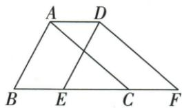

## 讲解

### 判据

图中原三角和像三角沿底边重叠，外边界多出两段对应点移动长。

### 流程

1.D→A、E→B、F→C，AD=BE3，AB=DE。2.原B-E-C-F序给BF=BE+EF3+EF。3.列外周AB+BF+FD+DA，再替为DE+EF+FD+6。4.原三角周24给30 cm。5.每个加3对应一段真实外边界，不靠背“周长加两倍距离”泛用。

## 例题

### 三角沿FE移三用边界两次加三求周长30

> 来源ID Q25-19；第25章图形的轴对称平移与旋转；301-350/full.md 第457–470行。原答案与解析定位：301-350/full.md 第486–494行。

例2 (2024 山东东营) 如图, 将 $\triangle DEF$ 沿 $FE$ 方向平移 $3 \mathrm{~cm}$ 得到 $\triangle ABC$ , 若 $\triangle DEF$ 的周长为 $24 \mathrm{~cm}$ , 则四边形ABFD的周长为 $\mathrm{cm}$ .

**原资料答案与解析：**

例2 解析：将 $\triangle DEF$ 沿 $FE$ 方向平移 $3\mathrm{cm}$ 得到 $\triangle ABC$

$$
\therefore A B = D E, A D = B E = 3 \mathrm{cm}.
$$

∴ 四边形 ABFD 的周长 = AD + BE + AB + EF + DF = AD + BE + △DEF 的周长 = 3 + 3 + 24 = 30 (cm).

答案 30

**展开解析（依据原详解补足理由与步骤）：**

对应点是D→A、E→B、F→C，所以AD=BE=3、AB=DE。原B-E-C-F共线且依次，BF=BE+EF=3+EF。四边形ABFD外周长=AB+BF+FD+DA=DE+(3+EF)+FD+3=(DE+EF+FD)+6=24+6=30 cm。只加一次3会漏掉另一端边界；整个平移前后三角形周长虽然各24，组合外边界不是任一原三角形的周长。

## 易错

其它重叠或反向点序可能改为减段；只保持三角周长24不保证组合外周也24。
