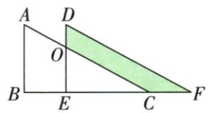

## 讲解

### 判据

三角沿一边平移，求角、距离或重叠阴影，先按顶点顺序区分对应连线与缝隙。

### 流程

1.ABC→DEF给B→E/C→F，BC=EF2，原B-C-E-F序使BE=BC+CE7；面积3与对应角40直接保持。2.阴影题DE=AB12、DO4，D-O-E序给OE8；BE为平移距离6。3.两全等大三角同减OEC，余块等积，把阴影换为ABEO。4.确认AB/OE平行，BE为垂直高，梯形面积(12+8)×6/2=60。

## 例题

### 三角沿边平移保持面积角并对应点距离7

> 来源ID Q25-12；第25章图形的轴对称平移与旋转；301-350/full.md 第293–306行。原答案与解析定位：301-350/full.md 第308–308行。

例1 如图, 将面积为 3 的三角形 ABC 沿 BC 方向平移到三角形 DEF 的位置, CE = 5, EF = 2, $\angle B = 40^{\circ}$ .

(1) BC 的长度是 \_\_\_\_， $\angle DEF=$ \_\_\_\_°.  
(2)平移的距离是\_\_\_\_，三角形DEF的面积是\_\_\_\_。

**原资料答案与解析：**

答案 (1)2;40 (2)7;3

**展开解析（依据原详解补足理由与步骤）：**

(1)平移后△DEF与△ABC全等，面积保持3。(2)∠E对应∠B，所以∠E=40°。(3)BC对应EF，BC=EF=2。按图B-C-E-F顺序，BE=BC+CE=2+5=7；B对应E，因此BE为平移距离，CF也为7。CE是原末点与新中点之间的空隙，不是对应点连接，不能直接把5当平移距离。

### 直角三角平移用等面积相减转六高梯形60

> 来源ID Q25-15；第25章图形的轴对称平移与旋转；301-350/full.md 第370–384行。原答案与解析定位：301-350/full.md 第386–394行。

例2 如图, 将 Rt△ABC 沿 BC 方向平移得到△DEF, DE 与 AC 交于点 O, AB = 12, DO = 4, 平移距离为 6, 则阴影部分的面积为 \_\_\_\_.

**原资料答案与解析：**

解析 $\because$ 将 Rt $\triangle ABC$ 沿 BC 方向平移得到 $\triangle DEF, \therefore DE = AB = 12, S_{\triangle DEF} = S_{\triangle ABC}$ ,

$$
\therefore E O = D E - D O = 1 2 - 4 = 8, S _ {\text {四边形} A B E O} = S _ {\text {阴影}}.
$$

∵ 平移距离为 6, ∴ BE = 6, ∴ 阴影部分的面积 = $S_{四边形ABEO} = \frac{1}{2} \times (8 + 12) \times 6 = 60$ .

答案 60

**展开解析（依据原详解补足理由与步骤）：**

平移使DE=AB=12，DO=4且D-O-E按序，OE=DE−DO=8。B到E的平移距离BE=6，AB∥OE并均垂直BE。原两个三角形面积相等，同时减去重叠△OEC，剩下两块面积相等，所以题中阴影面积等于梯形ABEO面积。梯形两底12/8，高6，面积=(12+8)×6/2=60。DO=4是斜边交点截出的段，不能误当梯形另一底；先说明等面积相减才允许交换两块。

## 易错

先求OE而非把DO4当底；两块面积等须说明共同被减区域，不能靠视觉大小。
