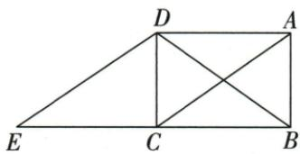

## 讲解

### 判据

原ABC移至DCE，A-D B-C C-E，保对应边角后目标ACD/EDC能配夹直角。

### 流程

1.原AD=BC，平移CE=BC，得到AD=EC。2.原ADC90、像DCE90，CD共同夹两边，SAS ACD≌EDC。3.原矩形AC=BD，像DE=AC，等量传递BD=DE，所以BDE等腰。4.写移动向量只沿原BC整方向，不能只移动B而别点不动。

## 例题

### 矩形平移两直角等腿SAS并原对角等造BDE等腰

> 来源ID Q23-33；第23章平行四边形；251-300/full.md 第1455–1466行。原答案与解析定位：251-300/full.md 第1468–1486行。

例4 如图, 在矩形 ABCD 中, 连接对角线 AC、BD, 将 $\triangle ABC$ 沿 BC 方向平移, 使点 B 移到点 C 处, 得到 $\triangle DCE$ .

(1) 求证: $\triangle ACD \cong \triangle EDC.$   
(2)请探究 $\triangle BDE$ 的形状,并说明理由.

**原资料答案与解析：**

解析（1）证明：∵四边形ABCD是矩形，∴AD=BC, $\angle ADC=\angle ABC=90^{\circ}$ .

由平移的性质得 CE=BC, $\angle DCE=\angle ABC=90^{\circ}$ ,

$$
\therefore A D = E C, \angle A D C = \angle E C D.
$$

在 $\triangle ACD$ 和 $\triangle EDC$ 中,AD=EC, $\angle ADC=\angle ECD$ ,CD=DC,

$$
\therefore \triangle A C D \cong \triangle E D C (\mathrm{SAS}).
$$

(2) $\triangle BDE$ 是等腰三角形.理由如下:

由矩形的性质可知 AC=BD. 由平移的性质得 DE=AC, ∴ BD=DE,

∴ $\triangle BDE$ 是等腰三角形.

**展开解析（依据原详解补足理由与步骤）：**

(1)原矩形AD=BC、ADC90；平移A→D、B→C、C→E给CE=BC、DCE90。ACD/EDC中AD=EC、CD公共、夹角ADC=ECD90，SAS全等。(2)原矩形AC=BD，平移保原AC像DE等长，故BD=DE，BDE等腰两腰分别BD/DE。不是平移本身保证任意两条线都等，需原对角相等连接两关系。

## 易错

平移保的是对应整图，BDE等腰额外靠矩形对角等。
