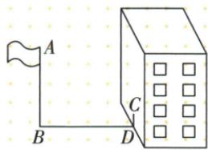
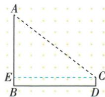
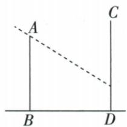
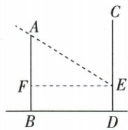

## 错法

把21米地影与2米墙影相加23，再乘高影比；或楼18的落差直接答成墙影。

## 正解

两段互相垂直，不能当相似三角同一底。旗杆作墙端水平线，水平21配上部14，再加墙端对应下高2为16；楼水平20配落差10√2，余墙高要从18减。先注明求全高还是余高。

## 例题

### 旗杆地影二十一墙影二按水平斜降十四加回二

> 来源ID Q28-01；第28章投影与视图；301-350/full.md 第3813–3824行。原答案与解析定位：301-350/full.md 第3826–3854行。

例1 如图,某一时刻在旗杆旁测得1米长的竹竿竖直放置时影长为1.5米,在同一时刻测量旗杆的影长时,因旗杆靠近一幢楼,影子有一部分落在墙上,测得落在地面上的影长为21米,落在墙上的影长为2米,则旗杆的高度为\_\_\_\_米.

**原资料答案与解析：**

解析 如图, 连接 AC, 过点 C 作 $CE \parallel BD$ 交 AB 于点 E, 则 CE = BD = 21 米, EB = CD = 2 米,

∵在同一时刻同一地点,物体的高度与影长成比例,

$$
\therefore \frac {A E}{E C} = \frac {1}{1 . 5}, \therefore \frac {A E}{2 1} = \frac {1}{1 . 5},
$$

∴ AE = 14 米.

$$
\therefore A B = A E + E B = 1 4 + 2 = 1 6 (\text { 米 }).
$$

答案 16

注意 易误以为旗杆的影长是地面上的影长与墙上的影长之和，应根据落在地面上的影长求出对应的部分旗杆的高度，加上落在墙上的影长得出旗杆的高度.

**展开解析（依据原详解补足理由与步骤）：**

墙面影不能和地面影直接相加作同一水平长度。过墙上影端C作水平CE到杆E，CE21、EB2来自矩形。杆顶A到E的竖直落差与水平CE对应同一太阳光倾角，所以AE/21=1/1.5；乘21得AE14。旗杆全高AB=AE+EB=14+2=16米。错误23×1/1.5把转折影线当一条水平影。

### 甲楼十八到乙墙水平二十高影比一根二求墙影

> 来源ID Q28-09；第28章投影与视图；301-350/full.md 第4126–4137行。原答案与解析定位：301-350/full.md 第4139–4156行。

例5 如图,甲楼 AB 高 18 米,乙楼 CD 坐落在甲楼的正北面,两楼相距 20 米,已知当地某天中午 12:00 时,物高与影长的比是 $1:\sqrt{2}$ ,求甲楼的影子落在乙楼上的高度.(结果保留根号)

**原资料答案与解析：**

解析 设当地该天中午12:00时,甲楼最高处A点的影子落在乙楼的E处,那么图中ED的长度就是甲楼的影子落在乙楼上的高度.过点E作 $EF\perp AB$ 于点F,在 $\triangle AEF$ 中,$\angle AFE = 90^{\circ}, EF = 20$ 米. $\because$ 物高与影长的比是 $1: \sqrt{2}, \therefore \frac{AF}{EF} = \frac{1}{\sqrt{2}}$ ,

则 $AF=\frac{\sqrt{2}}{2}EF=10\sqrt{2}$ 米, 故 $DE=FB=(18-10\sqrt{2})$ 米.

答:甲楼的影子落在乙楼上的高度为 $(18-10\sqrt{2})$ 米.

**展开解析（依据原详解补足理由与步骤）：**

由原图甲顶A的影到乙墙E，作EF水平交甲楼于F，EF20。相同光线倾角使AF/EF=1/√2，AF=20/√2=10√2。甲楼全高18，剩余FB=18−10√2，矩形给墙影ED=FB，所以答案18−10√2米。它为正且小于18，符合原图。题已指定当天比和投影位置，不仅凭“12:00、北半球”自行认影向；乙墙实际须包含E。
