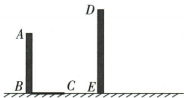
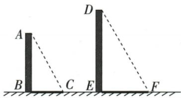
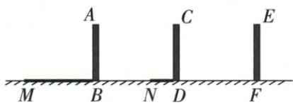
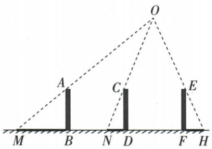

## 错法

原第三幅人影等长就当平行；已知路灯却过第三杆顶复制旧光线平行。

## 正解

同长影的两人可以在灯两侧等距，方向不同，顶影线反延长共点仍中心。路灯先用两对已知点定O，再沿O-E找H；太阳才复制平行方向。光线由光源经过物顶到影端，检查次序。

## 例题

### 四组等高人影连顶端判中心前三幅

> 来源ID Q28-03；第28章投影与视图；301-350/full.md 第3879–3887行。原答案与解析定位：301-350/full.md 第3889–3891行。

例3 下列投影中,是中心投影的是\_\_\_\_.

**原资料答案与解析：**

答案 ①②③

注意 在中心投影下，位于同一水平面上且等高的物体离光源越近，影子越短，离光源越远，影子越长，但并不是两个等高物体的影子一样长就一定不是中心投影，还应考虑影子与物体的相对位置.

**展开解析（依据原详解补足理由与步骤）：**

①②③顶端与影端连线反向延长可交同一点，属于中心投影；③虽影长相等，但分居灯脚两侧，光线有不同方向仍交一点。④影向相同且对应投影线平行，是平行投影。不能只比较影长；等长影可以由等高的人分居点光源两侧等距离处形成。

### 已知五十柱三十影过另一顶作平行光线

> 来源ID Q28-07；第28章投影与视图；301-350/full.md 第4048–4060行。原答案与解析定位：301-350/full.md 第4062–4075行。

例3 如图, 已知 AB 和 DE 是直立在地面上的两根立柱, AB = 50 cm, 某一时刻 AB 在阳光下的投影 BC = 30 cm, 请在图中画出此时 DE 在阳光下的投影.

**原资料答案与解析：**

解析 连接 AC, AC 所在的直线就是太阳光线. 因为平行投影的投影线是平行的, 所以只要过点 D 作 AC 的平行线即可得 DE 在阳光下的投影. 如图, EF 就是 DE 在阳光下的投影.

**展开解析（依据原详解补足理由与步骤）：**

连接A和已知影端C得到一条真实投影线AC。过另一柱顶D作AC的平行线，与同一地面交F，EF就是DE的影。使用的是同刻同地平行光，不连接两个柱顶当光线，也不让光线经过原柱脚B。题未给DE长，只要求作图，不能自补数值；50/30仅可检验方向的高影比5/3。

### 两标杆顶影反延长定灯再过第三顶定影

> 来源ID Q28-08；第28章投影与视图；301-350/full.md 第4081–4098行。原答案与解析定位：301-350/full.md 第4100–4119行。

例4 如图,电线杆上方有一盏路灯 O,电线杆与三个等高的标杆整齐地排列在马路的一侧,AB、CD、EF 是三个标杆,BM、DN 分别是标杆 AB、CD 在路灯下的影子.

(1)请画出路灯 O 的位置。(2)画出标杆 EF 在路灯下的影子 FH.

**原资料答案与解析：**

解析（1）根据中心投影的定义可知，连接 $MA, NC$ 并延长，它们的交点即为光源的位置，即路灯 $O$ 的位置，如图所示.

(2) 连接 OE 并延长交马路于点 H, 则 FH 为 EF 在路灯下的影子.

**展开解析（依据原详解补足理由与步骤）：**

先把M-A、N-C这两组物影对应点连线，沿影端经过物顶向上反延长交O，即灯位置。再从O经过第三杆顶E沿光传播方向延长交地面H；杆脚F到H为影段。O-E-H共线说明影端位置，F-H才是全影，不把OH当影长。两已知线须独立且相交，只有一条物影线只能限制灯在一条射线上，不能唯一定位。
