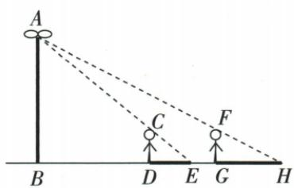
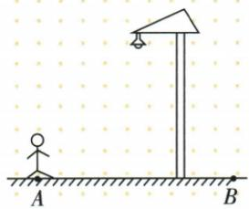

## 错法

比例把大三角底写脚距x；或人跨灯只说影越来越短。

## 正解

灯顶到影端的大底是脚距加影，首x+3，次x+5+5；正确得脚距7.5、灯高7。跨灯路线先减距再增距，影先短后长，逐渐短/长各只涵盖半段。

## 例题

### 路灯两次三和五影随走五求灯高七

> 来源ID Q28-10；第28章投影与视图；301-350/full.md 第4162–4162行。原答案与解析定位：301-350/full.md 第4164–4181行。

例6 如图,有一路灯 AB,在灯光下,大华在 D 点处的影长 DE=3 米,沿 BD 方向走到 G 点, DG=5 米,这时大华的影长 GH=5 米.如果大华的身高为 2 米,求路灯 AB 的高度.

**原资料答案与解析：**

解析 $\because CD \parallel AB, \therefore \triangle ECD \sim \triangle EAB, \therefore \frac{CD}{AB} = \frac{DE}{BE}$ , 即 $\frac{2}{AB} = \frac{3}{3 + BD}$ ①.

$\because FG \parallel AB, \therefore \triangle HFG \sim \triangle HAB, \therefore \frac{FG}{AB} = \frac{HG}{HB}$ , 即 $\frac{2}{AB} = \frac{5}{BD + 5 + 5}$ ②, 由①②得 $\frac{3}{3 + BD} = \frac{5}{BD + 5 + 5}, \therefore BD = 7.5$ 米, $\therefore \frac{2}{AB} = \frac{3}{3 + 7.5}, \therefore AB = 7$ 米, 即路灯 $AB$ 的高度为 7 米.

**展开解析（依据原详解补足理由与步骤）：**

设灯高H=AB，原BD=x>0。人体竖直CD∥AB，E端共同角使小△ECD与大△EAB相似，2/H=3/(x+3)。沿BD走5至G后，BG=x+5，第二影GH5，所以2/H=5/(x+10)。两式左侧相同，3/(x+3)=5/(x+10)，分母正，交乘3x+30=5x+15；移项15=2x，x7.5。代第一式2/H=3/10.5=2/7，交乘2×7=2H，H7米。检验另一位置BG12.5，影5与全底17.5满足2/7=5/17.5。

### 行人跨路灯脚影先短后长逐项

> 来源ID Q28-02；第28章投影与视图；301-350/full.md 第3858–3871行。原答案与解析定位：301-350/full.md 第3873–3875行。

例2 如图,晚上小亮在路灯下散步,在小亮由 A 处径直走到 B 处的这一过程中,他在地上的影子的变化情况是 ( )

A.逐渐变短  
B.先变短后变长  
C. 先变长后变短  
D.逐渐变长

**原资料答案与解析：**

解析 人从远处走近路灯,影子慢慢缩短,当走到路灯的正下方时,影子成为一个“点”,在离开路灯远去时,影子又慢慢伸长,因此,从A处走到B处,影子先由长变短,再由短变长.

答案 B

**展开解析（依据原详解补足理由与步骤）：**

原A到B路线跨过灯脚；接近灯脚，身高与灯高固定，影长缩短，正下方理想竖线人的影缩为一点，随后远离而变长，B。A逐渐变短只描述前半程；D逐渐变长只描述后半程；C先长后短把距离变化倒置。真实人的宽度仍有投影，一点仅属原竖线模型，不说现实人体影完全消失。
