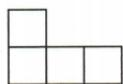
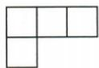
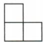

## 讲解

### 是什么

对原从地面逐层堆实心小正方体模型，在俯视每个非空格标柱高正整数，空格标0。主视同左右列的最高柱高给该列顶轮廓；左视同前后排的最高柱高给该排顶轮廓。总块数是所有柱高之和，视图显示的格数不是总块数。

### 怎么来的

俯视抹掉高度，却保留非空位置；主/左投影时同一方向不同深度的块重叠，外顶只由最高柱控制。原三图例底4格，列最高2/1/1、排最高2/1，迫使后排左柱2，其余1，总5。原仅俯左两图，后排3柱各可2、前排1，最多7；只给两个方向未必唯一，题问最多必须先证上界再造出合法达到该界的原布局。

### 什么时候能用

柱必须在原堆叠模型中无悬空空洞，否则仅标高度不能代表块数；题给若干实际块图时依其真实支撑和占位。两个视图可能允许多总数，三个视图也不保证所有堆形唯一，须实际解所有约束。

## 例题

### 三视图底四上一个堆方块总五

> 来源ID Q28-18；第28章投影与视图；301-350/full.md 第4455–4464行。原答案与解析定位：301-350/full.md 第4466–4468行。

例3 由若干个相同的小正方体搭成一个几何体,从不同角度观察该几何体所得到的平面图形如图所示,求搭成这个几何体所用小正方体的个数.

  
主视图

  
俯视图

  
左视图

**原资料答案与解析：**

解析 由俯视图可以确定最底层有4个小正方体；由主视图可以确定该几何体只有两层，且上层最多有

2个小正方体;由左视图可以确定上层只有1个小正方体.所以搭成这个几何体所用小正方体的个数是 $4+1=5$ .

**展开解析（依据原详解补足理由与步骤）：**

俯视上排三个格、下排左一个格，底层4个位置各至少1块。主视左列高2、其余列1；左视后排最高2、前排1。这使上层只可能落在后排左格，其他三个位置均高1。因此各柱高2、1、1、1，总5。这里三图联合恰确定，不能据“主视上层最多2”就多添一个会破坏左视的块。

### 俯视四格左视二一每格允许高最大总七

> 来源ID Q28-19；第28章投影与视图；301-350/full.md 第4474–4480行。原答案与解析定位：301-350/full.md 第4482–4486行。

例4 一个几何体由若干个大小相同的小正方体组成,它的俯视图和左视图如图所示,则组成该几何体所需小正方体的个数最多为\_\_\_\_.

  
俯视图

  
左视图

**原资料答案与解析：**

解析 由俯视图与左视图知,该几何体所需小正方体的个数最多时的分布情况如图所示.所以组成该几何体所需小正方体的个数最多为7.

| 2 | 2 | 2 |
| --- | --- | --- |
| 1 |  |  |

答案 7

**展开解析（依据原详解补足理由与步骤）：**

俯视后排三格、前排左一格。左视对应后排最高2、前排最高1。每柱不能超过它所在排的左视高度，所以后排三柱各≤2，前排一柱≤1，总≤2+2+2+1=7。取后排各2、前排1，既满足俯视非空格又满足各排最高高度，7能取到，故最多7。题没有主视，不能强加某列高度只1。

### 五方块移A到B上只主视顶格由中到右逐项A

> 来源ID Q28-22；第28章投影与视图；301-350/full.md 第4522–4540行。原答案与解析定位：301-350/full.md 第4548–4550行。

例2（2024 山东日照）如图是由 5 个完全相同的小正方体搭成的几何体, 如果将小正方体 A 放置到小正方体 B 的正上方, 则它的三视图变化情况是 ( )

A. 主视图会发生改变

B. 左视图会发生改变

C.俯视图会发生改变

D.三种视图都会发生改变

**原资料答案与解析：**

例2 解析 将小正方体 A 放置到小正方体 B 的正上方后, 几何体的主视图会由下层 3 个正方形, 上层正中间 1 个正方形变为下层 3 个正方形, 上层最右边 1 个正方形, 左视图和俯视图都不发生改变, 故选 A.

答案A

**展开解析（依据原详解补足理由与步骤）：**

移块前主视下层三格、上层中格；移后下层三格仍在，上层由中列到右列，故主视改变，A。左視所看相同前后位置的最高仍为2，轮廓不变，B错。原A所在底柱仍有底块，B所在格原已有底块，俯视非空占位都没变，C错。D声称三图都变，违背另两图核对。移动一块不必使所有方向的投影变。

## 易错

把左视最高2理解为这一排每柱都必须2会多算最少数；求最多时才可尝试所有允许柱到上界，并核全部图。
