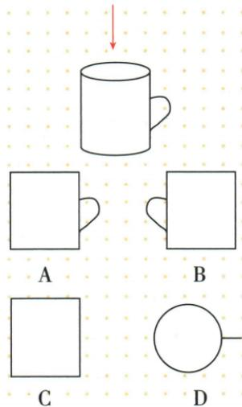

## 讲解

### 是什么

正投影用垂直投影面的平行线。线段平行于面，影长等于原长；倾斜时影长较短；垂直面时两端落同一点。平面纸板平行于面保形保大小，倾斜时一般压缩变形，垂直面时退化成线段。

“影不增长”只对正投影成立，不能拿来判断所有斜向平行光。

### 怎么来的

把原线段的两端分别垂直投到同一平面，原段与其影段、两端高度差可构成直角三角。勾股给原段平方=影长平方+高度差平方，故影长不超过原长；高度差0且线段平行面时等长，纯垂直时影长0。对纸板可逐条分析边；垂直侧立时所有点投到面与纸板平面相交的同一直线上，因此成线段。非退化平行投影仍保持平行对边，但角、长度未必都保。

### 什么时候能用

投影线必须与面垂直才可使用勾股分解；杯口平行面且正投影，顶口圆保持圆，不等同杯正面矩形。平行线若方向也沿投影线可合并退化，谈投影后的两组平行边需先排除退化。原边8正方影10×6的×依该段正投影条件，原只写阳光不够明确，保留条件缺口。

## 例题

### 杯口平行面正投影圆口带杯把逐项D

> 来源ID Q28-04；第28章投影与视图；301-350/full.md 第3995–4004行。原答案与解析定位：301-350/full.md 第4005–4007行。

例4 如图所示,水杯的杯口与投影面平行,太阳光线的方向如箭头所示,它的正投影是（）

**原资料答案与解析：**

解析 根据题意,水杯的杯口与投影面平行,即与光线垂直,则它的正投影是 D.

答案 D

**展开解析（依据原详解补足理由与步骤）：**

正投影的光线垂直投影面，杯口又平行该面，等同从杯口正上方观察。圆口投影仍圆，右侧把手按图投影为外侧短线，D。A/B是侧面的矩形轮廓，分别把把手画在右/左，观察方向不符；C为四边形且漏杯把，不是圆口的正投影。

### 原四条投影辨析保留正投影条件与非退化边界

> 来源ID Q28-23；第28章投影与视图；301-350/full.md 第3987–3991行。原答案与解析定位：301-350/full.md 第3987–3991行。

1. 一个矩形纸板在阳光下的投影形状可能是一条线段. （√）  
2.一个等边三角形木框在阳光下的投影形状可能是腰和底边不相等的等腰三角形. （√）  
3.一个平行四边形纸板在阳光下的投影形状不可能是等腰梯形.
(√)  
4.一个边长为8的正方形纸板在阳光下的投影可能是长为10，宽为6的矩形. (×)

**原资料答案与解析：**

1. 一个矩形纸板在阳光下的投影形状可能是一条线段. （√）  
2.一个等边三角形木框在阳光下的投影形状可能是腰和底边不相等的等腰三角形. （√）  
3.一个平行四边形纸板在阳光下的投影形状不可能是等腰梯形.
(√)  
4.一个边长为8的正方形纸板在阳光下的投影可能是长为10，宽为6的矩形. (×)

**展开解析（依据原详解补足理由与步骤）：**

①纸板沿光线侧立，可退化成线段，√。②等边三角沿对称轴方向压缩高度而左右仍对称，可成非等边等腰，√。③非退化平行投影保持两组对边平行，所以不成只有一组对边平行的梯形，√；退化时成为线段。④若承接所在小节的正投影，线段投影不增长，所以原边8不能投成边10，×。但字面只写阳光平行投影，不明确垂直投影面，就不能引用正投影不增的结论；正文保留原×并标注依赖正投影的条件缺口，不将它概括到全部斜投影。

## 易错

物体不是把照片按相同比例缩小。可见点、棱还需保留；纸板平行面不等于光线也平行面，二者平行会无法投到面上。
