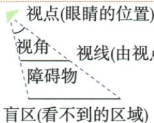

## 讲解

### 是什么

视点是眼的位置，视线是用于表示观察方向的几何线；两视线夹角叫视角，受物体遮挡看不到的范围是盲区。盲区必须说清在哪个观测面或目标区域，不能把地面一段、角范围和遮挡面积混为同一个量。

### 怎么来的

连接视点与障碍上沿或侧缘形成临界视线，延伸到指定面上得到可见/不可见分界。在原眼高于障碍、地面水平示意中，设固定眼高H、障碍高h、眼到障碍水平距d，H>h。大/小同角三角使(H−h)/d=h/l，交乘(H−h)l=hd，故l=hd/(H−h)，这里l是障碍后地面盲段。这说明同高前提下d减小，后方这段也减小，不可笼统说盲区必增。

### 什么时候能用

若眼不高于障碍，临界线未必能按原点序交后方地面，应重新判范围；升高眼或换观测面也会改变关系。原资料只有示意与断言，没有独立数值题，保留这个缺口和几何推导，不编题凑例。

## 例题

### 原视点盲区示意顶点连线延伸定分界

> 来源ID Q28-24；第28章投影与视图；301-350/full.md 第3967–3983行。原答案与解析定位：301-350/full.md 第3967–3983行。

# 知识解读 视点、视线、视角与盲区

(1) 观测点的位置叫作视点, 由视点发出的观测线叫作视线, 两条视线的夹角叫作视角. 视线遇到障碍物, 会有看不到的地方, 称为盲区.  
(2) 视点常常指眼睛的位置, 视线并不是太阳光线或灯光光线等实际存在的线, 常用虚线表示.  
(3)人离障碍物越近,盲区越大;将视点与障碍物的顶点连接并延长,交观测面于一点,此点就是盲区与非盲区的分界点.

**原资料答案与解析：**

# 知识解读 视点、视线、视角与盲区

(1) 观测点的位置叫作视点, 由视点发出的观测线叫作视线, 两条视线的夹角叫作视角. 视线遇到障碍物, 会有看不到的地方, 称为盲区.  
(2) 视点常常指眼睛的位置, 视线并不是太阳光线或灯光光线等实际存在的线, 常用虚线表示.  
(3)人离障碍物越近,盲区越大;将视点与障碍物的顶点连接并延长,交观测面于一点,此点就是盲区与非盲区的分界点.

**展开解析（依据原详解补足理由与步骤）：**

视点是眼的位置，连接眼与障碍物上沿形成临界视线，再延伸交观测平面，其后方受遮挡的一段是盲区。原“越近盲区越大”需固定眼高、障碍高、地面及点序：眼高H大于障碍h、两者水平距d，相似得障碍后盲长l=h·d/(H−h)，故在这个固定高度模型下d越小，盲长反而越小。原笼统断言与这个地面后方长度模型不符；不按一句口诀判所有视角或遮挡面积，先指定看哪个面与哪一范围。

## 易错

原“人离障碍越近盲区越大”没有指定衡量对象，在原地面后方长度模型甚至反向。先画指定观测面的分界，再谈比较。
