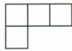
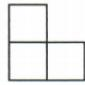

## 讲解

### 判据

少一个视图且问最多，俯视每格允许高度由现有侧图限定，先算上界并构造合法布局。

### 流程

1.原后排3格左视高度2，每柱≤2；前排1格高度1，该柱≤1。2.总≤3×2+1=7。3.后排三柱都2、前排1，俯视仍同四格，左视仍后2前1，能达到7。4.最多7而非仅凭图猜6。5.若又给主视，须加入列高上界后再求；当前题不得添未给限制。

## 例题

### 俯视四格左视二一每格允许高最大总七

> 来源ID Q28-19；第28章投影与视图；301-350/full.md 第4474–4480行。原答案与解析定位：301-350/full.md 第4482–4486行。

例4 一个几何体由若干个大小相同的小正方体组成,它的俯视图和左视图如图所示,则组成该几何体所需小正方体的个数最多为\_\_\_\_.

  
俯视图

  
左视图

**原资料答案与解析：**

解析 由俯视图与左视图知,该几何体所需小正方体的个数最多时的分布情况如图所示.所以组成该几何体所需小正方体的个数最多为7.

| 2 | 2 | 2 |
| --- | --- | --- |
| 1 |  |  |

答案 7

**展开解析（依据原详解补足理由与步骤）：**

俯视后排三格、前排左一格。左视对应后排最高2、前排最高1。每柱不能超过它所在排的左视高度，所以后排三柱各≤2，前排一柱≤1，总≤2+2+2+1=7。取后排各2、前排1，既满足俯视非空格又满足各排最高高度，7能取到，故最多7。题没有主视，不能强加某列高度只1。

## 易错

最多时全到各自上限仍须核视图；最少要只保各排至少一根到最高，不能把同一方案直接用于最少。
