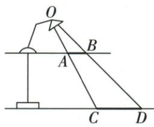

## 讲解

### 判据

灯固定，桌地平行，笔在桌同高沿自身方向平移，需证明影长不变。

### 流程

1.原AB影CD、平移EF影MN，各对应线从O发出。2.AB∥CD、EF∥MN，相似给AB/CD=OB/OD及EF/MN=OE/OM。3.桌地平行且高度固定，两个中心射线的截距比相同，OB/OD=OE/OM。4.平移保AB=EF，两个比相等，约去正笔长得CD=MN。5.这里只证长度，影的端点坐标随平移可改变。

## 例题

### 铅笔沿桌平行自身移影长度不变但位置移动

> 来源ID Q28-12；第28章投影与视图；301-350/full.md 第4239–4247行。原答案与解析定位：301-350/full.md 第4203–4211行。

例2 (2023 江苏南京节选) 如图, 玻璃桌面与地面平行, 桌面上有一盏台灯和一支铅笔, 点光源 O 与铅笔 AB 所确定的平面垂直于桌面. 在灯光照射下, AB 在地面上形成的影子为 CD (不计折射), $AB \parallel CD$ . 在桌面上沿着 AB 方向平移铅笔, 试说明 CD 的长度不变.

**原资料答案与解析：**

例2 解析 设 AB 平移到 EF, 在灯光照射下, EF 在地面上形成的影子为 MN. ∵ $AB \parallel CD$ , ∴ $\frac{AB}{CD} =$

$$
\frac {O B}{O D}, \frac {E F}{M N} = \frac {O E}{O M}, \frac {O B}{O D} = \frac {O E}{O M}, \therefore \frac {E F}{M N} =
$$

$\frac{AB}{CD},\because EF=AB,\therefore MN=CD,\therefore$ 沿
AB 方向平移铅笔, CD 的长度
不变.

**展开解析（依据原详解补足理由与步骤）：**

桌面与地面平行，笔始终同高，灯位置固定。原AB∥CD、EF∥MN，分别以O为中心对应相似得AB/CD=OB/OD、EF/MN=OE/OM；同高平行桌地使OB/OD=OE/OM。因此AB/CD=EF/MN，平移保EF=AB>0，两边约去同长得MN=CD。结论只是影长度不变，影位置通常改变；若笔升高、倾斜或灯移动，不能使用这一固定比例。

## 易错

“离灯更远影就短”若只是同高水平移动并不适用；竖杆和水平笔模型的变化量不同。
