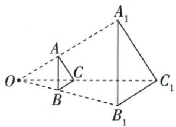

## 讲解

### 判据

原图形平行影面且光源点O，给相邻光线上分段比，先改成从同中心出发的对应总距比。

### 流程

1.原O-B-B₁点序，OB2份、BB₁3份，OB₁5份。2.位似原/影边比2/5，影/原5/2。3.面积影/原=(5/2)²=25/4，60×25/4=375。4.逐项原A90混面积2:3，B135混分段边比2:3，C150漏平方；D375满足全条件。5.若图形未平行面，不可未经证明直接统一位似面积比。

## 例题

### 硬纸板面积六十光源比二三总比二五面积三七五

> 来源ID Q28-11；第28章投影与视图；301-350/full.md 第4215–4237行。原答案与解析定位：301-350/full.md 第4185–4201行。

例1（2024四川凉山州）如图，一块面积为 $60~\mathrm{cm}^2$ 的三角形硬纸板（记为 $\triangle ABC$ )平行于投影面时，在点光源 $O$ 的照射下形成的投影是 $\triangle A_{1}B_{1}C_{1}$ ，若 $OB:BB_{1} = 2:3$ ，则 $\triangle A_{1}B_{1}C_{1}$ 的面积是 （）

A. $90 \mathrm{~cm}^{2}$

B. $135 \mathrm{~cm}^{2}$

C. $150 \mathrm{~cm}^{2}$

D. $375 \mathrm{~cm}^{2}$

**原资料答案与解析：**

例1 解析 由 $\triangle A_{1}B_{1}C_{1}$ 是平行于投影面的 $\triangle ABC$ 在点光源的照射下形成的投影, 可知 $\triangle ABC$ 与 $\triangle A_{1}B_{1}C_{1}$ 是位似图形,

又∵OB:BB\_{1}=2:3,

$$
\therefore \frac {A B}{A _ {1} B _ {1}} = \frac {O B}{O B _ {1}} = \frac {2}{5}, \therefore \frac {S _ {\triangle A B C}}{S _ {\triangle A _ {1} B _ {1} C _ {1}}} =
$$

$$
\left(\frac {A B}{A _ {1} B _ {1}}\right) ^ {2} = \left(\frac {2}{5}\right) ^ {2} = \frac {4}{2 5}, \therefore S _ {\triangle A _ {1} B _ {1} C _ {1}}
$$

$$
= \frac {2 5}{4} S _ {\triangle A B C} = \frac {2 5}{4} \times 6 0 = 3 7 5 (\mathrm{cm} ^ {2}).
$$

答案 D

**展开解析（依据原详解补足理由与步骤）：**

纸板平行投影面，原图与影位似。原O-B-B₁点序使OB₁=OB+BB₁；OB:BB₁2:3须转OB:OB₁2:5。边比原/影2/5，面积比4/25，所以影面积=60×25/4=375平方厘米，D。A90只是把2:3直接当面积比；B135把2:3当边比后平方；C150用了正确2:5却只乘一次边比。三种均不满足实际面积倍率25/4。

## 易错

分段比2:3与中心总距比2:5不同；面积倍率不能用一次边比。
