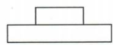
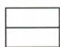
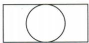
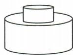
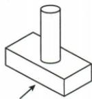
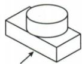
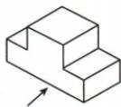

## 讲解

### 判据

三图含矩形、圆和台阶，拆上/下基本体，再把三方向共同尺寸对齐。

### 流程

1.俯视外矩形内圆，底座长方体、上部圆柱。2.原主视下宽上窄，而左视上下同宽，说明圆柱径等底座宽。3.C正合；A双圆柱俯视无外矩形，B细柱左视上窄，D上棱柱俯视无圆，分别排除。4.核每一张图，不只看到圆就认某种含圆物。5.资料对任意复杂体可能存在多解，原四选项中仅C同时满足，结论限定题目范围。

## 例题

### 圆柱加长方体三视图拼接逐项C

> 来源ID Q28-17；第28章投影与视图；301-350/full.md 第4425–4445行。原答案与解析定位：301-350/full.md 第4447–4449行。

例2 下图是某几何体的三视图,则这个几何体是

( )

  
A

  
B

  
C

  
D

**原资料答案与解析：**

解析 由三视图可知,所求几何体分为上、下两部分,上半部分是一个圆柱,下半部分是一个宽与圆柱底面直径相等的长方体,故选 C.

答案 C

**展开解析（依据原详解补足理由与步骤）：**

俯视外矩形内圆，说明下部是长方体底座，上部为圆柱；圆直径与底座宽相同。主视下底座横长、上圆柱较窄，左视因底座宽等圆径而上下同宽。C符合全部三个方向。A为双圆柱，俯视应两同心圆无矩形；B上柱细长且直径小于底座宽，左视上部应更窄；D上部为棱柱，俯视不出现圆。

## 易错

单个矩形可能来自多个体，三个图形名字并不是三块独立实体；它们描述同一组合的不同方向。
