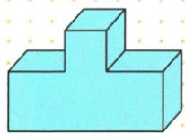
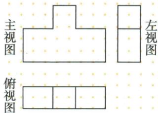
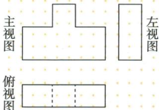
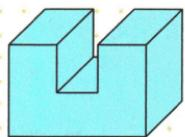
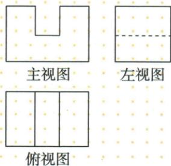

## 讲解

### 判据

实际台阶或开槽实体要求画三图，先以主图确定长高，再按对应关系投到另两图。

### 流程

1.凸块主视为中凸台阶，主下俯视长对正，主右左视高平齐，再让左/俯宽对应。2.每一棱按视向查能否看到；凸块俯视两分界可见实线，左视分层横线也实。3.槽形主视U，俯视两槽口实线，左视被外墙挡住的槽底横边虚线。4.将三个图同轴尺度比回原物体，不能只认形状而任意拉伸。5.保留原正确图和错误图，并说明错误对应哪条真实棱。

## 例题

### 中间凸起三视图可见台阶实线与左视分层

> 来源ID Q28-14；第28章投影与视图；301-350/full.md 第4336–4338行。原答案与解析定位：301-350/full.md 第4340–4362行。

例2 如图,画出该物体的三视图.

**原资料答案与解析：**

解析 如图所示.

注意 易出现如图所示的错误.

**展开解析（依据原详解补足理由与步骤）：**

原物体从前看为中间凸起的台阶轮廓；从左看上下两层高度不同，在左视矩形内有一条可见水平分界，应实线。从上看底层三段及中间高块两侧竖直面相接的边都能看到，两条分界也应实线。原错误图省掉左视分层，并将俯视两可见分界画成虚线；不能把所有内部线一律隐藏。

### 槽形物体主左俯长高宽对应及隐藏槽底虚线

> 来源ID Q28-15；第28章投影与视图；301-350/full.md 第4366–4368行。原答案与解析定位：301-350/full.md 第4370–4382行。

例3 如图,画出该物体的三视图.

**原资料答案与解析：**

解析 如图所示.

注意 画三视图时应注意各视图尺寸之间的对应关系，注意“长对正”“高平齐”“宽相等”.

**展开解析（依据原详解补足理由与步骤）：**

先沿原前方观察，主视外轮廓是U形，槽宽与两侧厚度按实物对应；左视为外侧整矩形，槽底横边被左侧实体挡住，画虚线。俯视外矩形中的两槽边从上可见，画实线。主与俯共同左右长，主与左共同竖高，左与俯共同前后宽；不能为凑图把左视高度与俯视宽互换。

## 易错

图内不等于隐藏；同一条边可在不同视图虚实不同，不能借主视线型直接照搬。
