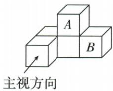

## 讲解

### 判据

已知堆形移动一个块，比较各视向保留的占位、最高位置，分别判断。

### 流程

1.按原箭头主视，下三格不变，上格由中到右，A真。2.原A柱留底块，B柱本有底块，俯视占位不变，C假。3.左视对应前后排的最高仍同位置同高，B假。4.只有主图变，D“三种都变”假。5.核原五块总数守恒，但块数守恒本身不能推出任意视图不变。

## 例题

### 五方块移A到B上只主视顶格由中到右逐项A

> 来源ID Q28-22；第28章投影与视图；301-350/full.md 第4522–4540行。原答案与解析定位：301-350/full.md 第4548–4550行。

例2（2024 山东日照）如图是由 5 个完全相同的小正方体搭成的几何体, 如果将小正方体 A 放置到小正方体 B 的正上方, 则它的三视图变化情况是 ( )

A. 主视图会发生改变

B. 左视图会发生改变

C.俯视图会发生改变

D.三种视图都会发生改变

**原资料答案与解析：**

例2 解析 将小正方体 A 放置到小正方体 B 的正上方后, 几何体的主视图会由下层 3 个正方形, 上层正中间 1 个正方形变为下层 3 个正方形, 上层最右边 1 个正方形, 左视图和俯视图都不发生改变, 故选 A.

答案A

**展开解析（依据原详解补足理由与步骤）：**

移块前主视下层三格、上层中格；移后下层三格仍在，上层由中列到右列，故主视改变，A。左視所看相同前后位置的最高仍为2，轮廓不变，B错。原A所在底柱仍有底块，B所在格原已有底块，俯视非空占位都没变，C错。D声称三图都变，违背另两图核对。移动一块不必使所有方向的投影变。

## 易错

把空间移动等同每个方向的投影移动会错；若移空某柱或新添占位，俯视又可能变，须回原堆形。
